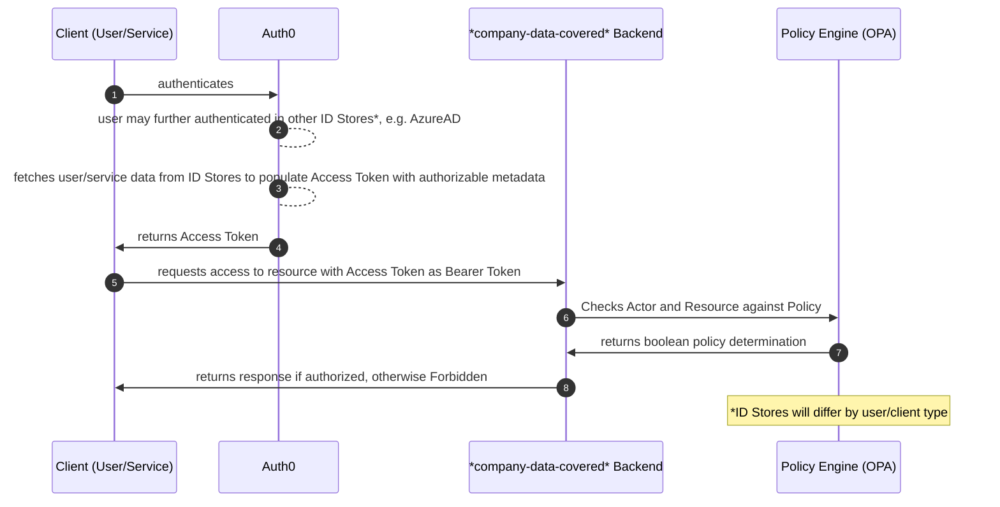

# Auth Overview

> :warning: This document represents the intended authorization flow for our applications.
> The implementation is still a work-in-progress.

> :wave: **Owner**: EngCore



## Auth0

All our users and services authenticate through Auth0; they may use various Identity Stores (AzureAD for _company-data-covered_ employees, Passwordless for patients, various SSO or username/pass logins for partners, etc.) but from the perspective of our applications this is encapsulated as a single Identity Provider, "Auth0".

When a user is authenticated, they receive an Access Token via OAuth2 flows.

## Access Token

In Auth0, we populate user and service Access Tokens with the details relevant to determining whether a user is authorized to access a given resource. The goal is that all critical authorization-related information is encapsulated in the token itself, and is available in a standard format to our various services for evaluation.

The authorization attributes that we store in the token should help answer the question of "does this Actor have permission to access a resource?" Other user-attributes which do not specifically answer authorization questions in the system should be queried as-needed in business logic outside of the JWT and our main authorization flow.

Example Attributes which may belong in the JWT:

- User ID
- User Roles
- User Markets

Example Attributes which _don't_ belong in the JWT:

- Provider Credentials
- User Name
- User Email

Auth0 is configured to reach out to various internal and external services to populate the Access Token.

The decoded JWT body will look something like this:

```js
{
    // `type` is one of "user" | "m2m" | (patients, partners TBD)
    "https://*company-data-covered*.com/type": "user",

    // `props` is a bag of authZ attributes specific to the actor type
    "https://*company-data-covered*.com/props": {
        "id": 1,
        "market_role": "APP",
        ...
    },

    // ... followed by standard OAuth2 claims from Auth0
}
```

The division of users/clients by "type" (user, m2m, partner, patient) is due to the fact that their users are from disparate sources and that primary identifiers, roles, groups, etc may match but _are not equivalent_. It is vital that these users' authorization is independently evaluated.

See below for Access Token elements.

### _company-data-covered_ User Elements

| Element       | Type        | Example                     | Source                                 |
| ------------- | ----------- | --------------------------- | -------------------------------------- |
| `id`          | `numeric`   | `99999`                     | Station User ID                        |
| `market_role` | `string`    | `"APP"`                     | UKG -> AzureAD (Extension Attribute 3) |
| `groups`      | `[]string`  | `["Lead APPs", "APPs"]`     | AzureAD Groups                         |
| `roles`       | `[]string`  | `["csc","provider","user"]` | Station (Application) Roles            |
| `markets`     | `[]numeric` | `[1,176]`                   | Station User-Markets                   |

Notes:

- `roles` from Station are inconsistently implemented today and manually applied to users. Our goal is to transition to `groups` which are managed in AAD and can be derived directly from employee attributes in AAD/UKG. We include `roles` today for backward-compatibility, but new relationships should be added as AAD `groups`, in coordination with IT/HR.
- `market_role` is defined in UKG, and is one of: `["Lead APP", "APP", "Lead DHMT", "DHMT", "RDO", "RMD", "Market Manager", "Advanced Care APP", "Advanced Care Coordinator", "Lead Advanced Care APP", "Advanced Care Nurse Nav"]`

### Machine-to-machine (M2M) Elements

> AKA Service-to-service (S2S)

| Element       | Type     | Example                 | Source                                     |
| ------------- | -------- | ----------------------- | ------------------------------------------ |
| `client_name` | `string` | `Logistics M2M Service` | Auth0 Application Name (Terraform-managed) |

### Partner User Elements

> :warning: TBD, examples below

| Element      | Type      | Example | Source                     |
| ------------ | --------- | ------- | -------------------------- |
| `id`         | `numeric` | `99999` | Partner-Product User ID    |
| `partner_id` | `numeric` | `12345` | Partner-Product Partner ID |

### Patient User Elements

> :warning: TBD, examples below

| Element     | Type      | Example | Source                   |
| ----------- | --------- | ------- | ------------------------ |
| `id`        | `numeric` | `99999` | Patients Service User ID |
| `athena_id` | `numeric` | `12345` | Athena EHR ID of Patient |

## Policy Engine

Access Tokens are sent to backend services as Bearer Tokens in order to gain access to private resources.

When an application receives a Bearer Token, the application:

1. Verifies the JWT signature and JWKS per OAuth2 norms
1. (If fails, returns _Forbidden_)
1. Serializes the JWT as an "Actor" for a "Policy Check"
1. Performs a Policy Check request given the Actor, an intended Resource, and the Policy which governs access to that action and resource.
1. (If fails, returns _Forbidden_)
1. (Success! The user is authorized and may access the resource)
1. ...

The verification of JWTs is handled in HTTP/gRPC middleware provided by the `auth` package, and can automatically return _Forbidden_ when verification fails.

Since our JWTs follow a standard structure, we can simply serialize them into an `Actor` for Policy Checking. The `auth` package will automatically serialize the Actor from the verified JWT. Callers should never serialize their own Actors, since it violates the single source-of-truth of authorizable data from Auth0.

The `Resource` represents authorization attributes related to the data the requestor is trying to access. For example, if a user is trying to view a patient's lab results, the Policy Resource may include attributes of the patient (is this user a caregiver who can access this patient record?) and also the lab results themselves (are these labs sensitive, and/or released for patient-visibility?). The serialization of the resource is dependent on the expectations of the Policy, and is performed by the application.

The `Policy` is written in Rego and hosted by our OPA server which acts as a Policy Decision Point. Given the Actor, Resource, and a Policy name, the Policy Decision Point will calculate a boolean result indicating whether access should be granted.

## Example

Scenario:

> Your application manages Patient Lab Results. The Patient may be able to see their own results. _company-data-covered_ providers can see these results. Partners may not view results.

### Frontend

The frontend application uses the [Auth0 React SDK for SPAs](https://auth0.com/docs/libraries/auth0-react) to wrap a React frontend with an authentication/authorization provider.

The user logs in through Auth0 when they access the frontend, and receives an Access Token through [OAuth2 with PKCE](https://auth0.com/docs/get-started/authentication-and-authorization-flow/authorization-code-flow-with-proof-key-for-code-exchange-pkce).

The frontend makes requests to a backend using the Access Token as a [Bearer Token](https://oauth.net/2/bearer-tokens/) in the Authorization header.

### Backend: Configuration

The backend service configures two authorization-related interceptors to handle JWT Verification and Policy-Checking:

```go
    server, err := baseserv.NewServer(baseserv.NewServerParams{
		//...
		GRPCAuthConfig: auth.Config{
			AuthorizationDisabled:  os.Getenv(authorizationDisabledKey) == "true",
			IssuerURL:              *auth0IssuerURL,
			Audience:               *auth0Audience,
			AllowMultipleAudiences: true,
		},
		GRPCPolicyAuthorizerConfig: &auth.GRPCPolicyAuthorizerConfig{
			Enabled:              policyServiceEnabled,
			PolicyServiceBaseURL: policyServiceBaseURL,
		},
		// ...
	})
	if err != nil {
		log.Panic(err)
	}
	defer server.Cleanup()

	err = server.GRPCPolicyAuthorizer().RegisterGRPCRequest(&patientspb.GetPatientLabResults{}, auth.PatientLabResultsRead, nil)
	if err != nil {
		log.Panicf("failed to register grpc request, err: %s", err)
	}
```

The `GRPCAuthConfig` enables a middleware responsible for JWT Verification, and parses the verified JWT into claims data ("Actor" information) which can be used in Policy-checks.

The `GRPCPolicyAuthorizerConfig` enables the policy-checking middleware. Given verified JWT claims, it will handle requesting an authorization result from the policy service (OPA).

gRPC endpoints which will use the policy service must be registered using `RegisterGRPCRequest()`. This connects a given gRPC request to a Policy which is evaluated to determine authorization; and accepts an optional `PolicyResourceSerializer` function which can be used for ABAC determinations.

### Backend: Using the PolicyResourceSerializer

Many of our APIs, especially internal ones, authorize access based purely on the Actor. For example, Logistics-Service may authorize certain endpoints to be accessible by M2Ms only, and the Caremanager-Service authorizes users based on whether they possess the "caremanager" role. In these cases, we don't need any extra information about the requested resource to make an authorization determination, and the endpoint is registered with a `nil` serialization function:

```go
server.GRPCPolicyAuthorizer().RegisterGRPCRequest(&patientspb.GetPatientLabResultsRequest{}, auth.PatientLabResultsRead, nil)
```

In some cases we rely on information about the request to determine authorization. For example, when reading a Patient's Lab Results, a Patient-User should only be able to access their own lab results. A request to access another user's results should be Forbidden. In this case, we need to get these extra attributes and pass them to the policy-check. That's where we use the PolicyResourceSerializer:

```go
/*
 policy_serializer.go
 */

type MyPolicyResourceSerializer struct{
    myDatabaseConnection any
    myMemoryCache        any
}

func (m *MyPolicyResourceSerializer) SerializePatientForRequest(ctx context.Context, req any) (any, error) {
    request, ok := req.(*patientspb.GetPatientLabResultsRequest)
    if !ok {
        return nil, nil, errors.New("unexpected request type...")
    }

    patient := m.myDatabaseConnection.GetPatient(request.GetPatientID())

    policyData := struct{
        PatientID          int
        PatientCaregivers  []int
    }{
        PatientID:         patient.ID,
        PatientCaregivers: patient.CareGiverIDs
    }

    m.myMemoryCache.cache(patient)

    return policyData, nil
}

/*
 main.go
 */

 // ...

myPolicyResourceSerializer := &MyPolicyResourceSerializer{ myDatabaseConnection: db, myMemoryCache: cache }

err = server.GRPCPolicyAuthorizer().RegisterGRPCRequest(
    &patientspb.GetPatientLabResults{},
    auth.PatientLabResultsRead,
    myPolicyResourceSerializer.SerializePatientForRequest)

// ...
```

The `PolicyResourceSerializer` serves the purpose of aggregating and formatting whatever data the Policy-Check will need to determine authorization (`policyData` above). As shown above, you may also fetch needed data from the database - in this case, your `PolicyResourceSerializer` may also perform side-effects relevant to your application such as caching, which is mocked above but not required.

### Backend: Policy

The policy itself is hosted by the OPA server, `policy-service`. The policy may look something like:

```rego
package policies.labresults

import data.utils.actor
import data.static.station_roles

default read := false

read {
    # DH Employees may read if they are providers/caremanagers
    actor.user_has_role(station_roles.Caremanager, station_roles.Provider)
}

read {
    # Patients may read if they are the patient in question
    actor.patient_has_id(data.input.resource.patient_id)
}

# ...other CRUD rules, or generic "allow" rules may follow
```

## Glossary

We recommend you consult [Auth0's Identity Glossary](https://auth0.com/docs/glossary) for a great overview of important terminology. A few key items for understanding our Auth flows:

- **ABAC** - Attribute-based access control (ABAC) is an authorization model that evaluates attributes (or characteristics), rather than roles, to determine access. It is often contrasted with Role-based access control (RBAC).
- **Access Token** - Credential that can be used by an application to access an API. It informs the API that the bearer of the token has been authorized to access the API and perform specific actions specified by the scope that has been granted. An Access Token can be in any format, but two popular options include opaque strings and JSON Web Tokens (JWT). They should be transmitted to the API as a Bearer credential in an HTTP Authorization header.
- **Audience** - Unique identifier of the audience for an issued token, identified within a JSON Web Token as the `aud` claim. The audience value is either the application (Client ID) for an ID Token or the API that is being called (API Identifier) for an Access Token. At Auth0, the Audience value sent in a request for an Access Token dictates whether that token is returned in an opaque or JWT format.
- **Authentication Server** - Server that confirms or denies a user’s identity. An authentication server does not limit the actions or resources available to the user (although it can provide context for this purpose).
- **Authorization Server** - Centralized server that contributes to defining the boundaries of a user’s access. For example, your authorization server can control the data, tasks, and features available to a user. An authorization server does not authenticate users. It’s the role of the authentication server to verify a user’s identity.
- **Identity Provider (IdP)** - Service that stores and manages digital identities. Auth0 supports trusted social, enterprise, and legal identity providers. Auth0 also can function as an identity provider for your applications.
- **Identity Store** - A database that stores user identity data such as user name, group membership, and other information used to verify a caller's credentials.
- **ID Token** - Credential meant for the client itself, rather than for accessing a resource. It has a fixed format that clients can parse and validate.
