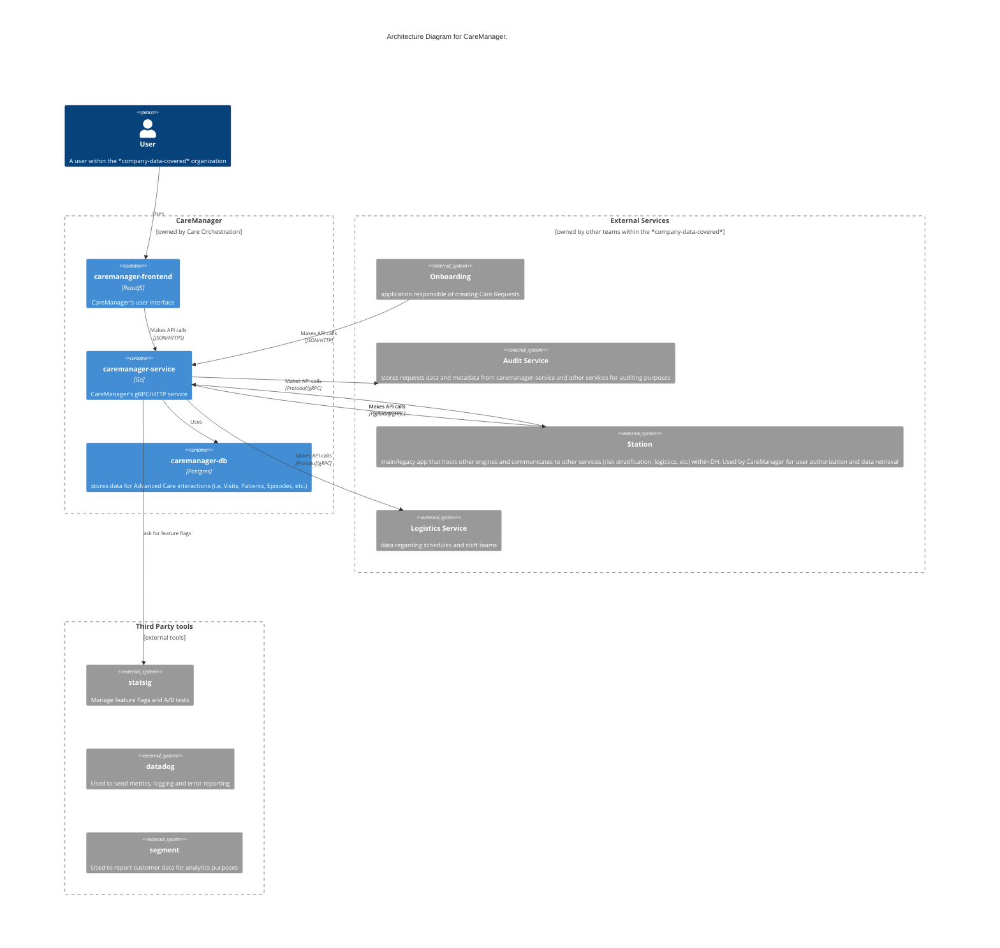

```mermaid

  C4Context

  title Architecture Diagram for  CareManager.

  Person(User, "User", "A user within the *company-data-covered* organization")

  Boundary(CareOrchestrationBoundary, "CareManager", "owned by Care Orchestration") {
      Container(CareManagerFE, "caremanager-frontend", "ReactJS", "CareManager's user interface")
      Container(CareManagerService, "caremanager-service", "Go", "CareManager's gRPC/HTTP service")
      Container(CareManagerDB, "caremanager-db", "Postgres", "stores data for Advanced Care interactions (i.e. Visits, Patients, Episodes, etc.)")
  }

  Boundary(ExternalServicesBoundary, "External Services", "owned by other teams within the *company-data-covered*") {
      System_Ext(OnboardingService, "Onboarding", "application responsible of creating Care Requests")
      System_Ext(AuditService, "Audit Service", "stores requests data and metadata from caremanager-service and other services for auditing purposes")
      System_Ext(Station, "Station", "main/legacy app that hosts other engines and communicates to other services (risk stratification, logistics, etc) within DH. Used by CareManager for user authorization and data retrieval")
      System_Ext(LogisticsService, "Logistics Service", "data regarding schedules and shift teams")

  }

  Boundary(ThirdPartyBoundary, "Third Party tools", "external tools") {
      System_Ext(StatsigService, "statsig", "Manage feature flags and A/B tests")
      System_Ext(DatadogService, "datadog", "Used to send metrics, logging and error reporting")
      System_Ext(SegmentService, "segment", "Used to report customer data for analytics purposes")
  }

  Rel(CareManagerService, AuditService, "Makes API calls", "Protobuf/gRPC")
  Rel(CareManagerService, Station, "Makes API calls", "gRPC/HTTP")
  Rel(CareManagerService, CareManagerDB, "Uses")
  Rel(CareManagerFE, CareManagerService, "Makes API calls", "JSON/HTTPS")
  Rel(User, CareManagerFE, "Uses")
  Rel(Station, CareManagerService, "Makes API calls", "Protobuf/gRPC")
  Rel(CareManagerService, LogisticsService, "Makes API calls", "Protobuf/gRPC")
  Rel(OnboardingService, CareManagerService, "Makes API calls", "JSON/HTTP")
  Rel(CareManagerService, StatsigService, "ask for feature flags")


```
