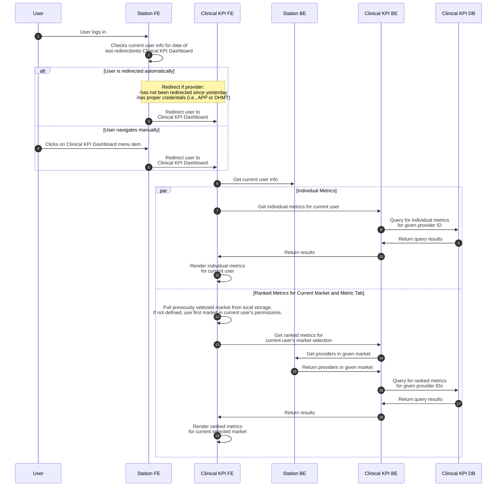

# Clinical KPI

```mermaid
sequenceDiagram
    autonumber

    %% Nodes
    participant User
    participant Station_FE as Station FE
    participant Clinical_KPI_FE as Clinical KPI FE
    participant Station_BE as Station BE
    participant Clinical_KPI_Svc as Clinical KPI BE
    participant Clinical_KPI_DB as Clinical KPI DB

    %% Flows
    User ->> Station_FE: User logs in
    Station_FE ->> Station_FE: Checks current user info for date of<br>last redirectionto Clinical KPI Dashboard
    alt User is redirected automatically
        note over Station_FE, Clinical_KPI_FE: Redirect if provider:<br>-has not been redirected since yesterday<br>-has proper credentials (i.e., APP or DHMT)
        Station_FE ->> Clinical_KPI_FE: Redirect user to<br>Clinical KPI Dashboard
    else User navigates manually
        User ->> Station_FE: Clicks on Clinical KPI Dashboard menu item
        Station_FE ->> Clinical_KPI_FE: Redirect user to<br>Clinical KPI Dashboard
    end
    Clinical_KPI_FE ->> Station_BE: Get current user info
    par Individual Metrics
        Clinical_KPI_FE ->> Clinical_KPI_Svc: Get individual metrics for current user
        Clinical_KPI_Svc ->> Clinical_KPI_DB: Query for individual metrics<br>for given provider ID
        Clinical_KPI_DB ->> Clinical_KPI_Svc: Return query results
        Clinical_KPI_Svc ->> Clinical_KPI_FE: Return results
        Clinical_KPI_FE ->> Clinical_KPI_FE: Render individual metrics<br>for current user
    and Ranked Metrics for Current Market and Metric Tab
        Clinical_KPI_FE ->> Clinical_KPI_FE: Pull previously selected market from local storage.<br>If not defined, use first market in current user's permissions.
        Clinical_KPI_FE ->> Clinical_KPI_Svc: Get ranked metrics for<br>current user's market selection
        Clinical_KPI_Svc ->> Station_BE: Get providers in given market
        Station_BE ->> Clinical_KPI_Svc: Return providers in given market
        Clinical_KPI_Svc ->> Clinical_KPI_DB: Query for ranked metrics<br>for given provider IDs
        Clinical_KPI_DB ->> Clinical_KPI_Svc: Return query results
        Clinical_KPI_Svc ->> Clinical_KPI_FE: Return results
        Clinical_KPI_FE ->> Clinical_KPI_FE: Render ranked metrics<br>for current selected market
    end
```
