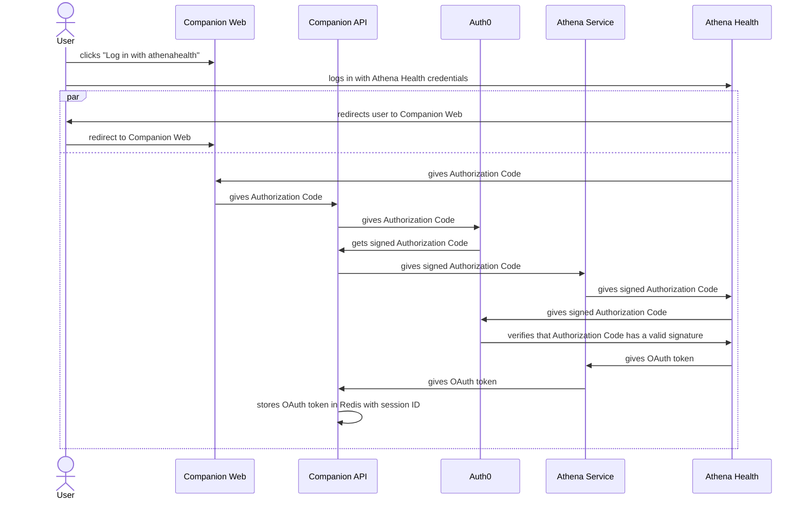
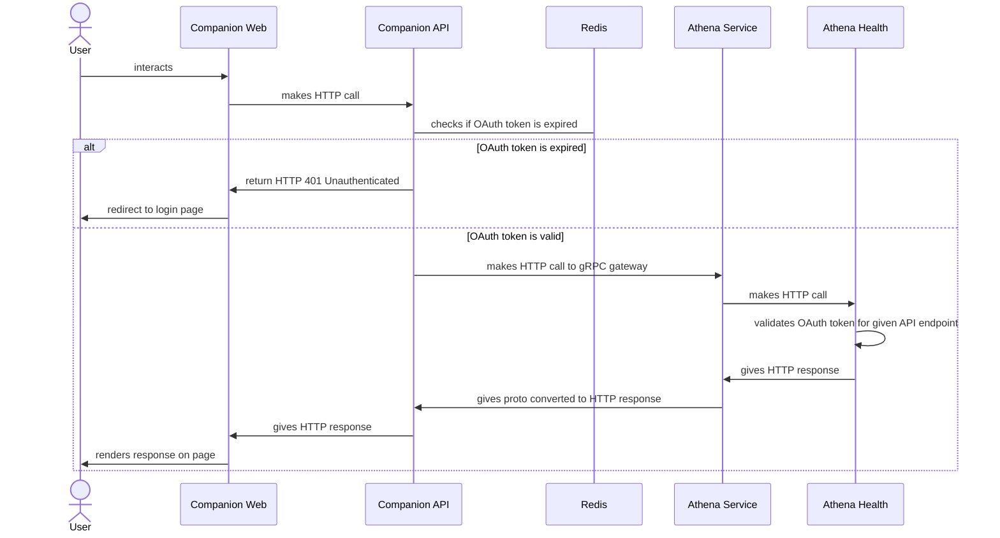

# [Patient Accounts (WIP)](https://*company-data-covered*.sharepoint.com/:w:/s/tech-team/EQacNNZUlttAjvFU9vsu8GUBus4V3CU7MUYkm_cdHRH6iA?e=ogDaz3)

## Authorization Sequence

```mermaid
sequenceDiagram
    %% Nodes
    actor User
    participant Companion Web
    participant Companion API
    participant Auth0
    participant Athena Service
    participant Athena Health

    User->>Companion Web: clicks "Log in with athenahealth"
    User->>Athena Health: logs in with Athena Health credentials
    par
      Athena Health->>User: redirects user to Companion Web
      User->>Companion Web: redirect to Companion Web
    and
      Athena Health->>Companion Web: gives Authorization Code
      Companion Web->>Companion API: gives Authorization Code
      Companion API->>Auth0: gives Authorization Code
      Auth0->>Companion API: gets signed Authorization Code
      Companion API->>Athena Service: gives signed Authorization Code
      Athena Service->>Athena Health: gives signed Authorization Code
      Athena Health->>Auth0: gives signed Authorization Code
      Auth0->>Athena Health: verifies that Authorization Code has a valid signature
      Athena Health->>Athena Service: gives OAuth token
      Athena Service->>Companion API: gives OAuth token
      Companion API->>Companion API: stores OAuth token in Redis with session ID
    end

```

## Request Sequence

```mermaid
sequenceDiagram
    %% Nodes
    actor User
    participant Companion Web
    participant Companion API
    participant Redis
    participant Athena Service
    participant Athena Health

    User->>Companion Web: interacts
    Companion Web->>Companion API: makes HTTP call
    Companion API->Redis: checks if OAuth token is expired
    alt OAuth token is expired
      Companion API->>Companion Web: return HTTP 401 Unauthenticated
      Companion Web->>User: redirect to login page
    else OAuth token is valid
      Companion API->>Athena Service: makes HTTP call to gRPC gateway
      Athena Service->>Athena Health: makes HTTP call
      Athena Health->>Athena Health: validates OAuth token for given API endpoint
      Athena Health->>Athena Service: gives HTTP response
      Athena Service->>Companion API: gives proto converted to HTTP response
      Companion API->>Companion Web: gives HTTP response
      Companion Web->>User: renders response on page
    end
```
