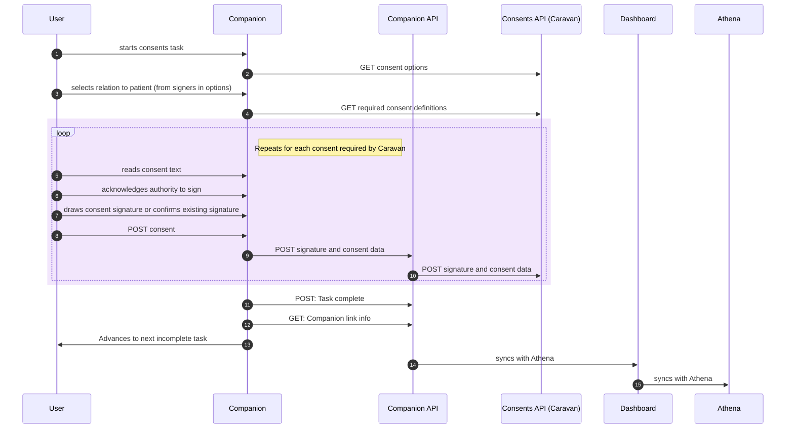

# Consents Task Sequence

```mermaid
sequenceDiagram
    autonumber

    %% Nodes
    participant User
    participant Companion
    participant Companion API
    participant Consents as Consents API (Caravan)
    participant Dashboard
    participant Athena

    User->>Companion: starts consents task
    Companion->>Consents: GET consent options
    User->>Companion: selects relation to patient (from signers in options)
    Companion->>Consents: GET required consent definitions

    rect rgb(127, 17, 224, 0.1)
        loop
            note right of Companion: Repeats for each consent required by Caravan
            User->>Companion: reads consent text
            User->>Companion: acknowledges authority to sign
            User->>Companion: draws consent signature or confirms existing signature
            User->>Companion: POST consent
            Companion->>Companion API: POST signature and consent data
            Companion API->>Consents: POST signature and consent data
        end
    end

    Companion->>Companion API: POST: Task complete
    Companion->>Companion API: GET: Companion link info
    Companion->>User: Advances to next incomplete task
    Companion API->>Dashboard: syncs with Athena
    Dashboard->>Athena: syncs with Athena
```
