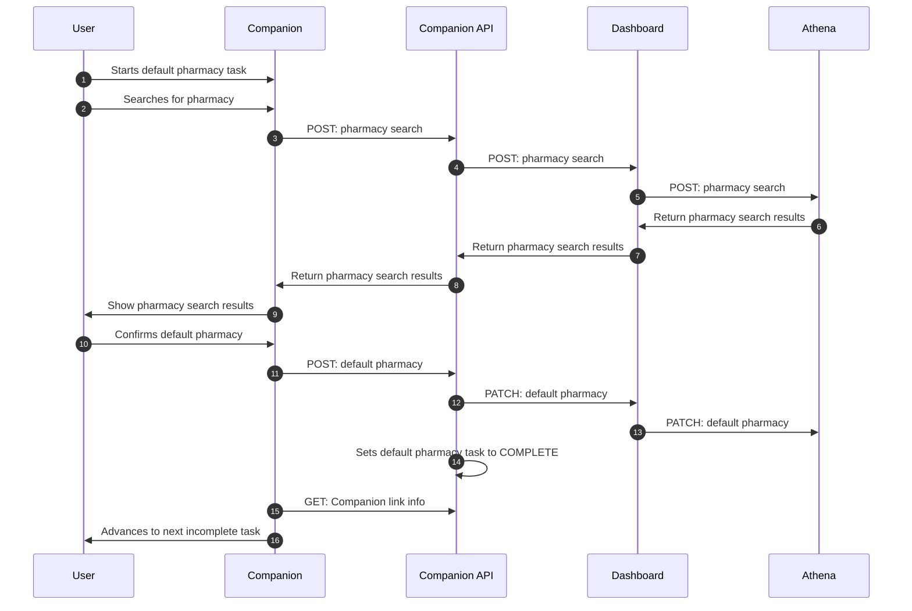

# Default pharmacy Task Sequence

```mermaid
sequenceDiagram
    autonumber

    %% Nodes
    participant User
    participant Companion
    participant Companion API
    participant Dashboard
    participant Athena

    User->>Companion: Starts default pharmacy task
    User->>Companion: Searches for pharmacy
    Companion->>Companion API: POST: pharmacy search
    Companion API->>Dashboard: POST: pharmacy search
    Dashboard->>Athena: POST: pharmacy search
    Athena->>Dashboard: Return pharmacy search results
    Dashboard->>Companion API: Return pharmacy search results
    Companion API->>Companion: Return pharmacy search results
    Companion->>User: Show pharmacy search results
    User->>Companion: Confirms default pharmacy
    Companion->>Companion API: POST: default pharmacy
    Companion API->>Dashboard: PATCH: default pharmacy
    Dashboard->>Athena: PATCH: default pharmacy
    Companion API->>Companion API: Sets default pharmacy task to COMPLETE
    Companion->>Companion API: GET: Companion link info
    Companion->>User: Advances to next incomplete task
```
