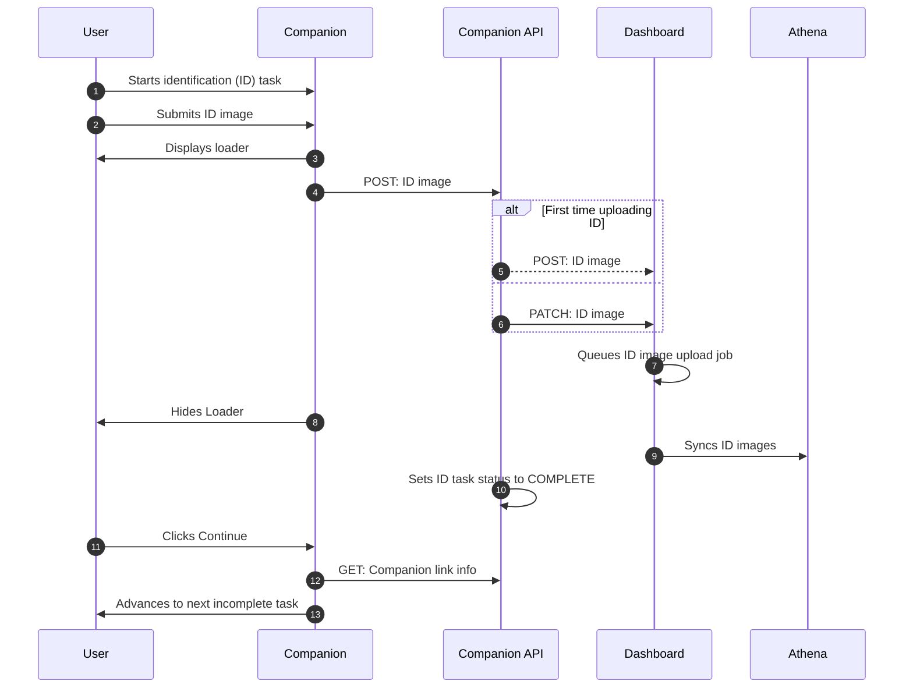

# Identification Task Sequence

```mermaid
sequenceDiagram
    autonumber

    %% Nodes
    participant User
    participant Companion
    participant Companion API
    participant Dashboard

    User->>Companion: Starts identification (ID) task
    User->>Companion: Submits ID image
    Companion->>User: Displays loader
    Companion->>Companion API: POST: ID image
    alt First time uploading ID
        Companion API-->>Dashboard: POST: ID image
    else
        Companion API->>Dashboard: PATCH: ID image
    end
    Dashboard->>Dashboard: Queues ID image upload job
    Companion->>User: Hides Loader
    Dashboard->>Athena: Syncs ID images
    Companion API->>Companion API: Sets ID task status to COMPLETE
    User->>Companion: Clicks Continue
    Companion->>Companion API: GET: Companion link info
    Companion->>User: Advances to next incomplete task
```
