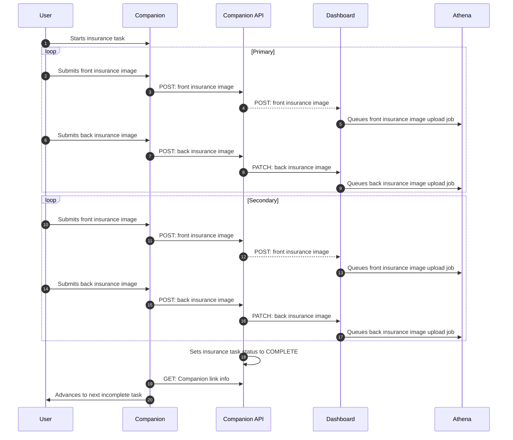

# Insurance Task Sequence

```mermaid
sequenceDiagram
    autonumber

    %% Nodes
    participant User
    participant Companion
    participant Companion API
    participant Dashboard

    User->>Companion: Starts insurance task

    loop Primary
        User->>Companion: Submits front insurance image
        Companion->>Companion API: POST: front insurance image
        Companion API-->>Dashboard: POST: front insurance image
        Dashboard->>Athena: Queues front insurance image upload job
        User->>Companion: Submits back insurance image
        Companion->>Companion API: POST: back insurance image
        Companion API->>Dashboard: PATCH: back insurance image
        Dashboard->>Athena: Queues back insurance image upload job
    end

    loop Secondary
        User->>Companion: Submits front insurance image
        Companion->>Companion API: POST: front insurance image
        Companion API-->>Dashboard: POST: front insurance image
        Dashboard->>Athena: Queues front insurance image upload job
        User->>Companion: Submits back insurance image
        Companion->>Companion API: POST: back insurance image
        Companion API->>Dashboard: PATCH: back insurance image
        Dashboard->>Athena: Queues back insurance image upload job
    end

    Companion API->>Companion API: Sets insurance task status to COMPLETE
    Companion->>Companion API: GET: Companion link info
    Companion->>User: Advances to next incomplete task
```
