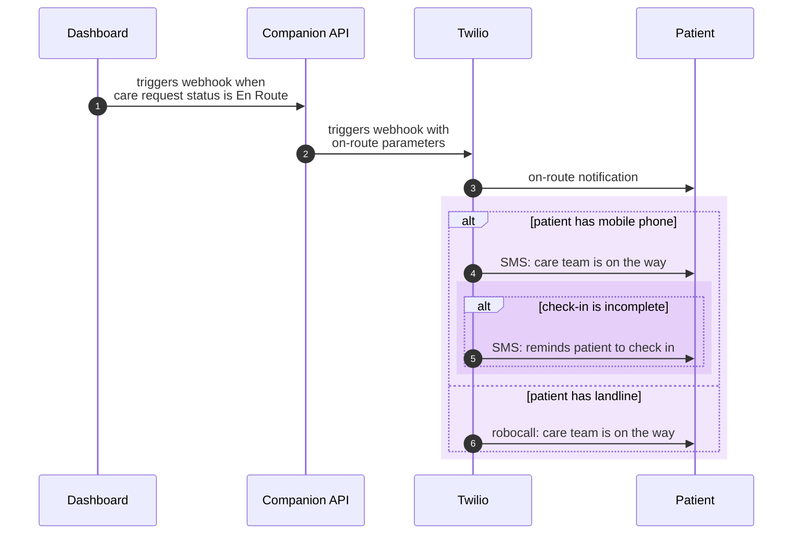

# On Route Notification Sequence

```mermaid
sequenceDiagram
    autonumber

    %% Nodes
    participant Dashboard as Dashboard
    participant CompanionAPI as Companion API
    participant Twilio
    participant Patient

    Dashboard->>CompanionAPI: triggers webhook when <br> care request status is En Route
    CompanionAPI->>Twilio: triggers webhook with <br> on-route parameters
    Twilio->>Patient: on-route notification

    rect rgb(127, 17, 224, 0.1)
        alt patient has mobile phone
            Twilio->>Patient: SMS: care team is on the way
                rect rgb(127, 17, 224, 0.1)
                    alt check-in is incomplete
                        Twilio->>Patient: SMS: reminds patient to check in
                    end
                end

        else patient has landline
            Twilio->>Patient: robocall: care team is on the way
        end
    end
```
