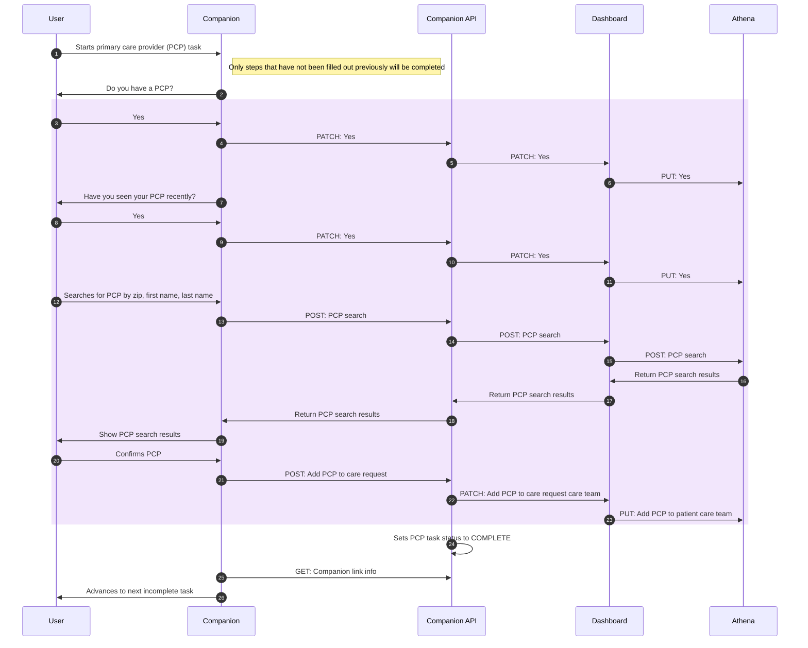

# PCP Task Sequence

```mermaid
sequenceDiagram
    autonumber

    %% Nodes
    participant User
    participant Companion
    participant Companion API
    participant Dashboard
    participant Athena

    User->>Companion: Starts primary care provider (PCP) task

    note right of Companion: Only steps that have not been filled out previously will be completed

    Companion->>User: Do you have a PCP?

    rect rgb(127, 17, 224, 0.1)
        User->>Companion: Yes
        Companion->>Companion API: PATCH: Yes
        Companion API->>Dashboard: PATCH: Yes
        Dashboard->>Athena: PUT: Yes
        Companion->>User: Have you seen your PCP recently?
        User->>Companion: Yes
        Companion->>Companion API: PATCH: Yes
        Companion API->>Dashboard: PATCH: Yes
        Dashboard->>Athena: PUT: Yes
        User->>Companion: Searches for PCP by zip, first name, last name
        Companion->>Companion API: POST: PCP search
        Companion API->>Dashboard: POST: PCP search
        Dashboard->>Athena: POST: PCP search
        Athena->>Dashboard: Return PCP search results
        Dashboard->>Companion API: Return PCP search results
        Companion API->>Companion: Return PCP search results
        Companion->>User: Show PCP search results
        User->>Companion: Confirms PCP
        Companion->>Companion API: POST: Add PCP to care request
        Companion API->>Dashboard: PATCH: Add PCP to care request care team
        Dashboard->>Athena: PUT: Add PCP to patient care team
    end

    Companion API->>Companion API: Sets PCP task status to COMPLETE
    Companion->>Companion API: GET: Companion link info
    Companion->>User: Advances to next incomplete task
```
