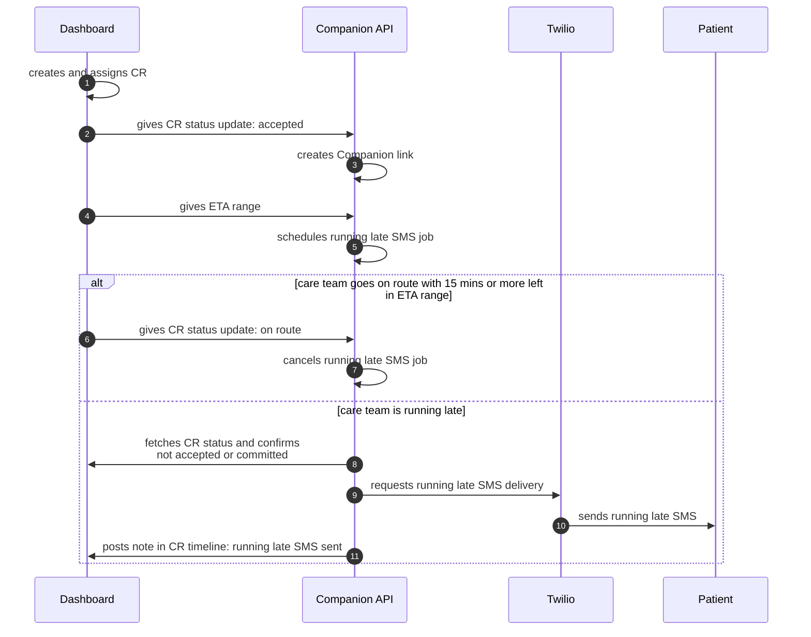

# Running Late Notification Sequence

```mermaid
sequenceDiagram
    autonumber

    %% Nodes
    participant Dashboard as Dashboard
    participant CompanionAPI as Companion API
    participant Twilio
    participant Patient

    Dashboard->>Dashboard: creates and assigns CR
    Dashboard->>CompanionAPI: gives CR status update: accepted
    CompanionAPI->>CompanionAPI: creates Companion link
    Dashboard->>CompanionAPI: gives ETA range
    CompanionAPI->>CompanionAPI: schedules running late SMS job

    alt care team goes on route with 15 mins or more left in ETA range
        Dashboard->>CompanionAPI: gives CR status update: on route
        CompanionAPI->>CompanionAPI: cancels running late SMS job
    else care team is running late
        CompanionAPI->>Dashboard: fetches CR status and confirms <br> not accepted or committed
        CompanionAPI->>Twilio: requests running late SMS delivery
        Twilio->>Patient: sends running late SMS
        CompanionAPI->>Dashboard: posts note in CR timeline: running late SMS sent
    end

```
