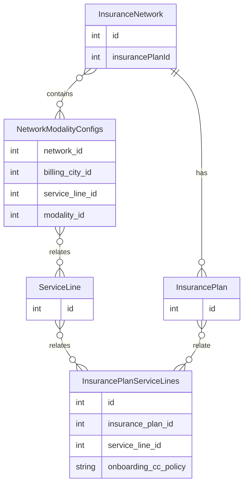

# Insurance Network

```mermaid
erDiagram
InsuranceNetwork ||--o{ InsurancePlan : has
InsuranceNetwork o{--o{ NetworkModalityConfigs : contains
NetworkModalityConfigs o{--o{ ServiceLine : relates
ServiceLine o{--o{ InsurancePlanServiceLines : relates
InsurancePlan o{--o{ InsurancePlanServiceLines : relate

InsuranceNetwork {
    int id
    int insurancePlanId
}
InsurancePlan {
    int id
}
NetworkModalityConfigs {
    int network_id
    int billing_city_id
    int service_line_id
    int modality_id
}
ServiceLine {
    int id
}
InsurancePlanServiceLines {
    int id
    int insurance_plan_id
    int service_line_id
    string onboarding_cc_policy
}
```
