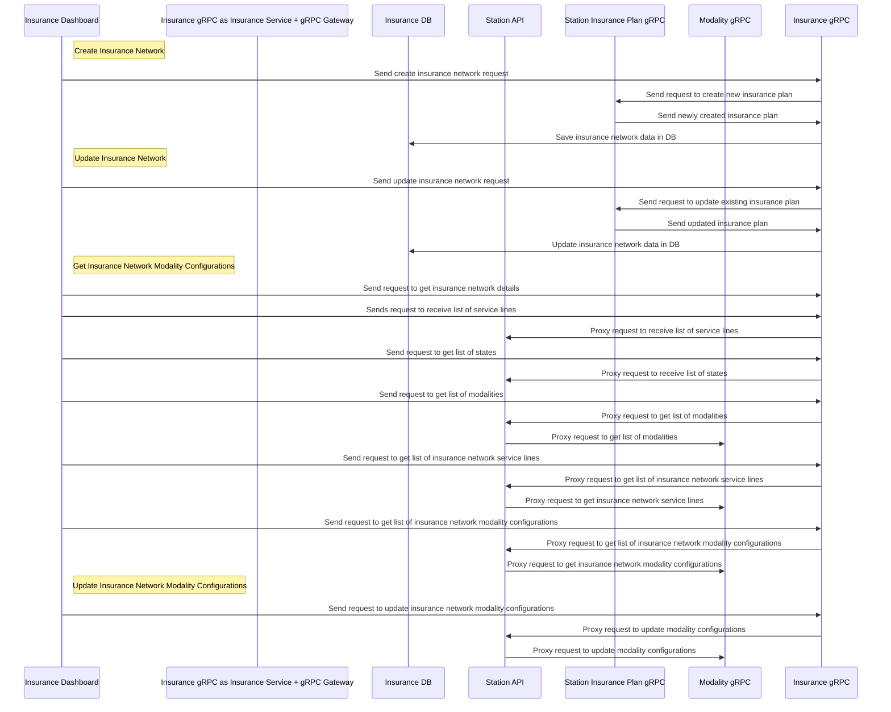

# Insurance Service

## Insurance Network

Insurance Network is a replacement of current Station Insurance Plan. The main difference from Insurance Network vs Insurance Plan is that Insurance Network is no longer tied to State, so we can operate with the same Insurance Network in multiple markets.

Insurance Network has corresponding Insurance Plan created in Station, so from Station and AOB perspective we still can operate with Insurance Plan model, which has less development impact on the project.

Insurance network replicates all configurations available on Station now, but which moved to the Insurance Dashboard UI.

## Modality Configurations

Network modality configurations regulates business modality rules for given Insurance Network based on billing city and service line.
