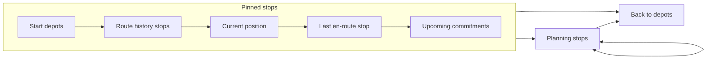
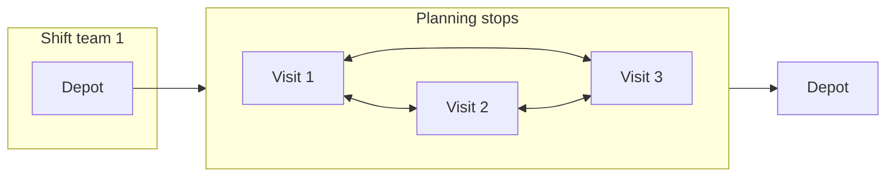
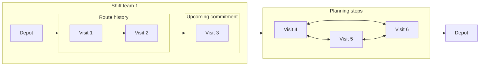
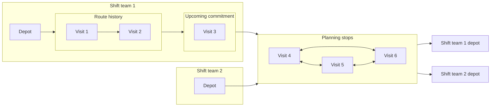

## Distance matrix

The logistics service computes a matrix composed of the distances between the following
segments:

### Pinned stops

Pinned stops are the unmodifiable list of stops for each shift teamd. The last stop is called **tail stop** and can connect either to the planning stops or go straight back to the depot.

#### Depots

The depots are the stops where the shift teams start and end. A market could have multiple depots.

The only case when we need distances from depots to planning stops is when the depot is the tail of the pinned stops (no route history and no upcoming commitments).

#### Route history stops

All the visits that have at least transitioned to `COMMITTED` state and breaks that have been already requested.

#### Current position

The current location of the shift team.

When an `ON_ROUTE` stop is the last route history stop, Optimizer
injects the current position "just before" that en-route stop.
Thus in that case, we need to compute the next distance from en-route stop to the next upcoming commitment.

For optimization, we normally only set the current location to the previous visit or depot.

### Planning stops

All the visits and unrequested breaks that are not in any route history yet and can be moved around and connect to each other. Thus we need to compute "planning stops to planning stops" distances.

### Upcoming commitments

These are the next visits the shift teams will handle and are pinned to their schedules.

### Examples

Here are some examples of how distances matrix would look like.

One shift team with no route history:

One shift team with route history and upcoming commitment.

Two shift teams, one with route history and the other without route history:

