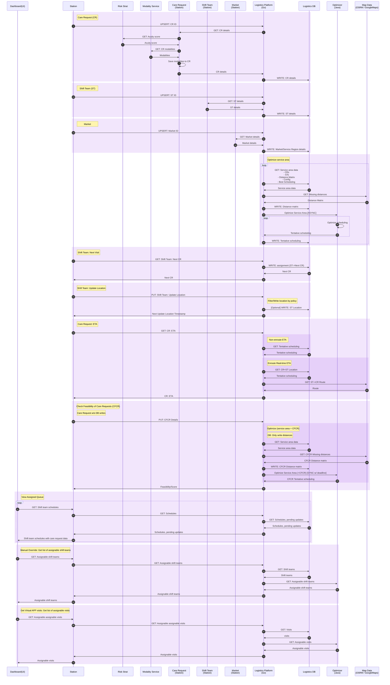

# Data flow diagram

```mermaid
sequenceDiagram
    autonumber

    %% Nodes
    participant Dashboard as Dashboard(UI)
    participant Station
    participant RS as Risk Strat
    participant MS as Modality Service
    participant CR as Care Request<br>(Station)
    participant ShiftTeam as Shift Team<br>(Station)
    participant Market as Market<br>(Station)

    participant LP as Logistics Platform<br>(Go)
    participant LPDB as Logistics DB
    participant Optimizer as Optimizer<br>(Java)
    participant MapData as Map Data<br>(OSRM / GoogleMaps)

    %% Flows
    rect rgb(127, 17, 224, 0.1)
        note right of Station: Care Request (CR)

        Station ->> LP: UPSERT: CR ID
        LP ->> CR: GET: CR details
        CR ->> RS: GET: Acuity score
        RS ->> CR: Acuity score
        CR ->> MS: GET: CR modalities
        MS ->> CR: Modalities
        CR ->> CR: Save modalities to CR
        CR ->> LP: CR details
        LP ->> LPDB: WRITE: CR details
    end

    rect rgb(127, 17, 224, 0.1)
        note right of Station: Shift Team (ST)

        Station ->> LP: UPSERT: ST ID
        LP ->> ShiftTeam: GET: ST details
        ShiftTeam ->> LP: ST details
        LP ->> LPDB: WRITE: ST details
    end

     rect rgb(127, 17, 224, 0.1)
        note right of Station: Market

        Station ->> LP: UPSERT: Market ID
        LP ->> Market: GET: Market details
        Market ->> LP: Market details
        LP ->> LPDB: WRITE: Market/Service Region details
    end

    rect rgb(127, 17, 224, 0.1)
        note right of LP: Optimize service area

        loop
            LP ->> LPDB: GET: Service area data<br>- CRs<br>- STs<br>- Distance Matrix<br>- Config<br>- Best Scheduling
            LPDB ->> LP: Service area data

            LP ->> MapData: GET: Missing distances
            MapData ->> LP: Distance Matrix
            LP ->> LPDB: WRITE: Distance matrix

            LP ->> Optimizer: Optimize Service Area [ASYNC]
            loop
                Optimizer ->> Optimizer: Optimize scheduling
                Optimizer ->> LP: Tentative scheduling
            end
            LP ->> LPDB: WRITE: Tentative scheduling
        end
    end

    rect rgb(127, 17, 224, 0.1)
        note right of Station: Shift Team: Next Visit

        Station ->> LP: GET: Shift Team: Next CR
        LP ->> LPDB: WRITE: assignment (ST->Next CR)
        LPDB ->> LP: Next CR
        LP ->> Station: Next CR
    end

    rect rgb(127, 17, 224, 0.1)
        note right of Station: Shift Team: Update Location

        Station ->> LP: PUT: Shift Team: Update Location
        note right of LP: Filter/Write location by policy
        LP ->> LPDB: [Optional] WRITE: ST Location
        LP ->> Station: Next Update Location Timestamp
    end

    rect rgb(127, 17, 224, 0.1)
        note right of Station: Care Request: ETA

        Station ->> LP: GET: CR: ETA

        rect rgb(127, 17, 224, 0.1)
            note right of LP: Non-enroute ETA

            LP ->> LPDB: GET: Tentative scheduling
            LPDB ->> LP: Tentative scheduling
        end

        rect rgb(127, 17, 224, 0.1)
            note right of LP: Enroute Real-time ETA

            LP ->> LPDB: GET: CR+ST Location
            LPDB ->> LP: Tentative scheduling
            LP ->> MapData: GET: ST->CR Route
            MapData ->> LP: Route
        end

        LP ->> Station: CR: ETA
    end

    rect rgb(127, 17, 224, 0.1)
        note right of Station: Check Feasibility of Care Requests (CFCR)
        note right of Station: Care Request w/o DB writes

        Station ->> LP: PUT: CFCR Details

        rect rgb(127, 17, 224, 0.1)
            note right of LP: Optimize (service area + CFCR)
            note right of LP: DB: Only write distances

            LP ->> LPDB: GET: Service area data
            LPDB ->> LP: Service area data

            LP ->> MapData: GET: CFCR Missing distances
            MapData ->> LP: CFCR Distance matrix
            LP ->> LPDB: WRITE: CFCR Distance matrix

            LP ->> Optimizer: Optimize Service Area (+CFCR) [SYNC w/ deadline]
            Optimizer ->> LP: CFCR Tentative scheduling
        end

        LP ->> Station: Feasibility/Score
    end

    rect rgb(127, 17, 224, 0.1)
        note right of Dashboard: View Assigned Queue

        loop
            Dashboard ->> Station: GET: Shift team schedules
            Station ->> LP: GET: Schedules
            LP ->> LPDB: GET: Schedules, pending updates
            LPDB ->> LP: Schedules, pending updates
            LP ->> Station: Schedules, pending updates
            Station ->> Dashboard: Shift team schedules with care request data
        end
    end

    rect rgb(127, 17, 224, 0.1)
        note right of Dashboard: Manual Override: Get list of assignable shift teams

        Dashboard ->> Station: GET: Assignable shift teams
        Station ->> LP: GET: Assignable shift teams
        LP ->> LPDB: GET: Shift teams
        LPDB ->> LP: Shift teams
        LP ->> Optimizer: GET: Assignable shift teams
        Optimizer ->> LP: Assignable shift teams
        LP ->> Station: Assignable shift teams
        Station ->> Dashboard: Assignable shift teams
    end

    rect rgb(127, 17, 224, 0.1)
        note right of Dashboard: Get Virtual APP visits: Get list of assignable visits

        Dashboard ->> Station: GET: Assignable assignable visits
        Station ->> LP: GET: Assignable assignable visits
        LP ->> LPDB: GET: Visits
        LPDB ->> LP: visits
        LP ->> Optimizer: GET: Assignable visits
        Optimizer ->> LP: Assignable visits
        LP ->> Station: Assignable visits
        Station ->> Dashboard: Assignable visits
    end
```
