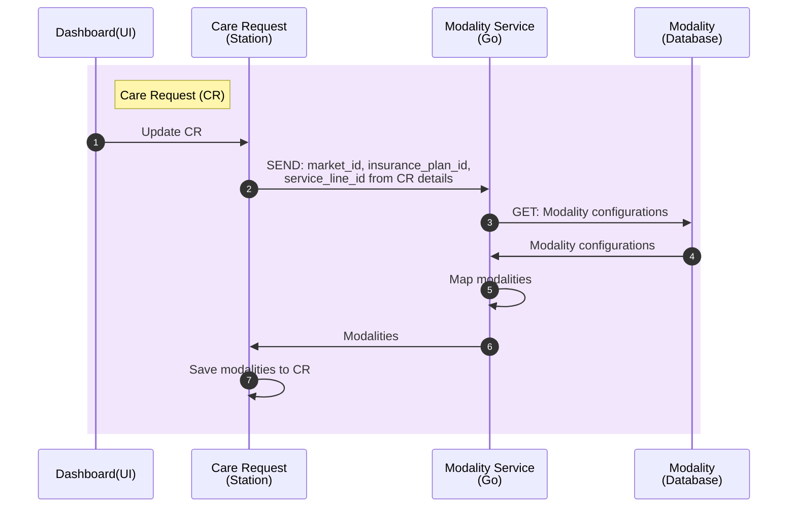

# Data flow diagram

```mermaid
sequenceDiagram
    autonumber

    %% Nodes
    participant Dashboard as Dashboard(UI)
    participant CR as Care Request<br>(Station)
    participant MS as Modality Service<br>(Go)
    participant MSDB as Modality<br>(Database)

    %% Flows
    rect rgb(127, 17, 224, 0.1)
        note right of Dashboard: Care Request (CR)

        Dashboard ->> CR: Update CR
        CR ->> MS: SEND: market_id, insurance_plan_id,<br>service_line_id from CR details
        MS ->> MSDB: GET: Modality configurations
        MSDB ->> MS: Modality configurations
        MS ->> MS: Map modalities
        MS ->> CR: Modalities
        CR ->> CR: Save modalities to CR
    end
```
