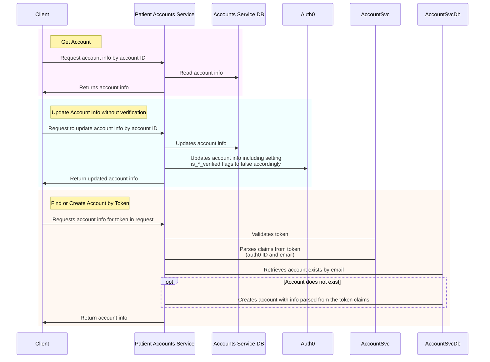
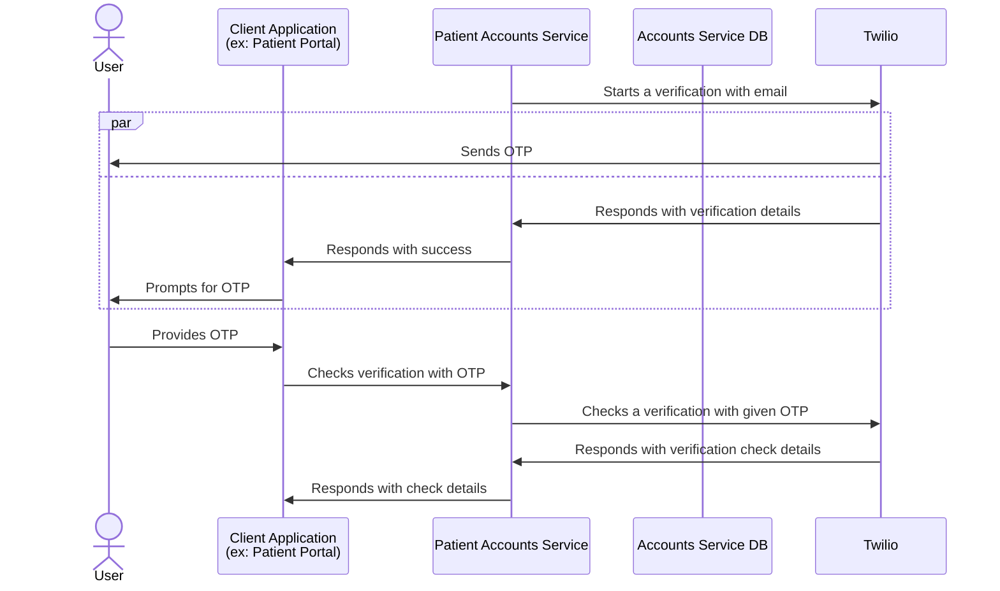
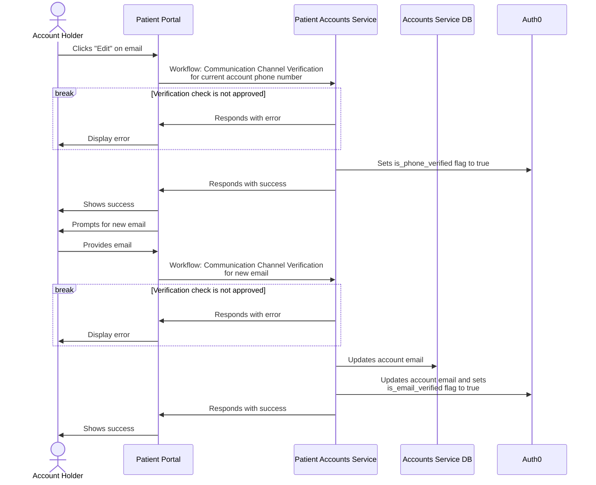
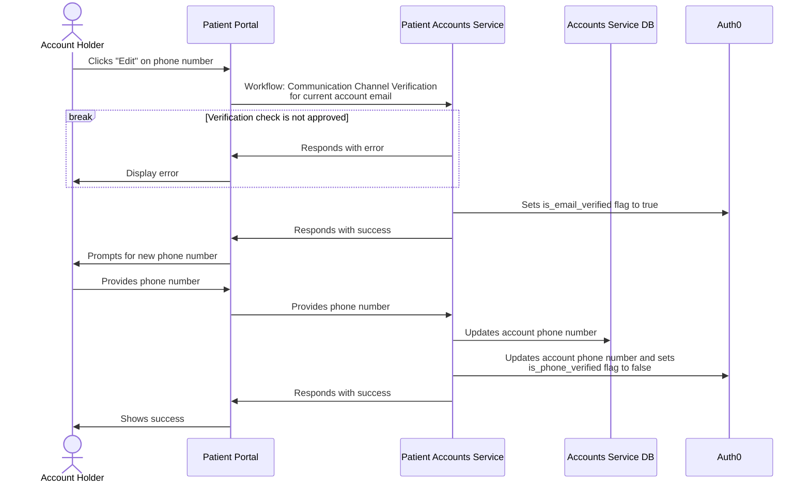
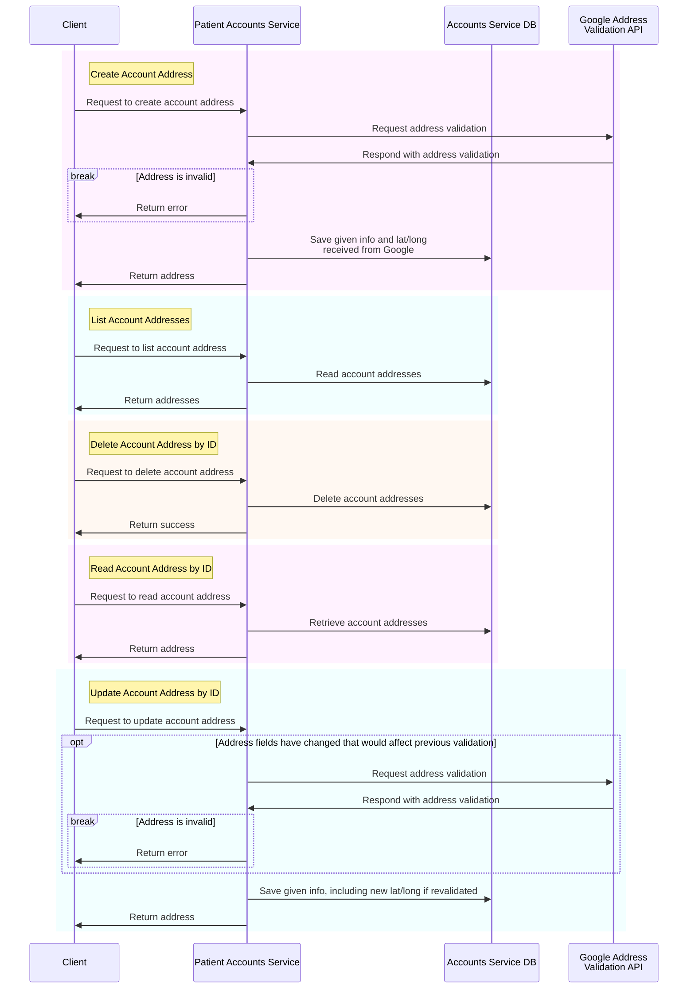
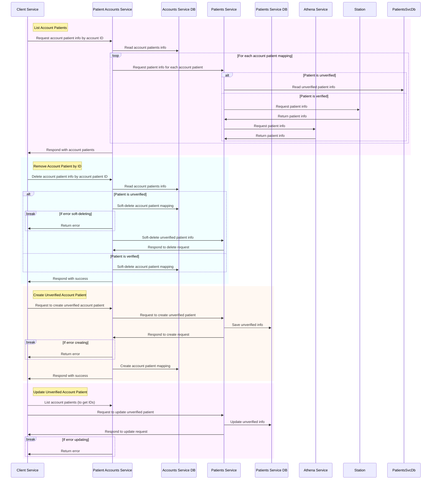

# Patient Accounts Sequence Diagrams

## Account Workflows

Standard workflows:

### Communication Channel Verification

The below workflow can be used to verify communication channels for:

- validating the user is who they say they are (i.e., validating access to channel values already associated with the account)
- validating new values for communication channels (i.e., updating the account email)

The workflow can be used to validate emails and phone numbers (via both SMS and voice channels). The diagram below will describe the flow for email verification, but the general process is the same for any supported communication channel. The workflow is intentionally left open ended in the patient accounts service because the next steps depend on the purpose of the verification (e.g., identity verification or channel verification).

### Email Update Workflow

[EDD Reference](../../../edd/patient-portal/account-profile-and-settings.md#verifying-communication-channels)

The following workflow leverages [Communication Channel Verification](#communication-channel-verification).

### Phone Update Workflow

[EDD Reference](../../../edd/patient-portal/account-profile-and-settings.md#verifying-communication-channels)

The following workflow leverages [Communication Channel Verification](#communication-channel-verification).

## Account Address Workflows

## Account Patient Workflows

