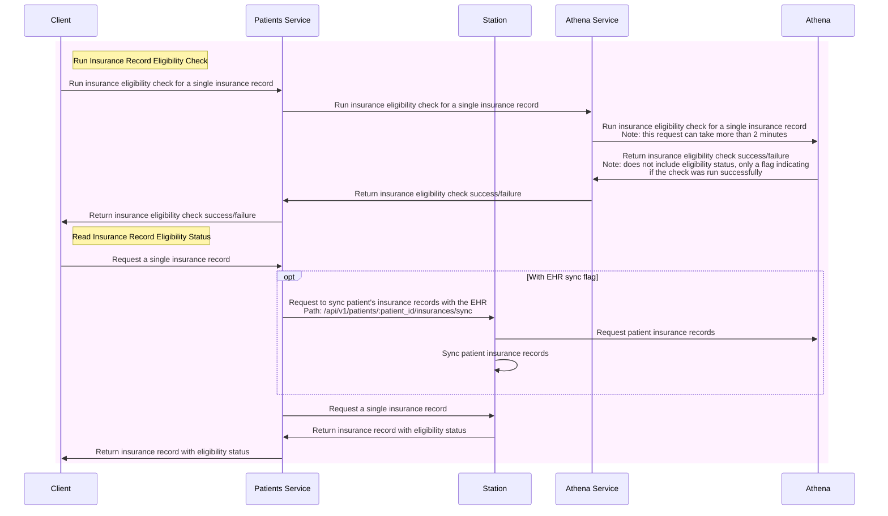

# Patient Insurance

## Eligibility

```mermaid
sequenceDiagram
    %% Nodes
    participant Client
    participant PatientsSvc as Patients Service
    participant Station
    participant AthenaSvc as Athena Service
    participant Athena

    rect rgba(255, 0, 255, .05)
        note right of Client: Run Insurance Record Eligibility Check
        Client->>PatientsSvc: Run insurance eligibility check for a single insurance record
        PatientsSvc->>AthenaSvc: Run insurance eligibility check for a single insurance record
        AthenaSvc->>Athena: Run insurance eligibility check for a single insurance record<br>Note: this request can take more than 2 minutes
        Athena->>AthenaSvc: Return insurance eligibility check success/failure<br>Note: does not include eligibility status, only a flag indicating<br>if the check was run successfully
        AthenaSvc->>PatientsSvc: Return insurance eligibility check success/failure
        PatientsSvc->>Client: Return insurance eligibility check success/failure

        note right of Client: Read Insurance Record Eligibility Status
        Client->>PatientsSvc: Request a single insurance record
        opt With EHR sync flag
            PatientsSvc->>Station: Request to sync patient's insurance records with the EHR<br>Path: /api/v1/patients/:patient_id/insurances/sync
            Station->>Athena: Request patient insurance records
            Station->>Station: Sync patient insurance records
        end

        PatientsSvc->>Station: Request a single insurance record
        Station->>PatientsSvc: Return insurance record with eligibility status
        PatientsSvc->>Client: Return insurance record with eligibility status
    end
```
