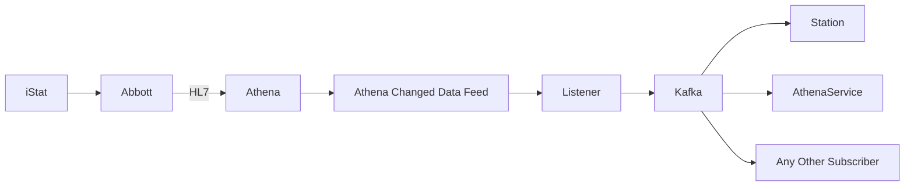
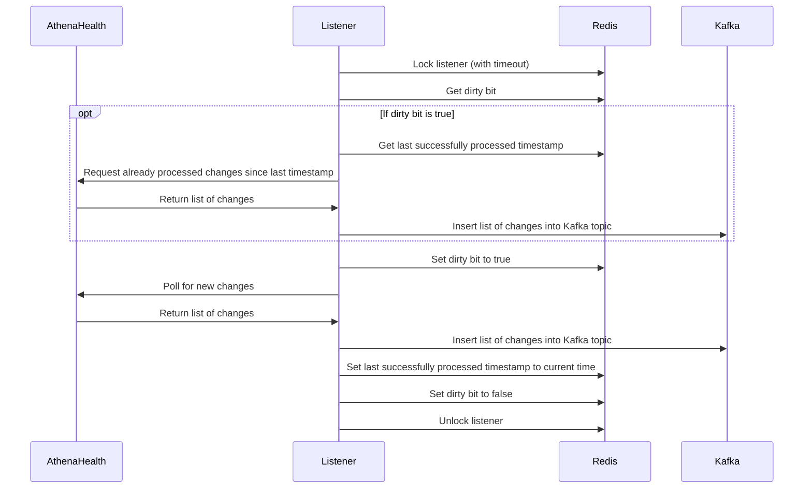
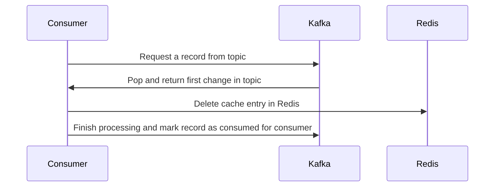

# Athena Listener

## Kafka Infrastructure

```mermaid
flowchart LR
  iStat --> Abbott
  Abbott --HL7--> Athena
  Athena --> AthenaChanged[Athena Changed Data Feed]
  AthenaChanged --> Listener
  Listener --> Kafka
  Kafka --> Station
  Kafka --> AthenaService
  Kafka --> Other[Any Other Subscriber]
```

## Producer Sequence Diagram

```mermaid
sequenceDiagram
  %% Nodes
  participant AthenaHealth
  participant Listener
  participant Redis
  participant Kafka

  Listener->>Redis: Lock listener (with timeout)
  Listener->>Redis: Get dirty bit
  opt If dirty bit is true
    Listener->>Redis: Get last successfully processed timestamp
    Listener->>AthenaHealth: Request already processed changes since last timestamp
    AthenaHealth->>Listener: Return list of changes
    Listener->>Kafka: Insert list of changes into Kafka topic
  end
  Listener->>Redis: Set dirty bit to true
  Listener->>AthenaHealth: Poll for new changes
  AthenaHealth->>Listener: Return list of changes
  Listener->>Kafka: Insert list of changes into Kafka topic
  Listener->>Redis: Set last successfully processed timestamp to current time
  Listener->>Redis: Set dirty bit to false
  Listener->>Redis: Unlock listener
```

## Consumer Sequence Diagram

```mermaid
sequenceDiagram
  %% Nodes
  participant Consumer
  participant Kafka
  participant Redis

  Consumer->>Kafka: Request a record from topic
  Kafka->>Consumer: Pop and return first change in topic
  Consumer->>Redis: Delete cache entry in Redis
  Consumer->>Kafka: Finish processing and mark record as consumed for consumer
```
