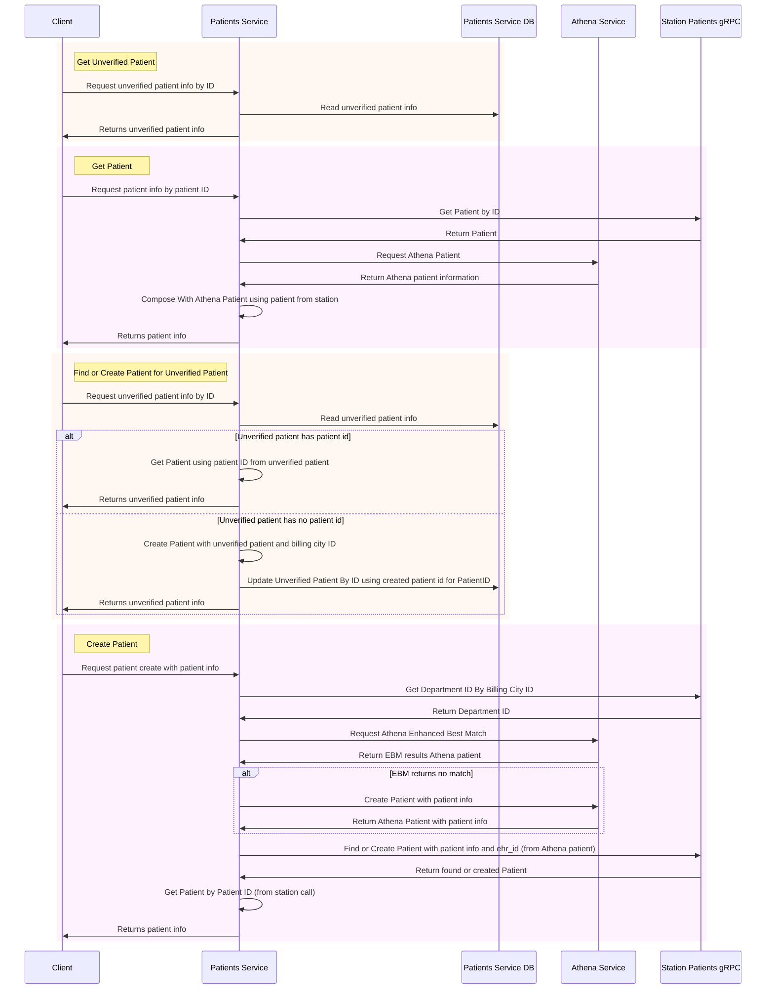

# Patient Sequence Diagrams

## Patient Workflows

Standard workflows:

Notes:

- We will use Athena [Enhanched Best Match](https://docs.athenahealth.com/api/workflows/enhanced-best-match), to determine if a `patient` has an Athena record, on Patient Create. If an appropriate match is found we use the Athena patient to call `station` gRPC endpoint `FindOrCreatePatient` which will query `station` DB using the `ehr_id` (Athena patient ID)
- In the EBM request `ReturnBestMatches` and `UseSoundexSearch` will be set to `false` to increase strength of match. A score of 26 or greater will be required to select patient from EBM results.
