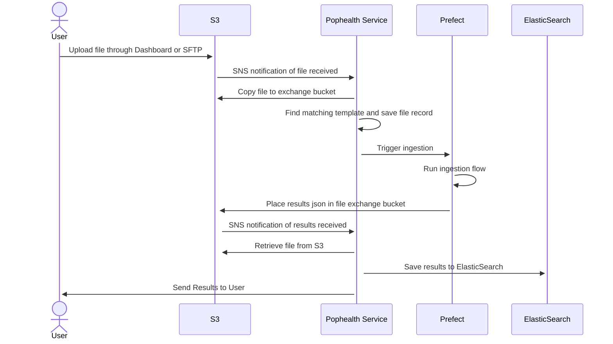
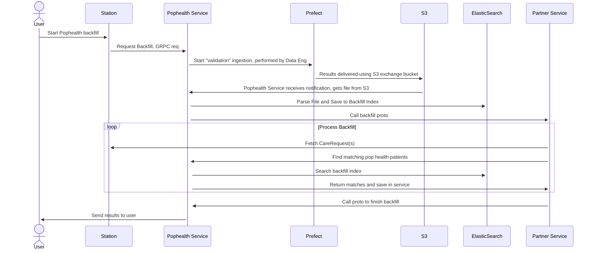

### Ingestion Sequence Without Errors

```mermaid
sequenceDiagram
    Actor User

    User->>+S3: Upload file through Dashboard or SFTP
    S3->>+Pophealth Service: SNS notification of file received
    Pophealth Service->>+S3: Copy file to exchange bucket
    Pophealth Service->>+Pophealth Service: Find matching template and save file record
    Pophealth Service->>+Prefect: Trigger ingestion
    Prefect->>+Prefect: Run ingestion flow
    Prefect->>+S3: Place results json in file exchange bucket
    S3->>+Pophealth Service: SNS notification of results received
    Pophealth Service->>+S3: Retrieve file from S3
    Pophealth Service->>+ElasticSearch: Save results to ElasticSearch
    Pophealth Service->>+User: Send Results to User
```

### Backfill Sequence Without Errors

```mermaid
sequenceDiagram
    Actor User

    User->>+Station: Start Pophealth backfill
    Station->>+Pophealth Service: Request Backfill, GRPC req
    Pophealth Service->>+Prefect: Start "validation" ingestion, performed by Data Eng
    Prefect->>+S3: Results delivered using S3 exchange bucket
    S3->>+Pophealth Service: Pophealth Service receives notification, gets file from S3
    Pophealth Service->>+ElasticSearch: Parse File and Save to Backfill Index
    Pophealth Service->>+Partner Service: Call backfill proto
    loop Process Backfill
        Partner Service->>+Station: Fetch CareRequest(s)
        Partner Service->>+Pophealth Service: Find matching pop health patients
        Pophealth Service->>+ElasticSearch: Search backfill index
        Pophealth Service->>+Partner Service: Return matches and save in service
    end
    Partner Service->>+Pophealth Service: Call proto to finish backfill
    Pophealth Service->>+User: Send results to user
```
