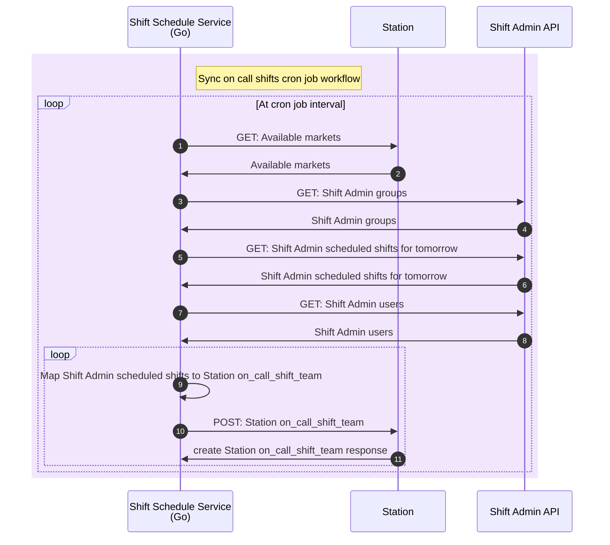

# Shift Schedule Service

```mermaid
sequenceDiagram
    %% Nodes
    participant ShiftSchedule as Shift Schedule Service<br>(Go)
    participant Station as Station
    participant ShiftAdmin as Shift Admin API

    %% Flows
    autonumber
    rect rgb(127, 17, 224, 0.1)
        note right of ShiftSchedule: Sync on call shifts cron job workflow

        loop At cron job interval
            ShiftSchedule ->> Station: GET: Available markets
            Station ->> ShiftSchedule: Available markets

            ShiftSchedule ->> ShiftAdmin: GET: Shift Admin groups
            ShiftAdmin ->> ShiftSchedule: Shift Admin groups

            ShiftSchedule ->> ShiftAdmin: GET: Shift Admin scheduled shifts for tomorrow
            ShiftAdmin ->> ShiftSchedule: Shift Admin scheduled shifts for tomorrow

            ShiftSchedule ->> ShiftAdmin: GET: Shift Admin users
            ShiftAdmin ->> ShiftSchedule: Shift Admin users

            loop
                ShiftSchedule ->> ShiftSchedule: Map Shift Admin scheduled shifts to Station on_call_shift_team
                ShiftSchedule ->> Station: POST: Station on_call_shift_team
                Station ->> ShiftSchedule: create Station on_call_shift_team response
            end
        end
    end
```
