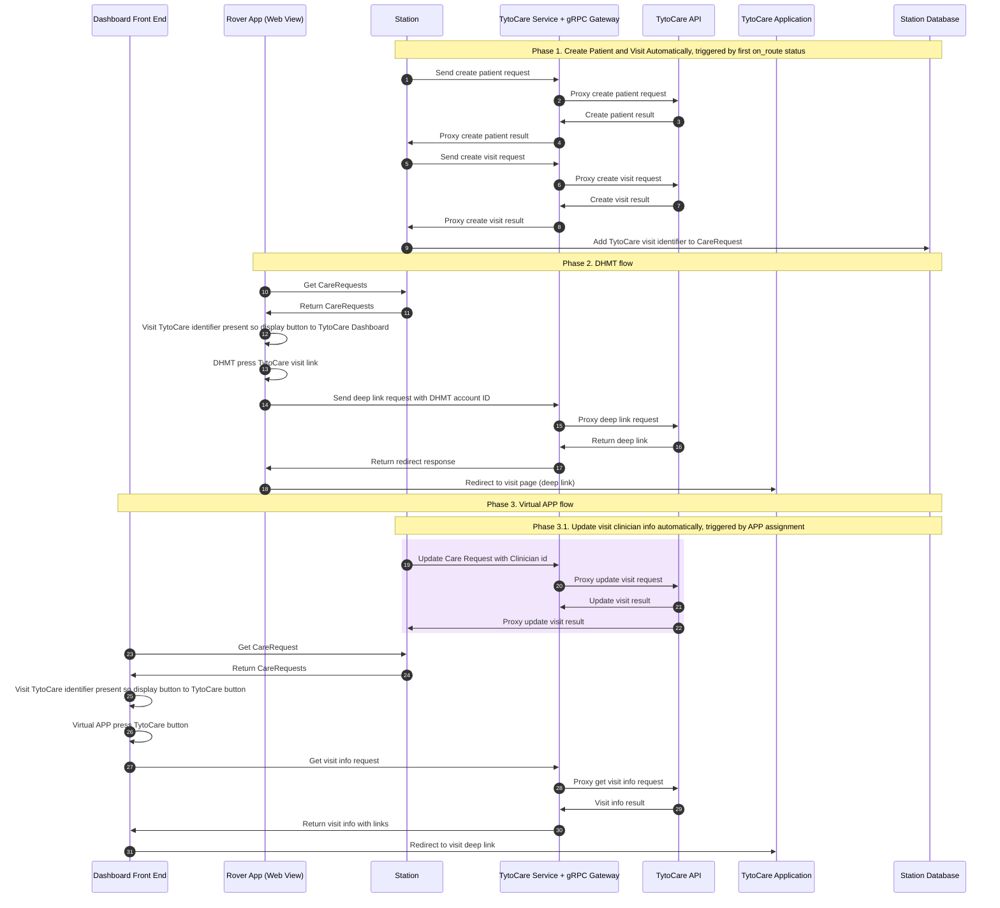

# TytoCare Service

```mermaid
sequenceDiagram
    autonumber

    %% Nodes
    participant Dashboard as Dashboard Front End
    participant Rover as Rover App (Web View)
    participant Station
    participant TytoSvc as TytoCare Service + gRPC Gateway
    participant TytoAPI as TytoCare API
    participant TytoUI as TytoCare Application
    participant Station Database

    %% Flows

    %%% Create Patient/Visit
    Note over Station, Station Database: Phase 1. Create Patient and Visit Automatically, triggered by first on_route status
    Station ->> TytoSvc: Send create patient request
    TytoSvc ->> TytoAPI: Proxy create patient request
    TytoAPI ->> TytoSvc: Create patient result
    TytoSvc ->> Station: Proxy create patient result

    Station ->> TytoSvc: Send create visit request
    TytoSvc ->> TytoAPI: Proxy create visit request
    TytoAPI ->> TytoSvc: Create visit result
    TytoSvc ->> Station: Proxy create visit result
    Station ->> Station Database: Add TytoCare visit identifier to CareRequest

    %%% DHMT Flow
    Note over Rover, Station Database: Phase 2. DHMT flow
    Rover ->> Station: Get CareRequests
    Station ->> Rover: Return CareRequests
    Rover ->> Rover: Visit TytoCare identifier present so display button to TytoCare Dashboard
    Rover ->> Rover: DHMT press TytoCare visit link
    Rover ->> TytoSvc: Send deep link request with DHMT account ID
    TytoSvc ->> TytoAPI: Proxy deep link request
    TytoAPI ->> TytoSvc: Return deep link
    TytoSvc ->> Rover: Return redirect response
    Rover ->> TytoUI: Redirect to visit page (deep link)

    %%% APP Flow
    Note over Dashboard, Station Database: Phase 3. Virtual APP flow
    Note over Station, Station Database: Phase 3.1. Update visit clinician info automatically, triggered by APP assignment

    rect rgb(127, 17, 224, 0.1)
        Station ->> TytoSvc: Update Care Request with Clinician id
        TytoSvc ->> TytoAPI: Proxy update visit request
        TytoAPI ->> TytoSvc: Update visit result
        TytoAPI ->> Station: Proxy update visit result
    end

    Dashboard ->> Station: Get CareRequest
    Station ->> Dashboard: Return CareRequests
    Dashboard ->> Dashboard: Visit TytoCare identifier present so display button to TytoCare button
    Dashboard ->> Dashboard: Virtual APP press TytoCare button
    Dashboard ->> TytoSvc: Get visit info request
    TytoSvc ->> TytoAPI: Proxy get visit info request
    TytoAPI ->> TytoSvc: Visit info result
    TytoSvc ->> Dashboard: Return visit info with links
    Dashboard ->> TytoUI: Redirect to visit deep link
```
