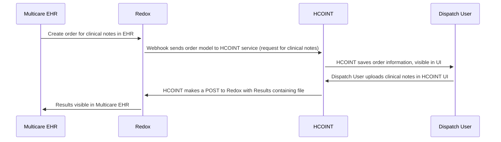

# EDD: HCOINT Migration

**Author:** [Carlos Garibay](carlos.garibay@*company-data-covered*.com), [Mike Lockwitz](michael.lockwitz@*company-data-covered*.com)

## Pre-review Checklist

Before scheduling your design review, ensure that you have checked all of the following boxes:

- [x] Familiarize yourself with our [EDR process](https://*company-data-covered*.atlassian.net/wiki/spaces/EN/pages/52002922/Process+Engineering+Design+Review)
- [x] Make sure PRD and EDD are aligned - EM

## Resources

PRD: No PRD exists since this was created before PRD/EDD process existed

Repository: [hco_integrator](https://github.com/*company-data-covered*/hco_integrator)

Existing application support docs: [Confluence HCO Int](https://*company-data-covered*.atlassian.net/wiki/spaces/DEV/pages/3346696/HCO+Int)

## Overview

Health Care Organization Integration (HCOINT) is utilized by an external partner to receive clinical notes from _company-data-covered_ for Medicare Waiver Patients by Advanced Care providers in the SEATAC market. The clinical notes are attached directly to a patients chart in the partner's Epic EHR and triggers a workflow in their billing department which results in reimbursement to _company-data-covered_ for the care we provided to the patient. The partner is not able to prioritize a workflow change or modification to existing connections to _company-data-covered_ through at least the end of the year. This application is currently used by <5 total users on a bi-weekly or monthly basis.

HCOINT was the original product used by Dispatch to determine if Redox was a viable solution to connect with external health systems. Although the project was successful, the application has not been adequately maintained and is now in need of engineering resources to bring it up to organization standards or a re-imagining of functionality into a more permanent solution including organization standards.

The following diagram gives a general overview of how the system currently works:

The application is currently hosted in AWS account `michaelsawsaccount` within ECS.

## Goals

- Maintain ability for _company-data-covered_ to attach clinical notes to an external partner patient’s chart after they have been transferred to Dispatch’s care and Dispatch has discharged them from active management.
- Minimize the amount of engineering effort because of the unplanned nature of the work and the current low usage of the functionality.
- Improve the system by adding observavility, debugging and alerting capabilities that it currently lacks.
- Leave opportunity for more partners to utilize similar functionality in the future as Advanced Care continues to grow in usage and importance to the business.

## Design Proposals

### Proposal 1 – Migrate existing HCOINT into Aptible (Selected)

Since this application is only used by one partner and is both used by less than 5 users on a bi-weekly or monthly bases, the intention is to spend as minimum resources as possible to bring it up to organizational standards. Therefore, the best option for now is to migrate it to Aptible and incorporate a few extra things that will not require a lot of resources, like increasing its code coverage to 80% and integrate Data Dog for logging and alerts.

The things to be done for the migration are:

1. Add required files and resources to Aptible.
2. Database migration to Aptible.
3. Add Circle CI tooling for running tests and sonarcloud.
4. Add endpoint in Redox console for QA or UAT.
5. Send test orders using Redox console to aptilble service.
6. Debug service and add log monitors in Datadog. I don't think additional metrics immediately we we can alert on failures using logs.
7. Setup prod Aptible resources and configure prod endpoint in Redox.
8. Make ticket for Redox support to update multicare connection.
9. Test connection with Multicare.
10. Remove old service hosted in ECS.

## Database Migration to Aptible

The current DB is in RDS. The proposal, given the application is used by a single partner and doesn't have high volume of data, is to use pg_dump to recreate the DB in Aptible. We will notify the partner of a maintenance period to make sure no updates occur when switching over to Aptible app in production.

Pros:

- Shortest path to solving immediate goals to bring HCOINT up to standards (aprox 2-3 eng weeks).
- Easy for anyone to maintain and deploy. This would be a rails app in Aptible.

Cons:

- Doesn’t make progress towards long term vision of how to support functionality.
- Requires bring application up to standards (test coverage, logging, metrics, etc)

### Proposal 2 – Rewrite HCOINT functionality into existing Redox solution in Elixir

Pros:

- Scalable solution which could account for future growth if this functionality continues to be requested by partners.
- Could leverage Redox code in Elixir and simplify app/make it more robust.

Cons:

- We do not officially support Elixir anymore so this would incur additional tech debt for the future.
- Most of the app would need to be re-written. No dev resources available in short term.

### Proposal 3 – Rewrite HCOINT functionality into Go service

Pros:

- Follows organizations best practices that all functionality gets written in Go.
- Allows for support of future growth.
- Creates a migration path for current Redox Elixir solution to sunset.

Cons:

- Will be time consuming and expensive for an application that has minimal use (aprox 10 times more than Proposal 1).

### Proposal 4 – Rewrite HCOINT functionality into CareManager application

Pros:

- Advanced care use case lives in Advanced Care application
- CareManager can just be the UI and it would interact with an HCOINT service

Cons:

- Care Orchestration does not have any historical knowledge of Redox integrations

### Proposal 5 – Do nothing and keep HCOINT as is

Pros:

- Least amount of eng effort

Cons:

- HCOINT stays special and doesn’t follow organizational standards for monitoring, logging, security
- No possible to remotely access box for troubleshooting

## Platform Components

This section does not apply since the application already exists and no new shared components are being added.

## Data Design & Schema Changes

This section does not apply since the data model already exists and there are no plans to change it.

## Metrics & Data Integration

What instrumentation will be done (outside of any handled intrinsically by standard frameworks)?

- Are the metrics going to the usual places or someplace where they might be less discoverable? If the latter, why?

  - Datadog will be used for service statistics to measure how much the system is being used and determine if it is worth investing more resources to migrate the application to a Go service. Will also add some Datadog APM features to increate observability.

## Error Handling & Alerting

What are the most likely failure points in this design?

- How will errors be handled?
  - We will incorporate Data Dog as the logging mechanism and add alerting on the most important errors so that actions can be taken when errors happen.

## Safety

No safety concerns since this is an existing application.

## Security

Are there any unusual security concerns around this design?

- New endpoints or methods of interaction within the system?
  - No
- New dependencies on external systems?
  - No
- New third party libraries?
  - No

## Audits and Logs

As mentioned in Error Handling & Alerting, Data Dog will be added for logging and no extra audits will be added to the existing application.

## Scalability

Where is this going to fall over?

- What are the expected bottlenecks in this design?
  - Since this application is currently being used by a single partner, there are no bottlenecks expected to happen based on how much the app has been used historically.
- Does this change introduce new fanout behavior that may impact other parts of the system?
  - No
- Does this change rely on existing known bottlenecks/high latency actions?
  - No
- Does this change introduce meaningful storage requirements (including for logging)?
  - No

## Cost

If the solution involves resources that are expected to increase with scale (e.g., AWS services), estimate the initial cost based on today's usage and projected cost 1-2 years out if it's expected to change substantially.

- 1 container for web server
- 1 container for Rails api
- 1 Postgres database

## Experimentation

How do we enable experimentation for different features?

- Currently no new features are planned for this application and if features are decided to be added in the future, they will be included as part of the migration to Go services.

## Testing

Are there components that will need to be manually tested?

- This application doesn’t have any automated end-to-end tests. So, after the migration to Aptible, a manual test will be required to make sure everything is working as expected. But since no new features are planned, no further manual testing will need to happen.

Are any load tests needed?

- No

## Training

Will this change require any end-user training?

- No new training is required since no changes in functionality are being introduced.

## Deployment

Are there any unusual notes about the deployment of this change?

- We will use Circle CI to manage application deployments because of the application stack closely resembles Express, which also uses Circle CI.

- Dependencies on updates covered by other designs?
  - No dependencies on other systems.
- Things that the DevOps or release teams need to know/do to deploy this change correctly?
  - Web service will need to be accessible from external traffic from Redox to send us messages.
- Are there any changes to run books/playbooks?
  - Yes, runbooks will need to get updated with new aptible access.
- Does anybody need to be made explicitly aware when this rolls out? If this is rolled back?
  - No
- Is there any reason this can't be trivially rolled back?
  - No

## Lifecycle management

Are any technology choices in danger of being sunset, abandoned, or deprecated?

- How will chosen products, service providers, technologies be observed for announcements of retirement?
  - We’re using standard ruby, rails, node, yarn for building and deploying application via docker containers so no risk that any of these technologies become deprecated.
