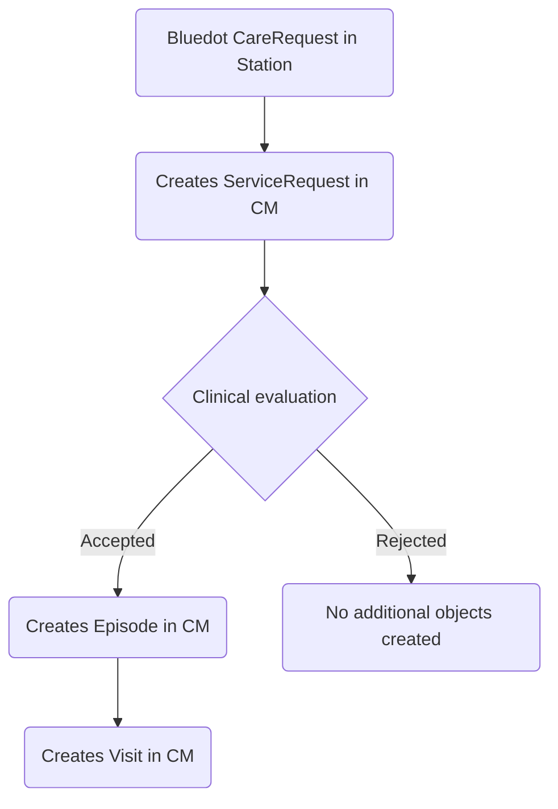
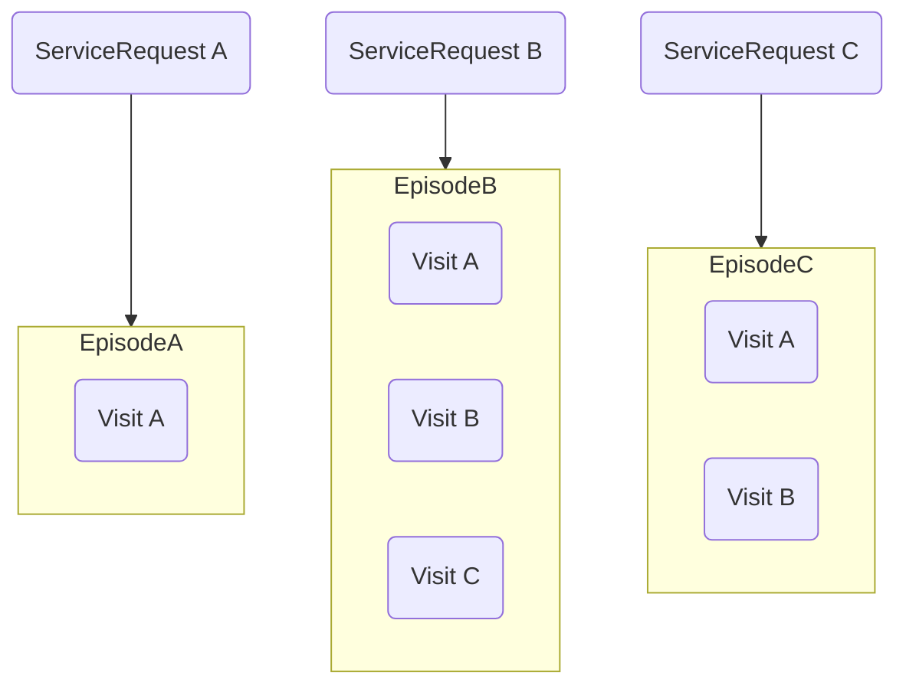
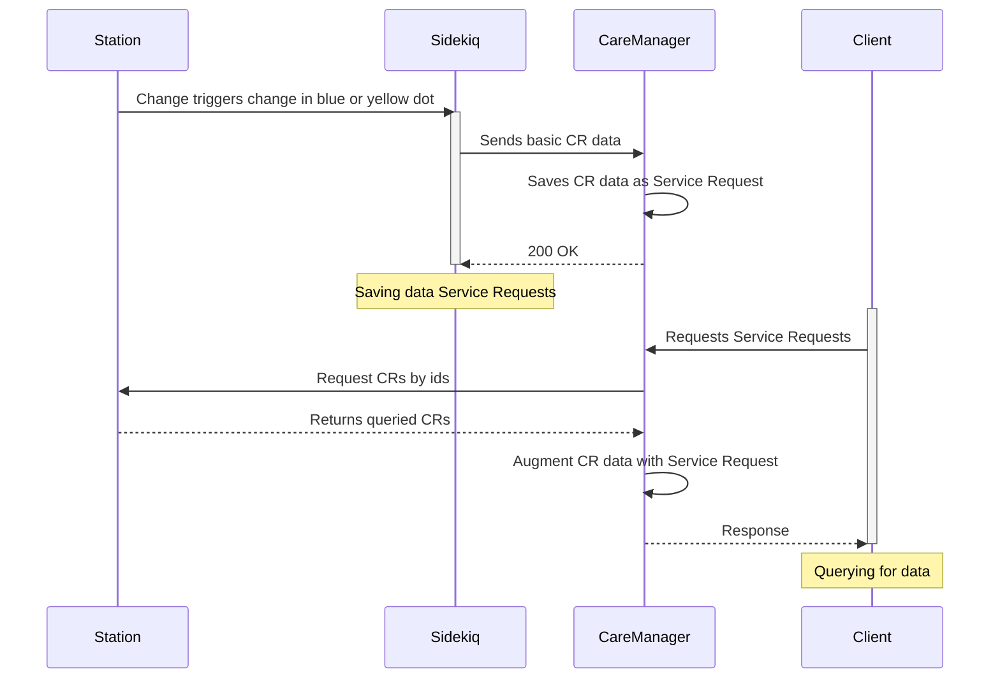
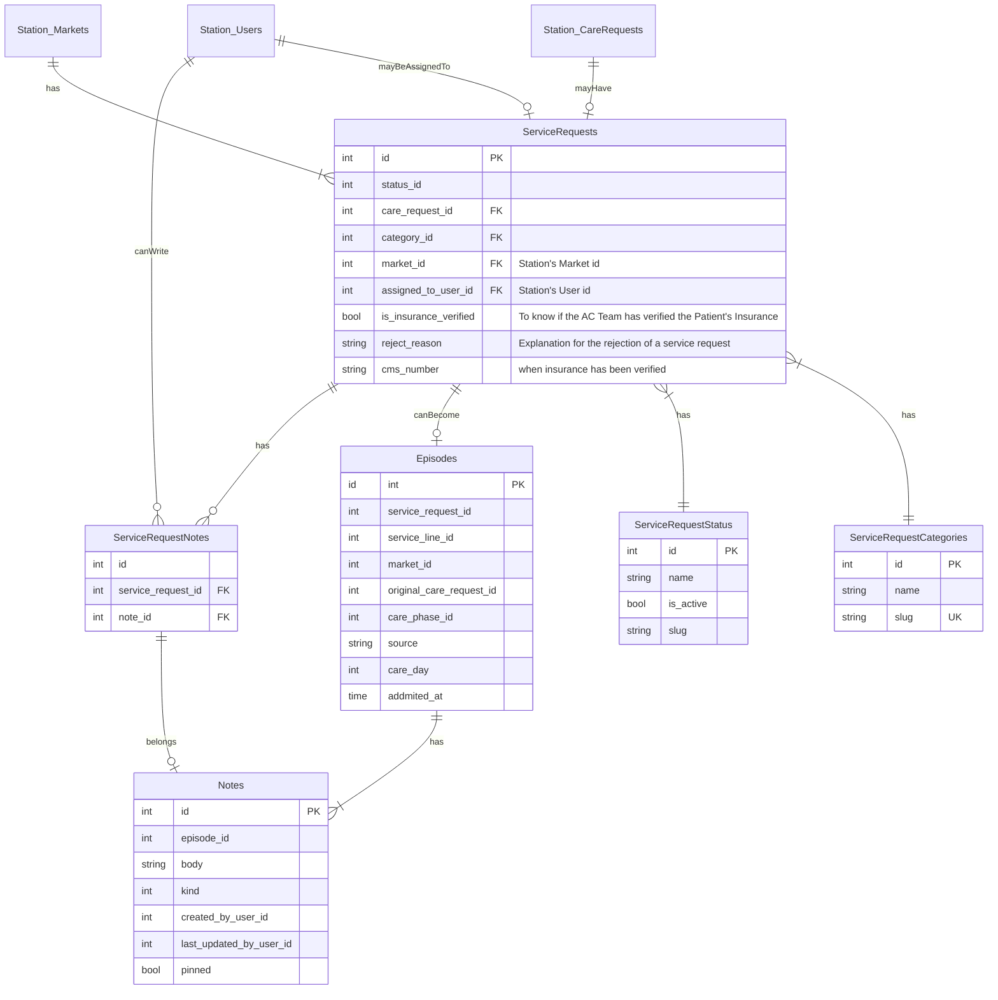

# EDD: Care Manager's Advanced Care Queue

**Authors:** [Rodrigo Guinea](rodrigo.guinea@*company-data-covered*.com), [Hugo Ramirez](hugo.ramirez@*company-data-covered*.com), [Diego Arcos](diego.arcos@*company-data-covered*.com),

## Pre-review Checklist

Before scheduling your design review, ensure that you have checked all of the following boxes:

- [ ] Familiarize yourself with our [EDR process](https://*company-data-covered*.atlassian.net/wiki/spaces/EN/pages/52002922/Process+Engineering+Design+Review)
- [ ] Make sure PRD and EDD are aligned - EM
- [ ] EDD has been reviewed by internal team members - EM

## Resources

[PRD](https://*company-data-covered*.sharepoint.com/:w:/s/tech-team/EWp_FVQJn2BNlAnPQoGPX_oBHLqFAWTy6zawNpEmwlE9Tg?e=PCyj6L)

Supporting designs: [Figma](https://www.figma.com/file/n8O5uIFKR4CdTZLyio65Ry/Advanced-Care-Request-Queue?type=design&node-id=616-42031&mode=design&t=Wm1LhsvQJ9sks1Tg-0)

## Glossary

**CR:** Station's Care Request

**Blue and Yellow dot/eligible CR:** the blue dot appears if the care request record in the database has a property called `advanced_care_eligibility`
set to true AND the method `patient_insurance_eligible` (in advanced_care_configuration.rb) returns also true.
The yellow dot appears whenever one of these conditions is false and the other one true.

**Service Request:** is a new entity representing an intent to perform a diagnostic or another service in Care Manager. Expanded definition and justification for its existence under [The new Service Request object](#the-new-servicerequest-object).

**FHIR** is the Fast Healthcare Interoperability Resources standard which defines how healthcare information can be exchanged between computer systems. [HL7 FHIR Foundation Website](https://fhir.org)

## Overview

Today, evaluating patients for Advanced Care eligibility poses significant challenges, often hindering the efficiency of healthcare teams.
Existing technology tools occasionally work against the teams, leading to inefficiencies in the evaluation process. To address these issues,
we are determined to create a comprehensive solution, in collaboration with clinical workflow changes, that streamlines the patient evaluation
process and ensures thorough assessments for Advanced Care eligibility. Our primary objective is to develop a lightweight tool that
facilitates trackability throughout the evaluation process, laying the groundwork for future powerful enhancements.

## Goals

- **Enhance Trackability:** Implement a system that enables healthcare teams to track the progress of each patient's evaluation, ensuring a more efficient and well-monitored process.
- **Streamline the Evaluation Process:** Develop a lightweight tool that simplifies and streamlines the patient evaluation process, reducing manual interventions and potential delays.
- **Ensure Comprehensive Evaluations:** Ensure that every eligible patient receives a thorough evaluation for Advanced Care, leaving no room for missed opportunities.
- **Reusable Approach for Other Roles:** This includes roles like DHMT, APP, Virtual App, Optimisers, and more, all of which utilize a queue for their respective functionalities.
- **Optimize Patient Care:** Ultimately, the goal is to optimize patient care and outcomes by providing efficient evaluations and timely access to Advanced Care service.

## Design Proposals

## The new ServiceRequest object

We propose a new object called `ServiceRequest`. It represents an intent to perform a diagnostic or another service for a patient. A `ServiceRequest` may materialize into an `Episode` with a `Visit` if accepted. Or it may not materialize into anything if it is rejected. The term is directly based from the [FHIR](https://build.fhir.org/servicerequest.html) definition.

This object will be created in Care Manager based on the identification of [eligible Care Requests from Station](#identifying-care-requests-eligible-for-advance-care).

Without this object there's no way to track progress or any data about the evaluation itself. This is the new flow that the object `ServiceRequest` unlocks in CM:

This is a representation of how this objects relate to each other in Care Manager:

We think this object isolates some implicit responsibilities of the Care Request object in Station. And even though it is planned to be only used for Advanced Care in the short term, it can be used for other service lines in the future.

## How Service Request Records are Created

Service Request records originate from Station Care Requests. Whenever there is a new Care Request in Station whose `advanced_care_eligibility` flag is set to true, a corresponding Service Request record must be created in Care Manager. The amount of data that will be transfered and stored in Care Manager's side is not discussed in this section but the following one, this section only deals with strategies to create Service Request records regardless of what data they contain.

The following proposals present a couple of methods to achieve this essential communication and data sharing between the two systems. All proposals will only consider as eligible those care requests that occur after a specific date and time, which will be the release date.

### Proposal 1: Station Sends Requests Through Jobs (recommended)

In this approach we add a handler to Station's CareRequest model so that whenever a record has its `advanced_care_eligibility` set to true, it will create a job that will asynchronously call Care Manager providing Care Request data. Care Manager will create Service Request records based on those calls from Station.

Pros:

- Real-time Identification: By actively identifying potential Advanced Care visits, Station can trigger immediate action by sending requests to Care Manager, ensuring timely evaluation and response.
- Asynchronous Processing: Job-based communication allows for asynchronous processing, decoupling Station and Care Manager systems and providing scalability.

Cons:

- Data Synchronization Complexity: Ensuring synchronization between Station and Care Manager's data may introduce complexities in managing potential conflicts or data inconsistencies.
- Adds complexity to the existing CareRequest model since it has one more check to do for every update operation.

### Proposal 2: Cron Job on Station Identifying Eligible Care Requests

In this approach, a scheduled cron job will run on the Station server to periodically identify Care Requests that are advanced care eligible and send the data to Care Manager. Just as in the previous proposal, Care Manager will create Service Request records based on received calls from Station.

Pros:

- Doesn't require any changes to the existing CareRequest model.
- Each call from Station to Care Manager can contain multiple records (in contrast to the previous proposal which makes a call per record), reducing the number of calls between systems.

Cons:

- Latency Due to Scheduling: The periodic nature of the cron job may introduce a slight delay in identifying Care Requests and updating their attributes, potentially impacting real-time data availability for Care Manager.
- Potential Data Inconsistencies: There might be instances where a Care Request's status changes between two scheduled runs of the cron job. This could lead to temporary data inconsistencies between Station's database and Care Manager's records.
- Overhead on Station's Server: Running a cron job involves server resources, and if the frequency of cron jobs increases, it could introduce additional overhead on Station's server.
- Handling Large Data Sets: If the number of Care Requests in Station's database is substantial, the cron job's processing time may increase, affecting the overall system performance.

## How to Retrieve Complementary Data for Service Requests

Regardless of the chosen proposal from the previous section, Service Requests records in Care Manager will be created from eligible Care Requests in Station. However, the clients fetch data not only from the Service Request table (see data design section) but from the original Care Request.

The following proposals put forward strategies about how much of the Care Request data is stored in Care Manager, or how much is retrieved from Station in real time.

### Proposal 1 – Pull Data from Station as a Proxy (recommended)

#### Overview

This proposal consists in pulling the data from Station as a proxy. Care Manager will only store the Care Request id from which the Service Request originated from, instead of storing the entire Care Request (CR) object in the Care Manager's database. Care Manager's backend will fetch the required data from Station **on-demand**.
Whenever a client asks for Service Request data, Care Manager's backend will augment it with the additional retrieved information from Station before returning the response to the client.

#### Implementation Details

When a request for CareRequest data is received by the CareManager's backend, it will act as a proxy and make the necessary API calls to Station to fetch the relevant CareRequest information.

The CareManager's backend will then enrich this data by adding any additional information, such as CareManager-specific fields, episode details, notes, or user assignments.

The final response, containing the combined data from Station and CareManager, will be sent back to the client.

If CareManager queries data from Station and it becomes outdated, we can implement a check during Service Request approval
to verify its ongoing eligibility, even if it introduces potential latency issues. This ensures that the information remains accurate and up-to-date for critical decisions.

#### Pros and Cons

Pros:

- Data Freshness: The data pulled from Station will always be up-to-date since it's fetched on-demand, ensuring that the latest information is provided to the client.
- Reduced Data Duplication: By not storing the entire CareRequest in CareManager's database, the need for data syncing and duplication is avoided, resulting in reduced storage requirements and data consistency concerns.
- Real-time Data: As data is fetched directly from Station, CareManager's backend can provide real-time information without concerns about data staleness.
- Simplified Data Management: CareManager's backend can focus on handling data enrichment and augmentation rather than managing complex syncing processes.

Cons:

- Increased Latency: Fetching data from Station on-demand may introduce additional latency compared to having the data locally available in the database.
- Dependency on Station: CareManager's functionality relies on the availability and responsiveness of Station. Any disruptions in Station's service could affect CareManager's data retrieval.
- API Compatibility: The design should consider the compatibility of the APIs between CareManager and Station to ensure smooth integration.
- Potential Overhead: CareManager's backend needs to handle data augmentation, which could introduce additional processing overhead depending on the complexity of the data enrichment.

### Proposal 2 – Save all CR information in CareManager's DB

#### Overview

This alternative proposal suggests saving the entire CareRequest (CR) object from Station directly into
the CareManager's database. By doing so, we eliminate the need to make repeated requests to Station whenever data
related to the CR is required. However, to maintain data consistency, regular syncing of the CR data between the two
databases will be necessary.

#### Changes to ServiceRequests Table

- New Columns on the `ServiceRequests` table like `chief_complaint`, `insurance_name`, `payer`, `car_name`
- Every field in Station's CR that is required would need to be stored.
- Extra tables like `ShiftTeams` would need to be created.

#### Handling Updates and Syncing

Whenever a new CareRequest is returned from the Station and not found in the CareManager's database, a new ServiceRequest will be created, and the entire CR object will be stored in the different columns and/or tables.
To maintain data consistency, a periodic syncing process will be implemented to update the CR data in the CareManager's database. This syncing process should be triggered at specific intervals or based on specific events, such as when any field of the CR changes in Station.
The syncing process will involve comparing the CR objects between Station and CareManager and updating the relevant columns with the latest data from Station.
Careful consideration must be given to handle any conflicts or discrepancies that may arise during the syncing process. A conflict resolution strategy should be implemented to ensure data accuracy and integrity.

#### Pros and Cons

Pros:

- Lower Latency: By storing the entire CR object in CareManager, we eliminate the need to make frequent requests to Station, reducing the latency and improving overall system performance.
- Offline Availability: Since CareManager will have a local copy of the CR data, it can continue to function even if there are temporary disruptions in connectivity with Station's DB.
- Simplified Queries: With all necessary data available locally, querying and filtering operations in CareManager become simpler and more efficient.

Cons:

- High Level of Coupling: Implementing data syncing between Care Manager and Station can result in significant coupling between the systems and their care model schemas. This tight coupling may hinder adaptability and maintenance, making it challenging to evolve each system independently.
- Data Syncing Overhead: Implementing a robust syncing mechanism can be complex and resource-intensive, as we need to keep the CareManager's data up-to-date with Station's DB.
- Potential Data Inconsistencies: Frequent changes to the CR object in Station may lead to data inconsistencies between the two databases if the syncing process is not carefully managed.
- Increased Storage Requirements: Storing the entire CR object in CareManager might increase storage requirements compared to just storing specific attributes.
- Handling Conflicts: Conflicts may occur during the syncing process, especially when updates are made simultaneously in both databases. A conflict resolution strategy must be in place to handle such scenarios.

### Proposal 3 – Initial Data Snapshot without Syncing.

#### Overview

This proposal suggests storing a initial snapshot of the entire CareRequest (CR) data from the Station's database directly into the CareManager's database without implementing a syncing mechanism. This approach aims to avoid the complexities and overhead associated with syncing data between the two databases. However, it comes with the trade-off of potential data staleness, as the information in CareManager will not reflect real-time updates from Station.

#### Changes to ServiceRequests Table

Every field in Station's CR that is required would need to be stored. Because `CareRequest` data exists across several entities in `station`, to store all information about it, extra tables like `ShiftTeam` would need to be created.

#### Pros and Cons

Pros:

- Simplicity: Storing a hard copy of the data without syncing eliminates the need for a complex syncing mechanism, simplifying the implementation and reducing potential points of failure.
- Reduced Overhead: Without the need for constant data syncing, the resource and processing overhead on the system can be minimized.
- No Conflicts: Since the data is not being updated in CareManager, there will be no conflicts arising from simultaneous updates in both databases.

Cons:

- Data Staleness: As the CareManager's database will not be updated with real-time changes from Station, the information in CareManager will become stale and not reflect the latest data.
- Loss of Real-time Information: The inability to access real-time data may impact decision-making and patient care, especially in cases where timely information is critical.
- Limited Usability: CareManager's effectiveness may be reduced due to its inability to present the most current patient information to healthcare providers.
- Dependence on Station: CareManager will heavily rely on Station for up-to-date information, which may introduce single points of failure in the system.

We are required to develop a series of endpoints in the CareManager REST API to present the necessary information in the CareManager UI. [In CareManager API section](#caremanager-api) is a table outlining the endpoints that need to be implemented, specifying the HTTP method, path, inputs, and outputs for each.

## Platform Components

Some of the existing RPC services in Station will be reused. These include:

- Market information, which is already consumed by the caremanager frontend via de config endpoint.
- Addresses, used in patient details.
- Users, needed for getting the details of any related user such as shift team providers or screener.

We will also reuse the existing EpisodesGRPC service in station. We will add data to the service since it's not all there yet. All the extra data will be optional to consume by providing flags so that existing consumers can keep working as usual without having extra bandwidth or having to conform to a new interface.

## Data Design & Schema Changes

The following changes will be the minimum required on CareManager's DB. No changes are required in Station's DB.

Note: `Station_` denotes that the table is stored in Station's DB

As soon as a Care Request is returned from Station and not found in the CareManager's DB, a new `ServiceRequest` would
be created along with its information. The default `ServiceRequestStatus` is `requested`.

## Metrics & Data Integration

We will leverage the existing AuditService. This service will be responsible for capturing and recording all significant actions and changes made by users in the CareManager platform, including assigning users, adding notes, and other relevant activities.

AuditService Functionality

- Capturing Actions: The AuditService is already integrated with CareManager's backend to receive notifications about relevant actions performed by users. These actions will be logged in the form of events, which will contain essential details about the operation, user identity, timestamp, and any associated data.

- Data Integration: The AuditService will collect data from various sources, including CareManager's backend and other relevant services, to ensure a comprehensive record of all operations. It will capture relevant metadata about the operations to provide meaningful insights into the platform's usage.

- DataDog Integration: To facilitate monitoring and analysis of the logged events, the AuditService is integrated with DataDog. It offers powerful capabilities to visualize, analyze, and alert on data, providing a comprehensive view of the platform's performance and usage patterns.

### Metrics and Insights

Leveraging the capabilities of DataDog and the AuditService tooling will enable the following metrics and insights:

The AuditService will maintain a complete and chronological audit trail of user actions within the CareManager platform. This will enable stakeholders to review and verify historical operations if they are needed.

User Activity Monitoring: DataDog's dashboard will provide real-time insights into user activity for this new feature, enabling administrators to identify any unusual or suspicious behavior.

Using the existing tooling the information will be available for analytics or data analysis.

## Error Handling & Alerting

In this section, we will outline the error handling strategies for communication between the CareManager UI, CareManager API, and Station, along with the alerting system to promptly address unexpected issues.

Error Handling for CareManager UI and API Communication

- HTTP Status Codes and Error Messages: For communication between the CareManager UI and CareManager API, standard HTTP status codes will be utilized. When an error occurs on the API side, the appropriate 4xx status code will be returned along with a meaningful error message. These error messages will provide the UI with details about the nature of the error, enabling users to understand and respond to issues effectively.

- Validation and Error Responses: CareManager API will perform input validation to ensure that invalid or malformed requests are detected early in the process. If validation fails, the API will respond with the relevant HTTP status code and an appropriate error message to guide users in correcting their inputs.

Error Handling for Communication between CareManager and Station (gRPC)

- gRPC Errors: Communication between CareManager and Station will use gRPC, and any errors encountered on Station side will be returned as gRPC errors. These errors will be propagated to the CareManager backend, where they will be logged and appropriately handled.

For unexpected errors like 5xx, we will use logs and alerts to know more detailed information regarding the possible causes of the errors. We will use the logs and tooling described above.

## Safety

All the information utilized in this feature is safeguarded within the CareManager's and Station's databases, both of which offer ACID properties. The resources employed originate solely from these databases, ensuring data integrity and minimizing the risk of data duplication or loss.

## Security

To achieve a secure environment, we will implement the following measures:

1. JWT Token-based Authentication
   Both CareManager and Station will utilize JSON Web Tokens (JWT) for user authentication. When a user logs into CareManager, the backend will issue a JWT token containing the user's identity. This token will be used for subsequent requests made by the user to CareManager.
2. Authorization and Access Control

-     	CareManager's Backend:
  - CareManager's backend will verify the JWT token on each incoming request to ensure the authenticity and identity of the user.
-     	Station:
  - When CareManager sends the information to Station, it will include the user's JWT token in the request.
  - Station's backend will validate the JWT token received from CareManager to confirm the user's authenticity.
  - The backend of Station will enforce access controls on its database resources, allowing users to access the requested data.

## Audits and Logs

By leveraging the existing tooling and infrastructure for audits and logs, we ensure a seamless and consistent approach to monitoring and maintaining the CareManager platform. The integration with DataDog further enhances log management and provides valuable insights for system analysis, ensuring the platform's performance, security, and compliance.

## Scalability

The primary bottleneck in this feature lies in Station, as it involves real-time data retrieval based on users' specific information needs. We rely on Station's scalability capabilities to ensure the system functions as expected, accommodating the dynamic demands of users efficiently.

## Cost

No additional cost is required for this change.

## Experimentation

The experimentation process will be facilitated by utilizing feature flags with Statsig, a feature management platform.

Feature Flag Rollout Strategy
Initial Rollout to a Small Group of Users: Initially, the "Advanced Care Queue" feature will be enabled for a small group of users. These users will have access to the feature through a feature flag that is managed by Statsig.

Monitoring and Gathering User Feedback: During the initial rollout, we will closely monitor the feature's performance, user interactions, and any reported issues or feedback from the small group of users. This feedback will be used to identify potential improvements and ensure the feature meets user expectations.

## Testing

To ensure the correctness of the system, we will conduct rigorous testing for all the endpoints we create, including the frontend, API, and gRPC controllers. Initially, we'll focus on writing comprehensive unit tests for each component. Once the main workflows for this feature are implemented, we'll complement the testing approach with dedicated end-to-end (e2e) tests. These e2e tests will provide an additional layer of confidence, ensuring that the entire system, along with its components, functions accurately and communicates effectively.

## Training

Advanced Care Coordinators will need training for this new feature. Initially, a small set of users will be trained by the product team. A set of guides and documents will be handed in by Care Orchestration team for training.

## Deployment

For deployment, we will leverage the existing tooling in GitHub Actions. This will allow us to deploy the feature to various environments, and if any issues arise, we can effortlessly roll back to previous versions. It's essential to follow this specific order for a successful deployment of the feature:

1. Deploy Station
2. Deploy CareManager service
3. Deploy CareManager frontend (FE)

By adhering to this sequence, we can ensure a smooth and effective deployment process.

## Lifecycle management

No technology is in danger of being sunset, abandoned, or deprecated.
