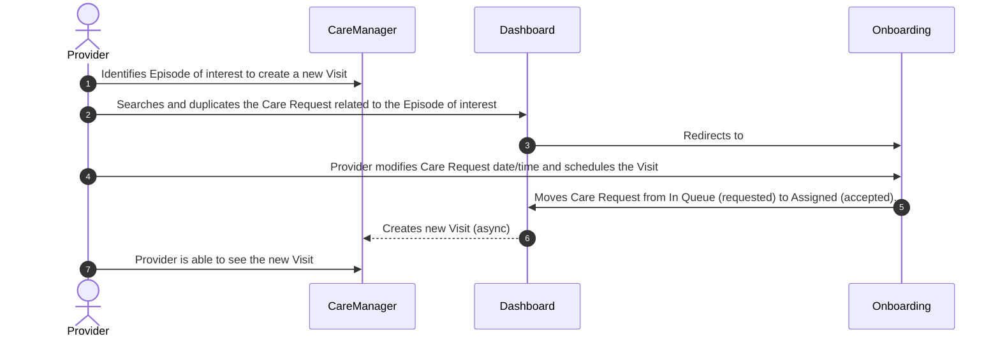
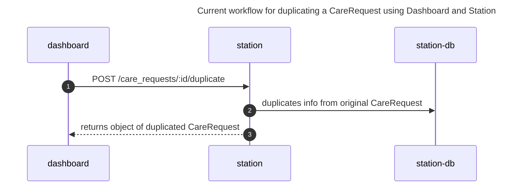
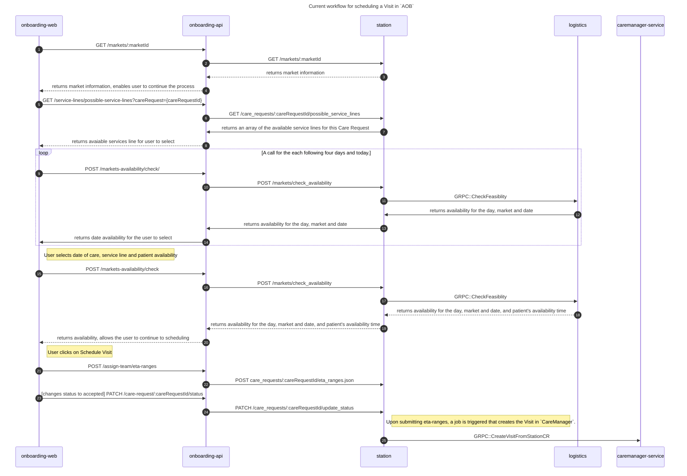
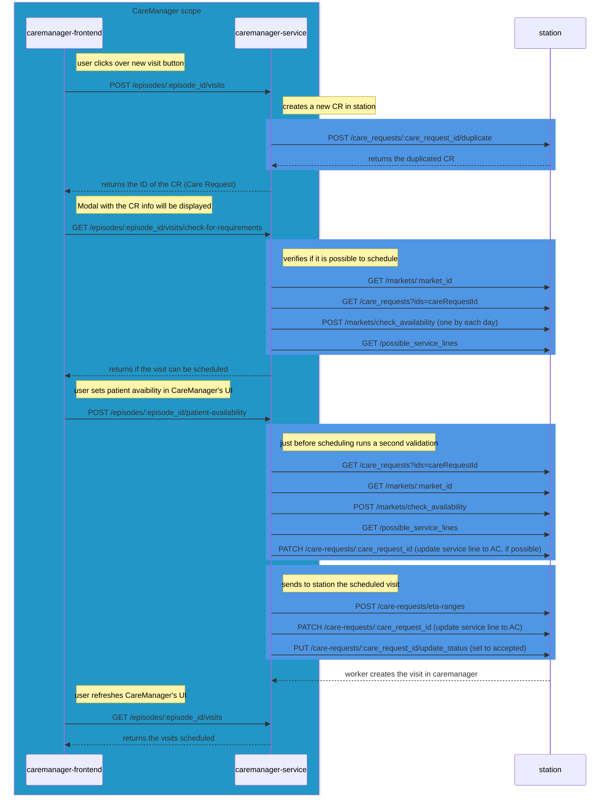
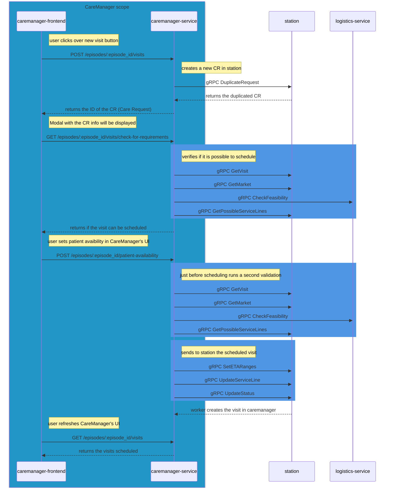

# EDD: Visit Scheduling in CareManager

**Authors:**

- Gabriel Acosta (gabriel.acosta@_company-data-covered_.com)
- Diego Arcos (diego.arcos@_company-data-covered_.com)
- Roberto Fierros (roberto.fierros@_company-data-covered_.com)

## Pre-review Checklist

Before scheduling your design review, ensure that you have checked all of the following boxes:

- [x] Familiarize yourself with our [EDR process](https://*company-data-covered*.atlassian.net/wiki/spaces/EN/pages/52002922/Process+Engineering+Design+Review)
- [x] Make sure PRD and EDD are aligned - EM

## Resources

PRD: [CM Visit Scheduling](https://*company-data-covered*.sharepoint.com/:w:/s/tech-team/EaKXP9fJVnpDhlpKUQQHZYIB0P7Vx4u1D9FGYxSKYU3f4Q?e=VdBJLY)

Supporting designs:

- [CareManager Framework Restructure](https://*company-data-covered*.sharepoint.com/:w:/r/sites/tech-team/_layouts/15/Doc.aspx?sourcedoc=%7B649E622D-191F-4D11-B8F4-61C3A2780937%7D&file=EDD_Restructure%20CareManager%20Framework.docx&action=default&mobileredirect=true)

## Overview

The linked PRD clearly describes the current state of how users schedule patient Visits in `CareManager`:

> Today, Episodic care team members must work between Dashboard, Assisted Onboarding (AOB), and Care Manager to schedule patient Visits within an active Episode. As we continue to scale our Episodic care service lines, this juggling of tools becomes incredibly difficult to manage and measure, as most patients in this type of care have multiple Visits per day.
>
> New Visits are created today by duplicating the original Care Request in Dashboard and updating the day and time we will see the patient in Assisted Onboarding. This requires all team members supporting Episodic Care (30+ people) to juggle all three tools for a simple task. Creating new Visits becomes a frustrating and time-consuming task as team members must schedule multiple Visits a day per patient and are supporting upwards of 70 patients per month across all markets. Even at this scale, this results in opening all three tools at least 140 times per day, often more to simply schedule another Visit.
>
> Given the amount of tool juggling, this process also introduces a high chance for user error. Given team members are juggling multiple tools, so many patients, and following a very manual process errors are common and unavoidable. If we double our Episodic Care volume, this task becomes nearly impossible with today’s staffing levels.
>
> Our solution here is to bring over the duplication functionality into Care Manager and rebrand it as “scheduling” to lay the groundwork for future development. This project aims to eliminate user error in Care Request duplication that often happens today and make this process easier for our care teams.
>
> Our first milestone here is to enable duplication of Visits (Care Requests) in Care Manager with the ability to edit them in Assisted Onboarding, eliminating the need for Dashboard.

The description above of the current workflow can be depicted by the following sequence diagram:

## Goals

- Allow users to duplicate and schedule an AdvancedCare CareRequest in CareManager.
- Support the creation of new Visits within already created Episodes in CareManager without using Dashboard or Onboarding.
- Reduce the dependency of Dashboard for duplicating Advance Care CareRequests.

## Design Proposals

As outlined before, the workflow for creating a new Visit in `CareManager` currently relies on both Dashboard and Onboarding to have the Visit be created in `CareManager`.
Dashboard provides a "duplicate Care Request" action; upon duplicating,
the user can go from Dashboard to Onboarding to submit the patient availability.
Onboarding makes other checks for the Care Request, such as: available service lines, the availability of the market and the availability shift teams to take the Care Request within a window of time.
Once the user has finished scheduling the Visit, a background job in `Station` will be in charge of creating the new Care Request in `CareManager`.
For Dashboard and `Station`, interactions are depicted in the following diagram:

As for the interactions happening during the scheduling of the Visit in `AOB`, we can summarize them with the following:

1. Verify market availability. Market availability means that the market is open.
2. Retrieve possible service lines for the Care Request.
3. Upon selecting a service line, check if a shift team is available to take the Care Request. This check is made for
   the current day and the following four days.
4. Have the user select an availability time window for the patient.
5. Upon selecting the patient availability, check if there is an available shift team to take care of the patient
   within the time window and date.
6. If there is a shift team available, then the user can proceed to schedule the Visit.

`AOB` (`onboarding-web`) will use its back-end `onboarding-api` to forward to `Station`. `Station` will rely on
`Logistics` (`logistics-service`) to check for availabilities of shift teams. Note: DHFU feature already relies on `Station`
to duplicate and schedule Visits, here we're only describing `AOB`'s workflow, since this what we aim to replicate in `CareManager`.

The following diagram shows these interactions:

The main proposal is to have `CareManager` interact with `Station` (and perhaps `Logistics`) directly using the workflows
above described. `CareManager` UI would now include a "Schedule Visit" button that would trigger an action to duplicate a Care Request,
this call would be received by `CareManager`'s back-end and forwarded to `Station`. `CareManager`'s back-end would
run the validations for availability, market open and close time, etc. Users will then be able to submit patient's
availability and schedule the Visit. CareManager will not store any data at any moment during the scheduling of a Visit, it will only rely on data from responses to forward or to consume other services. (e.g. to call `logistics-service`, `station`).

In the next sections, we will outline three proposals to approach our goals.

### Proposal 1 - Have `CareManager` reuse available REST endpoints in `Station`.

We propose that `CareManager` calls `Station` directly, calling the same endpoints that both Dashboard and `AOB` currently call.
These endpoints, living in `Station`, are exposed through a REST API. `CareManager`'s backend would expose a set of endpoints to create a new Visit, run the necessary validations and schedule a Visit. These calls would then be forwarded to `Station`. This workflow is depicted in the following diagram:

Pros:

- Less engineering effort required than Proposal 2. `CareManager` would only need to consume what is already implemented. This would allow a quick time-to-market,
  allowing users to benefit from this feature as soon as possible.
- No need to introduce new code in `Station`.
- Dashboard's current duplicate feature for Care Requests and DHFU feature are already using the `duplicate` endpoint, which
  guarantees that there is a consistent usage of this feature for all consumers or clients.

Cons:

- Lower level of API stability compared to gRPC calls (since gRPC has code generation on both sides to enforce interfaces).
- It goes against current internal recommendations as we should lean towards using gRPC-based communication between services.
- `Station` is using `Logistics` to check for the availability of a Care Request to be taken by a shift team. `CareManager` could call
  `Logistics` directly, reducing number of unnecessary hops between services.

### Proposal 2 – Extend EpisodeGRPC module in Station to expose CareRequest-related through gRPC and call Logistics gRPC and Market gRPC APIs directly.

For this proposal we would like to enforce GRPC-only interactions between services.

We propose extending [EpisodeGRPC](https://github.com/*company-data-covered*/station/blob/d99b96a238159600e029cfbcc035dd85d46cf8c9/app/rpc/episode_grpc/episode_service_controller.rb#L1) in `Station`. We would extend this module to include the following behaviours:

- Update Visit status (including a `UpdateVisitStatus` method replicating [CareRequestsController#update_status](https://github.com/*company-data-covered*/station/blob/d99b96a238159600e029cfbcc035dd85d46cf8c9/app/controllers/api/v1/care_requests_controller.rb#L572)).
- Retrieve service lines available for the Care Request (including a `GetPossibleServiceLines` method replicating [CareRequestsController#possible_service_lines](https://github.com/*company-data-covered*/station/blob/d99b96a238159600e029cfbcc035dd85d46cf8c9/app/controllers/api/v1/care_requests_controller.rb#L825)).
- Submit eta ranges for the Care Request (including a `SubmitETARanges` method replicating [EtaRangesController#create](https://github.com/*company-data-covered*/station/blob/d99b96a238159600e029cfbcc035dd85d46cf8c9/app/controllers/api/v1/eta_ranges_controller.rb#L6)).
- Duplicate a CareRequest (including a `DuplicateCareRequest` method replicating [CareRequestsController#duplicate](https://github.com/*company-data-covered*/station/blob/d99b96a238159600e029cfbcc035dd85d46cf8c9/app/controllers/api/v1/care_requests_controller.rb#L400)).
- Retrieve the Visit (Care Requesst) from Station, since we want the most up-to-date state of the Visit. There is an already existing RPC that will allow us to do this: [GetVisit](https://github.com/*company-data-covered*/station/blob/d99b96a238159600e029cfbcc035dd85d46cf8c9/app/rpc/episode_grpc/episode_service_controller.rb#L7)
- We would also propose consuming [MarketGRPC](https://github.com/*company-data-covered*/station/blob/d99b96a238159600e029cfbcc035dd85d46cf8c9/app/rpc/market_grpc/market_service_controller.rb#L1)) module, for the following behaviour:

- Check for Market availability ([GetMarket](https://github.com/*company-data-covered*/station/blob/d99b96a238159600e029cfbcc035dd85d46cf8c9/app/rpc/market_grpc/market_service_controller.rb#L5)).
  We will call `Logistics` (`logistics-service`) directly for the following behaviour

- Ask if there is a shift team available to take the `CareRequest` ([CheckFeasibility](https://github.com/*company-data-covered*/services/blob/e0ae98196aab4de31ded8a1677bb04f5e6d0965b/go/cmd/logistics-service/grpc_server.go#L740)). We will use the response from
  [GetVisit](https://github.com/*company-data-covered*/station/blob/d99b96a238159600e029cfbcc035dd85d46cf8c9/app/rpc/episode_grpc/episode_service_controller.rb#L7) to populate the request message for this call.

The overall workflow is depicted by the following diagram:

Pros:

- By communicating directly with `logistics-service`, we reduce hops between services.
- It accommodates to current organization's best practices for communication between services.
- We take advantage of the tooling that is currently in place for API code generation. (e.g. creating API contracts using proto messages that makes source easier to change in the future.)

Cons:

- Introduction of new code in Station for the gRPC handlers and possible delay in time-to-market.
  - We may end up duplicating some features, since some operations are too coupled to the HTTP Rails controllers (particularly `care_request.update_status`) and can't be easily abstracted to also be used by the new gRPC handlers.

### Proposal 3 - Have `CareManager` reuse available HTTP and gRPC endpoints in `Station`, except the ones that can be replaced by gRPC calls to `logistics-service`

This can be thought of a combination of Proposal 1 and 2. The idea is to avoid code changes in Station by calling the already existing HTTP/gRPC endpoints, while using `logistics-service` as much as possible.

Station HTTP calls to be reused:

- `POST /care_requests/:care_request_id/duplicate`
- `GET /possible_service_lines`
- `POST /care-requests/eta-ranges`
- `PATCH /care-requests/:care_request_id`
- `PUT /care-requests/:care_request_id/update_status`

Station gRPC calls to be reused:

- `RPC GetVisit`
- `RPC GetMarket`

`logistics-service` gRPC calls to be used:

- `gRPC CheckFeasibility`

Pros:

- Implies no change in Station:
  - Avoids the introduction of new, potentially duplicated code to Station's codebase.
  - Avoids possible refactors (e.g. the introduction of a _service_ layer for CareRequest operations) that might break existing Station features.
- Reduces the time-to-market of the feature compared to Proposal 2.
- Leverages code that is already in use by similar features (AOB, DHFU).

Cons:

- Lower level of API stability compared to gRPC calls
  - Changes to the HTTP interfaces/behaviors on Station's side will most likely go unnoticed in CareManager's side, with a high probability of introducing bugs in CareManager.
    - This could be potentially mitigated by a specialized test suite. More information on the testing section.
- The feature will still rely heavily on legacy code.

### Proposal 4 (recommended) - Create gRPC equivalents for trivial endpoints in `station` while reusing `CareRequest` mutating HTTP endpoints, and interact with `logistics-service` using existing proxied endpoints in `station`.

With this proposal, we aim to get closer to Proposal 2 without investing too much time working on endpoints that will be hard to expose via gRPC.
Also, since the Marketplace team is actively developing the `logistics-service` API and the `CheckFeasibility` operation will be modified soon (see [EDD](logistics-service/market-availability-and-visit-feasibility.md)), we will be calling `logistics-service` through Station (using `/markets/check_availability` endpoint). This way, we ensure the `Logistics team` can migrate all its clients simultaneously when they finish their work.

Station HTTP calls to be reused:

- `PATCH /care-requests/:care_request_id`.
- `PUT /care-requests/:care_request_id/update_status`.
- `POST /markets/check_availability`.

Station gRPC calls to be reused:

- `RPC GetVisit`
- `RPC GetMarket`

Station HTTP endpoints to be exposed through gRPC.

- `POST /care_requests/:care_request_id/duplicate`
- `GET /possible_service_lines`
- `POST /care-requests/eta-ranges`
- `POST /markets/check_availability`

Pros:

- We will comply with the rest of the `logistics-service` consumers, making future migrations easier.
- Relative easy-to-implement gRPC endpoints, increasing the reliability of the workflow.

Cons:

- We need to migrate to use the gRPC service later on.
- By using `station` as a proxy, an increased number of hops are made to consume the `logistics-service` endpoint.

## Platform Components

Reuse of shared components will depend largely on the chosen proposal.

### Station

Proposal 1 and Proposal 3:

- We will reuse the same HTTP calls AOB and DFHU are currently using to schedule `CareRequests`, plus the `duplicate` operation for `CareRequest`s.
  - For Proposal 3, we will also reuse a couple of existing gRPC calls (`GetVisit` and `GetMarket`).

Proposal 2:

- We will create gRPC equivalents for the HTTP calls AOB and DFHU are currently using to schedule `CareRequests`, plus the `duplicate` operation for `CareRequest`s.
  - We will also reuse a couple of existing gRPC calls (`GetVisit` and `GetMarket`)

Proposal 4:

- We will create some gRPC equivalents for the HTTP calls AOB and DFHU are currently using to schedule `CareRequests`, plus
  `duplicate` operation for `CareRequest`s.
- We will also reuse a couple of existing gRPC calls (`GetVisit` and `GetMarket`)

### `logistics-service`

Proposal 1 and 4:

- We will not use `logistics-service` directly from `caremanager-service`.

Proposal 2 and Proposal 3:

- We will use the `CheckFeasibility` gRPC endpoint.

## Data Design & Schema Changes

No schema changes are introduced by this design.

## Metrics & Data Integration

Monitoring will be done as it is today, using DataDog's APM.

## Error Handling & Alerting

In the above proposals, two major processes can be identified:

Step 1: Upon clicking the ‘Schedule new visit’ button, we will initiate a series of validations to after duplicate to determine the feasibility of scheduling a new visit.

Note: At this stage, two types of errors may occur. The first is an INTERNAL_ERROR, indicating an unexpected error within the backend system. The second type pertains to unmet scheduling requirements. In the latter case, users may need to go to Dashboard in order to address the issue, (eg.Creating a shift team to ensure availability for scheduling).

Step 2: Once Step 1 is successfully executed, and the patient's availability is set in the CareManager's user interface, just before sending the data to schedule the visit, we will perform a second verification process.

Similar to the previous step, In case of any issue (excluding INTERNAL errors) users may need to go to Dashboard in order to resolve the issues. In other words, the error handling process will be handled by the CareManager's backend, while the necessary fixes will be carried out by users through Dashboard, aligning with the existing workflow for resolving scheduling-related issues.

The following list outlines the processes for which users will be prompted to take action before scheduling the visit:

- Check that Advanced Care is a possible service line for the given Care Request.
- Check that there are available shift teams to take the Care Request.
- Check that the patient's availability time window is at least 4 hours.

In any other case of error, users will be advised to wait for a few minutes and then attempt again, as no specific user action will be required to resolve the error.

Furthermore, all of these errors will be logged in our alerting tool, and appropriate configurations will be set up to generate alerts for internal errors.

## Safety

No unusual safety concerns around this designed are forecasted.

## Security

We will open CareRequest and Market resources through GRPC for internal DH usage, increasing exposure (even it is only internal).

## Audits and Logs

No additional logging or audit is necessary, since all involved systems already have their necessary tooling in place.

## Scalability

We are relieving `AOB` from some workload, and bringing it over to `CareManager`. This should not represent an increase in workload
put in either `Logistics` or `Station`, given we are theoretically replicating requests already being done to `Station`, in `CareManager`.
Current bottlenecks that still exist in operations exposed by `Station` and `Logistics` will still represent areas for future improvement.

## Cost

No additional cost is required for this change.

## Experimentation

A feature flag to expose this feature to a reduced set of users will be created. The amount of users will increase and once
the feature is fully stable, it will be released to all users.

## Testing

Automated testing can be done separately for each of the changes in components involved (`caremanager-frontend`, `caremanager-service`, `station`).
Given this feature uses `Station` and `Logistics`, for completeness we will be doing manual testing of the whole workflow manually.
A comprehensive E2E suite will be also prioritized, particularly if we go with Proposal 1 or Proposal 3, since we will not have guarantees at the protocol level (HTTP).

## Training

Advanced Care Coordinators will need training for this new feature. Initially a small set of users will be trained by the product team. A set of guides and documents will be handed by Care Orchestration team for training.

## Deployment

Usual deployment flows will be enough to launch this feature.

## Lifecycle management

No technology in danger of being sunset, abandoned or deprecated.
