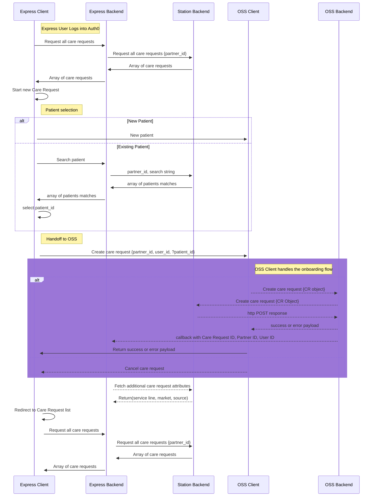
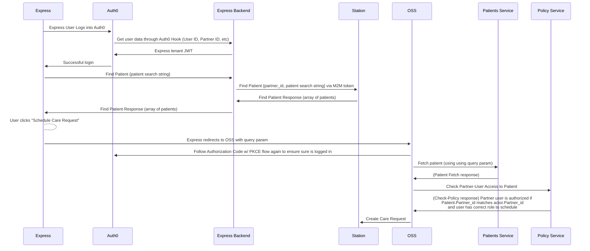

# EDD: Online Self Scheduling in Express

**Author:** Bernardo Gomez-Romero, Dan Cohn, Mike Lockwitz

## Pre-review Checklist

Before scheduling your design review, ensure that you have checked all of the following boxes:

- [x] Familiarize yourself with our [EDR process](https://*company-data-covered*.atlassian.net/wiki/spaces/EN/pages/52002922/Process+Engineering+Design+Review)
- [x] Make sure PRD and EDD are aligned - EM

## Resources

- [[1P] Online Self Scheduling for Partners.docx (Goals, high level strategy)](https://*company-data-covered*.sharepoint.com/:w:/s/tech-team/EbFcHGndJeFLuLwhsOuMXncBI7lehe6knlAYQuDUSFFQrg?e=GOJOa2)
- [PRD - Online Self Scheduling PRD 2023.docx (foundation/prerequisite)](https://*company-data-covered*-my.sharepoint.com/:w:/p/hatte_meneau/EZV1mmEk2_ZDjzMOct5eoBsBBi8fNHS3h5eg7C_wiPRCFw?e=pzsNpq)
- [PRD - Online Self Scheduling Partner 2023.docx (mostly relevant for OSS, not so much Express)](https://*company-data-covered*-my.sharepoint.com/:w:/p/hatte_meneau/Ea18_jSISINOlyJRcM5BJz0B7vgT0HwtczzNnuibYrxHfA?e=rf3456)

## Overview

Primary goal of this project is to allow external partners of _company-data-covered_ to fully onboard and schedule Express visits without needing to make a phone call. Because of the complexity involved with allowing anybody to schedule a visit without the assistance of a Dispatcher, we want to minimize the amount of duplicated functionality and try to centralize all external onboarding to a single place that can be reused for different users. Express will handoff during care request creation to an Online Self Scheduling (OSS) experience that will feel native to Express users. After successfully creating the care request in Online Self Scheduling, Express users will be redirected back to Express to see the status of the visit.

## Goals

- Support Express users in creating care requests without needing to make a phone call
- Minimize duplicated functionality between Express and Online Self Scheduling
- Minimize complexity of interdependent systems

## Design Proposals

### Proposal 1: Handoff from Express to Online Self Scheduling (Recommended)

This experience will be similar to how Dispatchers perform onboarding today. Express users will authenticate through the Express Auth0 tenant and be redirected to a design-system compliant Express application. Users can perform the same existing functionality: view current and past care requests, manage users, manage their profile preferences, and create new care requests. During the create care request flow, users can search for existing patients or create a new patient. Required information to prefill the onboarding form will be passed to Online Self Scheduling through URL params. Online Self Scheduling will handle the entirety of the onboarding flow for patients who qualify for self scheduling and also for patients who will need to talk to a Dispatcher or Nurse Triager for scheduling. OSS will handle requests that are successful or encounter errors. In order to authenticate Express users in OSS, Onboarding Team will support the two different Auth0 tenants in the same app based on URL path. Finally, after submittal of the care request, the user will be redirect back to the Express application.

Pros:

- Eliminates duplication of effort of writing and maintaining two similar onboarding flows.
- Simplifies Express data schema by not storing care request or patient attributes.
- Improves reliability of Express by eliminating need to keep two separate systems in sync.
- Simplified Express requirements will make eventual migration to Go easier.

Cons:

- Increases complexity of the Online Self Scheduling application because it needs to serve different users.
- User experience loading a second react application can be slow.

#### Authentication and Authorization

Users will follow [Authorization Code Flow](https://auth0.com/docs/get-started/authentication-and-authorization-flow/authorization-code-flow) to log into Express.

In the sequence, a call to station is made using the Partner ID of the user to ensure the user is authorized to view the patient. Partner ID is an attribute of both the user and patient.

#### Care Request Tracking

Express will need to query for care requests created by a user. This is currently enabled through the care_requests table in the Express database. We will continue to use the same table which maps a user, a partner and a care request ID to limit access.

To support the Express backend limiting PHI access, we will scope access to PHI to users and partners that are associated with care requests. To do this we will receive a POST callback from OSS with the care request ID, partner ID and user ID. We will store this information in the care_request table in the Express database. This will allow us to query for care requests that are associated with a user and partner.

### Considered Proposal 2 – Reuse components from Online Self Scheduling to quickly build a parity experience in Express

The Online Self Scheduling application will already exist with a set of components that could be re-imported into the existing Express application. Business logic for validation, form routing, persisting user input all need to get updated or rewritten to match the partner version of Online Self Scheduling duplicating much of the code (both back and front end) that already exists in OSS for Direct to Members.

Pros:

- Native look and feel for Express users.
- Less complexity on interdependent systems.
- Brings Express front end into Services monorepo.

Cons:

- Requires writing and maintaining duplicate business logic and user flows between Express and OSS.

### Considered Proposal 3 – Embed Online Self Scheduling application in Express

Share the experience with Online Self Scheduling and overcome the negative user experience aspects by embedding the entire OSS application inside of the existing Express application through an IFrame. Neither Express nor OSS were designed to support this type of functionality and requires an unknown amount of refactoring and development time which present a high risk of missing delivery estimates.

Pros:

- Native look and feel for Express users.
- Eliminates duplication of effort of writing and maintaining two similar onboarding flows.
- Simplifies Express data schema by not storing care request or patient attributes.
- Improves reliability of Express by eliminating need to keep two separate systems in sync.

Cons:

- Requires refactoring Online Self Scheduling web request application and Express to support embedded application.
- Lack of knowledge and experience with this type of architecture pattern.
- Increases complexity of the Online Self Scheduling application because it needs to serve different users.
- Could have unknown security problems or weird user experience problems.
- Require special styling to look good as embedded within Express.
- Requires loading two react applications which could be slow.
- More effort to maintain consistent UX between apps.
- Express needs a UI update to match

## Platform Components

This project involves Express FE, Express BE, Express DB, Web Request FE, AOB BE, Station BE, multiple Auth0 tenants. No new components are created.

Express requires significant refactoring to support a handoff to Online Self Scheduling. Express no longer stores care request details such as patient, location, insurances, medical power of attorney or callback information. This information exists within the scope of OSS and station only. Express BE needs to be rearchitected to pull care request and patient information from Station. Also the Express FE still needs additional work to be design-system compliant.

The Partner namespace in Station is updated to support serializing the information back to Express including care requests scoped to a partner.

Online Self Scheduling will need to get updated to support the difference in onboarding flows from Direct to Member and Partners. The Partner onboarding logic is more permissive and will allow for more information to be optionally collected while still allowing the user to continue through the entire onboarding flow.

## Data Design & Schema Changes

There will be a significant reduction in duplicated data between Express and Station since all user entered data will flow from OSS to Station. Express will be rearchitected to pull data from Station. Station will need to support serializing care request data back to Express via future-ready proto.

DROP tables from Express:

- care_request_insurances
- care_request_mpoas
- care_request_referral_contacts
- care_request_statuses
- care_requests
- eta_ranges
- insurances
- mpoas
- notes
- patients
- referral_contacts
- relationships
- risk_stratification_bypass_data

The data that will be removed from Express is not currently served from Station in the partner namespace.
ADD tables:

- care_request_users

Create new table to track which user is creating care requests and following the same pattern for D2M care request creation.

## Metrics & Data Integration

Express already has logging and APM integration with DataDog.

Express does not currently have any custom metric generation or collection but will want to integrate to the Data Analytics platform (Segment) to track custom user events that are not automatically captured by stored user input.

A significant amount of fields in the Express database are eliminated. There will need to be field normalization done between output from station endpoints and the Express FE.

Data Analytics Looker Dashboards will need to get updated since now data will exist in 2 different places instead of all in the Express database.

## Error Handling & Alerting

Likelihood for errors will get reduced with this design because of the single direction of data flow and no longer needing to keep separate systems in sync.

The addition of an application does introduce more surface area for problems especially the handoff between Express and OSS. We will rely on existing Auth0 logging to capture any errors that occur during handoff.

Express will require the persistent availability of Station and OSS. If there is a communication problem between any of the systems then Express will not be able to function.

Errors between OSS and Station will get handled by OSS.

## Safety

The most important part of the care request creation transaction occurs in OSS since Express relies on OSS to create the care request. No request is exchanged directly in Express.

## Security

Express users should not have access to any patient data scoped outside of their partner ID. Similarly, OSS users should not have access to any patient data scoped outside of their partner ID.

Express maintains user-to-partner relationships and will limit access to care request details scoped to the user's Partner ID. Express will fetch list of care request details from station by care request ID using the existing endpoint to return care request detail.

### InfoSec optional enhancement: Opaque Query Params

Express needs to redirect to OSS with some pre-filled information based on the chosen patient. The easiest way to do this is to use the URL as a communication channel, to pass information via query params. However, this exposes the communication channel between Express and OSS as an attack vector. In order to reduce the attack surface, it would be beneficial to hide query params with an opaque token that can be exchanged for the params. There are several ways this can be done.

#### Optional Infosec Proposal 1: Redis Exchange

System 1 generates a random token associated with the params, saves to Redis, and passes this to system 2. System 2 then retrieves the value for the token in Redis.

Pros:

- Easy to implement
- TTL is built in
- Fast

Cons:

- Sharing of a database may be contrary to SOA pattern

#### Optional Infosec Proposal 2: API Exchange

System 1 generates a random token with signature associated with the params, saves to Redis, and passes this to system 2. System 2 then calls an API (Rest or GRPC) with the token and signature to retrieve the value of the token. The signature will ensure the token can't be altered in any way.

Pros:

- Strict separation of services/concerns
- Can still use Redis with TTL as a data source

Cons:

- Might create circular dependency of services
- A little harder to implement
- Antipattern to have 2 different services both writing to a shared database

#### Optional Infosec Proposal 3: Encryption

System 1 uses symmetric encryption with Initialization Vector (IV) or nonce to encrypt the data. System 2 can simply decrypt the data.

Pros:

- Does not require a data store
- Simple

Cons:

- Worse if a large amount of data needs to be encrypted
- Can be misued by not using an IV
- May require using crypto libraries in different languages
- Key rotation will break when a key is issued before rotation and read after rotation

#### Optional Infosec Proposal 4: Token Service

Build a Go service with protos to support sharing of secrets across services.

Pros:

- Can be shared by multiple services
- Easier to log and audit
- Can be expanded with more functionality

Cons:

- Slowest option to implement
- More brittle due to need for another functioning service

## Audits and Logs

Express will not allow for any direct data manipulation of care request or patient data and relies on OSS for all state change logging.

Express will need to log all user actions that result in PHI being returned from Station to Express by Care Request ID.

Express will need to ensure that we log outbound handoff requests to OSS including opaque token URL parameter. OSS should log inbound requests including opaque token URL parameter. This will allow step-by-step tracing of any error or anomaly that might occur.

## Scalability

Express will be hitting Station and Patient Service endpoints to pull care request and patient data. Both services will need to be able to handle the increased load of requests from Express.

Current traffic is [~25k requests per day](https://app.datadoghq.com/s/bebc9408-d182-11ec-ad28-da7ad0900002/ctf-va7-t9d) which could increase 10x as Express utilization increases.

Utilizing small page sizes and indexes in Station will help with performance along with horizontal scaling of Station. Alerting will be added to existing station endpoints to ensure the endpoint performance remains within acceptable limits.

## Cost

There will be no significant impact to cost since we will be using existing infrastructure and not deploying any new services.

## Experimentation

Experimentation will be supported with existing StatSig infrastructure.

## Testing

Testing of Express will be done with DataDog Synthetics for smoke testing, Cypress for UI automation, React Testing Library for front end integration tests, and Rspec for backend unit and api tests.

Happy path testing will ensure the Express to OSS handoff is working as expected and will be automated with Cypress and Synthetics.

OSS will have it's own testing suite.

## Training

There will no provided training for end-users since they are external. FAQ and help documentation will be updated to reflect the new onboarding flow.

## Deployment

There will be no change in Aptible deployment process for Express. Runbooks will need to get updated to reflect new architecture and steps to troubleshoot with OSS.

We intend to release in two phases: Phase 1 allows us to source care request details from Station instead of Express. Phase 2 allows us to create a care request using OSS. We will launch each phase behind a feature flag which allows us to enable new workflows per partner.

## Lifecycle management

No new 3rd party components or libraries are introduced with this design so there is no concern for lifecycle management.
