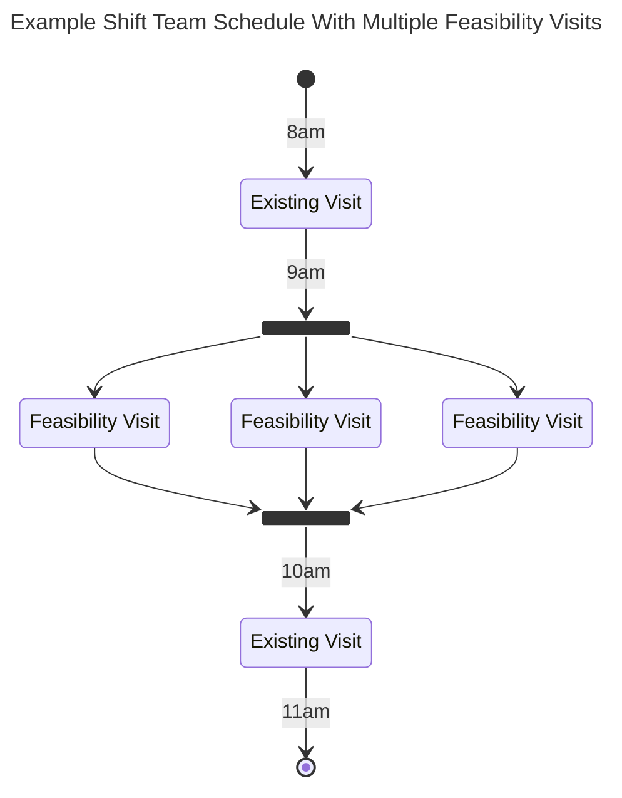
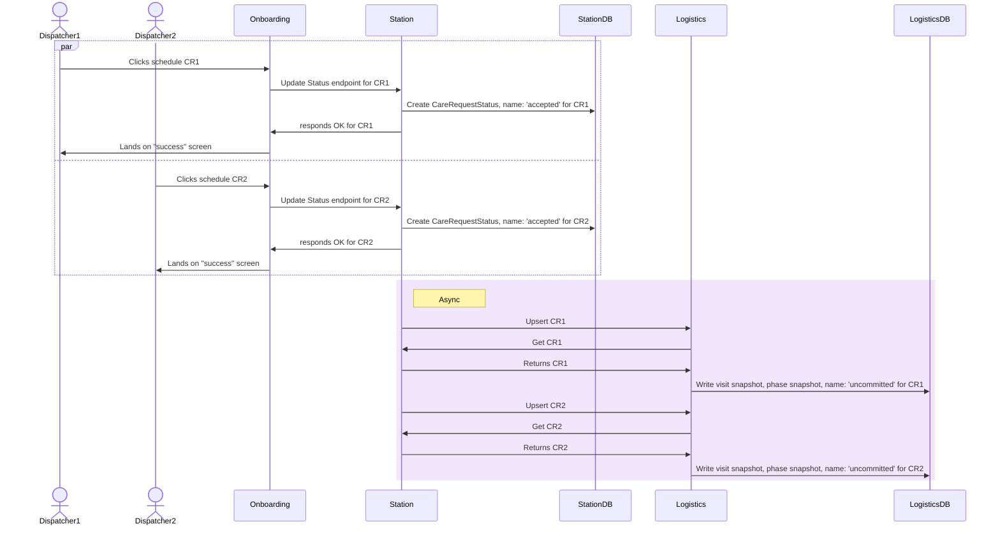
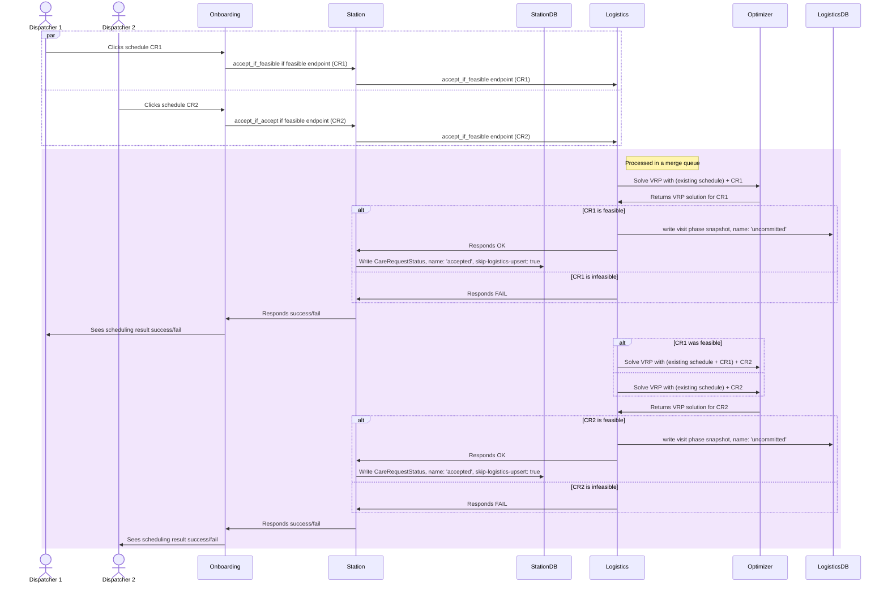

# EDD: Logistics Service: Availability and Feasibility Enhancements

**Author:** Josh Jones josh.jones@_company-data-covered_.com

## Pre-review Checklist

Before scheduling your design review, ensure that you have checked all of the following boxes:

- [x] Familiarize yourself with our [EDR process](https://*company-data-covered*.atlassian.net/wiki/spaces/EN/pages/52002922/Process+Engineering+Design+Review)
- [x] Make sure PRD and EDD are aligned - EM

## Resources

PRD: [Availability and Feasibility in Logistics](https://*company-data-covered*.sharepoint.com/:w:/s/tech-team/EWDt12L_ZzNGuoO9rIs-1VYBXq1ltTZaLRVUOhwReDibFw?e=pxjg03)

## Overview

The Market Availability and Visit Feasibility feature of the Logistics Service is the subject of continuous iteration and improvements.
The purpose of this doc is to outline proposals for next set of improvements, as outlined in the linked PRD, which will solve some (but not all) of the current shortcomings of the feature.

## Goals

Market Availability and Visit Feasibility are mechanisms to determine if we will be able to service a Care Request within a given time period.
The current implementations have introduced several edge cases and bugs that have undermined their usability and trust from our users.
The proposals in this document seek to improve these elements.

- Market Availability
  - Allow the business to stop using the Booked Market Sheet (BMS)
    - BMS is a manually curated shared document, used by human Dispatchers, to get signal from Manual Optimizers about whether it’s generally possible to book more patients. Dispatchers take the BMS information as the final “source of truth” while onboarding patients.
      When BMS says there’s open space, Dispatchers will attempt to force the logistics service to accept patients, even when LV1 says it’s not feasible.
      See the PRD for more info on the BMS.
  - Add granularity for different categories of service, e.g., service line, modality
  - Collect history of values for analysis
- Visit Feasibility
  - For "infeasible" results, provide a feasible time window, if possible
  - Provide visibility into "infeasible" results -- explanation of "why is this visit infeasible" by providing reasons each shift cannot serve an infeasible visit.
  - Eliminate over-booking race conditions -- E.g., multiple visits being onboarding at the same time causes over-booking
  - Provide mechanism for `Action Needed` Care Requests to occupy space in the schedule so new Care Requests don't steal their capacity before optimizers can fix them.
  - Collect history of feasibility requests for analytics.

## Design Proposals - Market Availability

### Proposal 1 – Periodic triggering market availability, calculate all possibilities at once (Recommended)

- Calculations done on a configurable cadence
  - Go routine in Logistics Service
- Store the results in the Logistics database
- Run a calculation for every service-region/day combination
  - Each calculation will consider every possibility of input category selection (in-person/acute, in-person/bridge, virtual/acute, etc.)
  - For each calculation, create multiple "feasibility visits" - one for each possible combination of input categories.
- During calculation, Optimizer will allow feasibility visits to occupy the same time (see diagram below)
  - Optimizer will assign the same arrival time to sequential feasibility visits.
  - This lets a single Optimizer run consider multiple feasibility visits at once.
- Expose the stored results via a new Logistics gRPC endpoint
- Availability for a potential visit will be determined by analyzing the schedule in the calculation result
  - Logistics service will find feasibility visits that match the attributes of the potential visit, e.g., acute
    - All matching feasibility visits in schedule -> full availability
    - Some matching feasibility visits in schedule -> limited availability
    - No matching feasibility visits in schedule -> no availability

Pros

- Updates are on a regular cadence, which is good for analysis
- Instantaneous results from the perspective of end users
- Able to tune calculations (more expensive, longer running) without impacting end user latency.

Cons

- Consumes CPU even when nobody is looking
- Stored Market Availability information may become out of date between runs.
  - Probably doesn't phase change frequently, so not a big problem

### Proposal 2 – Manual Triggering (currently used) with added params for service line and modality

Each gRPC request triggers a VRP run with the specific criteria given in the request.

Pros

- Only calculating when needed
- Most up-to-date results

Cons

- Tuning for more expensive calculations results in longer wait times in the UI.
- During times of high demand, many identical/redundant VRPs get solved.
- Irregular timing between runs makes historical analysis difficult

## Design Proposals - Visit Feasibility: Suggested Time Window

Present possible time windows to the user to prevent the need for guessing at values that would produce a feasible result.

### Proposal 1 - Expand Time Window on infeasible result. (Recommended)

- Create new score value in Optimizer: time window violations
  - Add a new term to the n-tuple used for sorting solutions. Currently this is: `[(stopsOnCorrectVehicle, hardConstraints, unassignedCustomers, softConstraints)]` We will modify this to
    `[(stopsOnCorrectVehicle, hardConstraints, unassignedCustomers, timeWindowViolations, softConstraints)]`
  - Only allow time window violations for feasibility visits, not existing visits.
- Feasibility calculation will prefer given window, but will schedule at another time if necessary.
- Logistics will return the scheduled time of the "feasibility visit"
- If scheduled time is outside of given range, it will be presented to the user as a possible time window for the user to suggest to the patient.

Pros

- Gives an exact time that will be possible.

Cons

- Requires an initial guess from the user.

### Proposal 2 - Multiple feasibility checks for preset time windows

Break the day into preset time buckets, e.g., morning, afternoon, evening. Perform the feasibility check for each bucket,
and present any that resulted in a feasible solution as possible time windows to the user.

Pros

- Allows user to give possibilities to the patient up front, without the need for an initial guess.

Cons

- More feasibility requests per CR.
- Time windows will be larger, less flexible.

## Design Proposals - Visit Feasibility: Prevent overbooking

The current implementation has a race condition where multiple CRs pass the final feasibility check and are all allowed to be scheduled.
When this happens in times of limited capacity, overbooking will occur.

### Proposal 1 - Use a merge queue to accept CRs. (Recommended)

Modify the scheduling workflow to accept visits synchronously from a queue, testing for feasibility before final acceptance.

- Scheduling requests will require a successful feasibility check
- New Station endpoint `accept_if_feasible`
- New gRPC endpoint in Logistics Service `accept_if_feasible` called by Station
  - include all CR data for upserting
  - working CR will be included in calculation as a "feasibility visit"
  - synchronous call -- the API will respond after the feasibility check and status update is complete, or an error occurs
- gRPC requests will be processed as a single queue per (service region, service date) tuple
  - Feasibility check VRP for each queued scheduling request will include all visits on the most recent processed schedule,
    plus all newly accepted visits that have not yet been processed on a schedule.

**Note:** This only applies to the final acceptance feasibility check. The rest of the feasibility checks will still be performed in parallel.

---

Existing Schedule Workflow

---

Proposed Schedule Workflow

---

Pros

- All scheduled visits will have their space guaranteed in the schedule.
- Scheduling happens in the order in which it was requested.

Cons

- Creates noticeable delay during peak usage (O(number of simultaneous feasibility requests))
- May produce unexpected "infeasible response" if a previous visit took last available space. (Will need to produce meaningful error message around this)
- Will result in duplicate "accepted" status snapshots. This is not a problem, and allowing this prevents statuses getting created out of order.

### Proposal 2 - Batched acceptance

- Collect any CRs that are attempting to get final acceptance in a batch of a configured amount of time (e.g., 5 seconds)
- Run all CRs in the batch in a single feasibility check
- Either Accept all or none

Pros

- Some users will see faster response compared to a queue
- Fewer VRP solve requests

Cons

- More rejections
- Some users will see slower response compared to a queue

## Design Proposals - Visit Feasibility: account for action needed

When previously scheduled visits become infeasible, they are no longer considered part of the schedule, and are effectively ignored for feasibility checks of new visits.
Since Action Needed CRs can typically be fixed by modifying their time window, we would like to prevent new visits from taking their place on the schedule.

### Proposal 1 - Calculate "feasibility planning" schedule (Recommended)

- Every time a schedule is generated, Logistics service will analyze the infeasible visit list
  - if no infeasible visits
    - do nothing
  - If infeasible visits exist
    - create new VRP, modifying the time window of each infeasible visit (now -> end of market open time)
      - Actual time window will not be modified -- only change what gets added to feasibility checks
    - the solution of this VRP will be considered a "feasibility planning schedule"
    - any infeasible visits that could be incorporated by modifying the time window will keep their place in the schedule.
- When calculating feasibility checks for new visits, Logistics service will use the "feasibility planning schedule" if available.
- Also use this "feasibility planning schedule" as the basis for Market Availability runs
- For analysis, we will record which visits were given modified time windows when recording the optimizer run.

Pros

- Simple to implement
- The "feasibility planning schedule" will have additional uses for future features

Cons

- Requires additional VRP computations
- Not a "perfect" solution (may be cases where some, but not all visits get their space saved)

### Proposal 2 - Occupy schedule with timeout

- Keep track of the time when a visit becomes infeasible.
- When calculating feasibility checks for new visits, only ignore infeasible visits if they have been infeasible for a configured amount of time

Pros

- Gives optimizers necessary amount of time to fix infeasible visits

Cons

- Complicated to implement
- Lots of edge cases (visits may flip between feasible and infeasible on subsequent schedules)
- Will effectively block scheduling of new visits during the timeout period.

## Design Proposals - Visit Feasibility Analytics

Store additional information about Feasibility checks -- specifically the Feasibility Visits that are used in the calculations. This will be used to gain analytical understanding around Feasibility results.

### Proposal 1 - Use visit_snapshots table, adding "feasibility" column

Feasibility visits will be added to existing `visit_snapshots` table, adding new "feasibility" flag.

Pros

- Only need to query visits from a single table, thus minimizing DB calls

Cons

- Would need to update all existing queries to exclude those with the flag set.
- Combines feasibility visits with real visits
- visit_snapshots table was designed for accepted visits only, so mixing feasibility visits may create confusion from having less data in various columns

### Proposal 2 - Create new feasibility_visit table (Recommended)

Table would be similar to visit_snapshots, but only contain columns relevant to feasibility calculations.

Pros

- Feasibility visits are very different from normal visits, so separating their tables makes sense.
- Don't need to modify existing queries for `visit_snapshots`

Cons

- Need to make additional queries for new table

## Platform Components

Updates will be made to Logistics Service and Station to
implement proposed changes. Consumers of the service (AOB, Web Request, etc.) will need to be updated to take advantage.
Existing implementations will remain available until no longer used.

## Data Design & Schema Changes

- Market Availability
  - New tables to store market availability runs, attributes
- Visit Feasibility
  - New tables to store feasibility_visits and feasibility_visit_attributes

## Metrics & Data Integration

Market Availability and feasibility results will be available for Data Science analysis

## Error Handling & Alerting

No changes

## Safety

No changes

## Security

No changes

## Audits and Logs

No changes

## Scalability

Increased CPU/Mem usage for market availability

- Expected usage: `O(service_regions * horizon_days) = O(50 * 5) = O(250)`
- If we assume cadence is 10 minutes, we will see 1500 calculations per hour
- Existing usage during peak time (9am - 3pm) is about 1200 per hour. [datadog logs](https://app.datadoghq.com/logs?query=env%3Aprod%20service%3Alogistics-optimizer%20%22SolveVRP%20%7Buse%3Dfeasibility%22%20&cols=host%2Cservice&index=%2A&messageDisplay=inline&stream_sort=desc&viz=timeseries&from_ts=1683212400000&to_ts=1683234000000&live=false)
  - note: this existing usage is market_availability + visit_feasibility so the comparison is not exact.

## Cost

Will need increased CPU to deal w/ higher throughput of problems being solved.

## Testing

Testing will follow _company-data-covered_ standard testing practices:

- FE will use Jest and Cypress
- BE will use integrated Go testing tools and rspec

## Training

End users will be trained on any impact to their workflow.

## Deployment

Nothing unusual

## Lifecycle management

No changes
