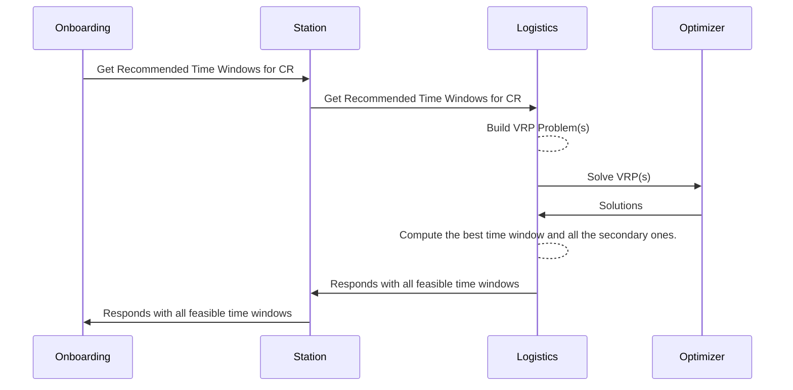

# EDD: Logistics Service: Visit Time Windows Recommendations

**Author:** [Aaron Lara](aaron.lara@*company-data-covered*.com)

## Pre-review Checklist

Before scheduling your design review, ensure that you have checked all of the following boxes:

- [x] Familiarize yourself with our [EDR process](https://*company-data-covered*.atlassian.net/wiki/spaces/EN/pages/52002922/Process+Engineering+Design+Review)
- [x] Make sure PRD and EDD are aligned - EM
- [x] EDD has been reviewed by internal team members - EM

## Resources

PRD: [Patient Availability Negotiation](https://*company-data-covered*.sharepoint.com/:w:/s/tech-team/Ec25er4__5RMpYaseqL7Hl4Bm36MrZgzVYP6dYG8ZoeQlQ?e=BhOQcO)

Supporting designs: [Figma](https://www.figma.com/file/dEyBsfbL1bIjk04gSBg05J/Scheduling?type=design&node-id=258%3A21944&t=7gL9qx66X96xaGss-1)

## Overview

As part of the requirements described in the linked PRD, the Logistics Service should be able to recommend the most preferable time windows for a given visit during onboarding and when adjusting a care request. The purpose of this doc is to outline the proposals to make the Logistics Engine compute the best recommendations for the client (Station).

Other considerations:

- If there's less than 1 hour remaining until market closes, do not recommend any time window for that day.
- If there are less than 4 hours remaining until market closes, return the remaining time window only if feasible.
- For high acuity visits, the earliest time windows should be recommended first.

Out of scope:

- Take into consideration the opportunity cost and forecasting outlined in the [Prioritizing Incoming Demand PRD](https://*company-data-covered*.sharepoint.com/:w:/s/tech-team/EXZ_X6x-cqFMuUDC2eQIlC8BVaHgMSo3gS1Na_HhKlD9qQ?e=neThlq)

### Workflow

## Goals

In addition to outline the required changes across the services (see the `Platform Components` section), the main goal of this EDD is to decide on the best approach for the Logistics Service to compute and respond with the recommended time windows.

## Design Proposals

### New Logistics GRPC Endpoint

Station will consume a new GRPC endpoint in the Logistics Service similar to the following.

`GetRecommendedTimeWindows(care_request_id, service_date)`

The Logistics Service will then collect the required data and make one or several requests to the Logistics Optimizer according to the selected Proposal.

The response should contain as many 4-hour time ranges as possible from the moment of the request until the market closes grouped by preference the following way:

- The most preferred time window.
- Other feasible time windows.

Additionally, each group should have subgroups by time of the day:

- Morning.
- Afternoon.
- Evening.

#### Override additional availability

If none of the recommended/feasible time windows is accepted, clicking `Override and find additional availability` will just display the remaining time windows, by selecting any of those visits will case the care request to be prioritized and potentially cause other visits to be kicked out of the schedule.

#### Special cases

For `Bridge` and `Advanced Care`, the Station endpoint will return the whole day as one single recommended Time Window if there's availability, so it won't be needed to consume the new endpoint.

### Proposal 1 (recommended) - One single VRP Problem with overlapping visits

#### Feasible time windows

Build one VRP problem with multiple visits that are allowed to overlap by using the `overlap_set_key` field, each representing a possible 4-hour time window for the remaining market open hours. Every visit that gets scheduled is a viable time window. In addition to this, add a visit in the set with a time window for the full day (or from now to the end of the market close time), this is in order to get the most preferable time window if the visit gets scheduled.

Pros:

- It won't require changing the Optimizer code
- Best performant

Cons:

- No quantitative ranking between time windows - all windows are either pass/fail, so the additional time windows won't be ordered by score.

### Proposal 2 – Run multiple VRP problems with different time windows

#### Feasible time windows

We can build as much VRP problems as 4-hour time windows are possible with the remaining time in the day. The problems can be run in parallel, and then we can order the solutions by score.

Pros:

- Does not require changing Optimizer code.
- Easy to implement.
- Visits are ordered by score.

Cons:

- Computationally expensive: It can potentially run 8 - 10 problems for a given visit/date

### Proposal 3 – Initial request for a single time window

#### Feasible time windows

Initially build one single VRP Problem with one single time window from now to the market close time. Depending on the eta in the response, we can make a time window from two hours before the eta and two hours after.
A second request with an additional parameter like `more_options bool` can be added in order to retrieve more recommendations if this first one is rejected. We can use proposal 1 or 2 for this second request.

Pros:

- Initially light weight

Cons:

- Requires two API calls if the initial recommendation is rejected.
- We would still to decide on Proposal 1 or 2 for the second request

### Proposal 4 (Design alternative) - Add recommended time windows to the Feasibility Check response.

Instead of creating a new endpoint, use the response of the visit feasibility check to include recommended time windows.

Build a special VRP problem (like the one suggested in `Proposal 1`) when a care request ID and a date are present in the request. The `CheckFeasibilityResponse` will contain the recommended time windows.

Pros:

- Doesn't require a new endpoint across the services.
- Uses the existing check feasibility flow.

Cons:

- May break the `Single Responsibility Principle` by expanding the response to also include the time windows.

## Platform Components

The following changes are also required to implement the `Patient Availability Negotiation` flow.

### Station changes

New HTTP Endpoint: `GET /api/care_requests/:id/recommended_time_windows`

Consumes the GRPC method `GetRecommendedTimeWindows` from Logistics Service and returns the recommended time windows ordered by preference.

### Onboarding changes

- Consume the new Station HTTP endpoint:
  - During the creation of a new care request, in the last page when time windows are to be offered to the patients after picking a date.
  - In the `Adjust Care Request` modal.

#### UI changes in `New Care Request` final page

- New `Recommended Window of Availability` component.
  - Display initial time window negotiation message.
  - Display the most preferred time window button.
- New actionable component to display more time windows for:
  - Additional availability windows if the most preferred one is rejected. Message: "Patient not available during this time".
  - Display “Override additional availability” for changes that would result in other visits being pushed. Message "Override and find additional availability".
- New `Additional Availability` component.
  - Displays a list of other recommended time windows.
- New `Override Additional Availability` component.
  - Display a list of time windows that would cause other visits to be pushed.
- Date picker for Advanced Care and Bridge Care visits.
- Once a time window is selected, and "Schedule Visit" is clicked, perform a PATCH with that availability (as we currently do when selecting a time range).

#### UI changes in `Adjust Care Request` modal

- Display the new `Recommended Window of Availability` and `Aditional Availability` components at once.
- Additionally, display `Custom Window` component with drop down for `Start` and `End` (Already exists).
- No availability message when there are no recommended time windows.
- Once a time window is selected, clicking `Update Care Request` will perform a PATCH with the time window change.

## Data Design & Schema Changes

Not required.

## Metrics & Data Integration

The usual metrics will be available for the Data Engineering team including:

- GRPC Method invocations
- GRPC Method latency
- Failures

## Error Handling & Alerting

- If there are errors during the computation of the time windows, a standard GRPC error should be raised. Station will be responsible for properly handling and exposing it to the front end.

## Safety

No specific concerns.

## Security

No specific concerns.

## Audits and Logs

No changes.

## Scalability

Onboarding time can be impacted depending on the time consumed by this new endpoint.

## Cost

This should not add any significant cost.

## Experimentation

This can be controlled with statsig gates.

## Testing

Testing will follow _company-data-covered_ standard testing practices:

- FE will use Jest and Cypress
- BE will use integrated Go testing tools and rspec

## Training

End users will be trained on what to expect when interacting with the recommendation windows results.

## Deployment

Nothing unusual.

## Lifecycle management

No changes.
