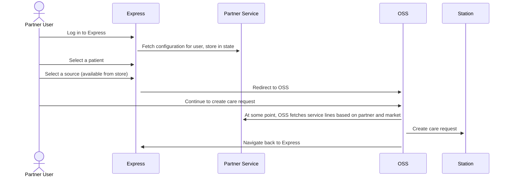
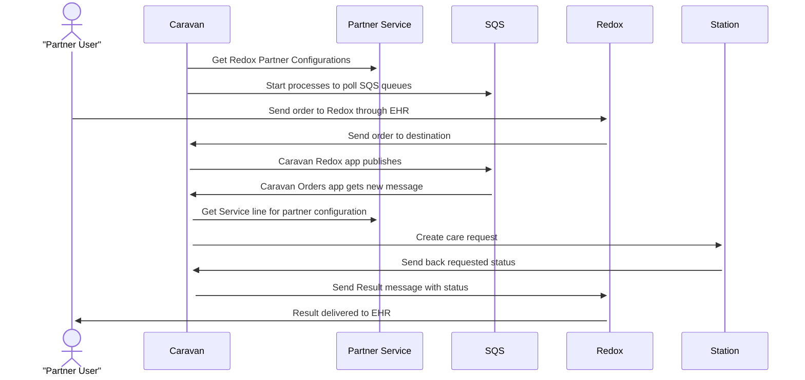
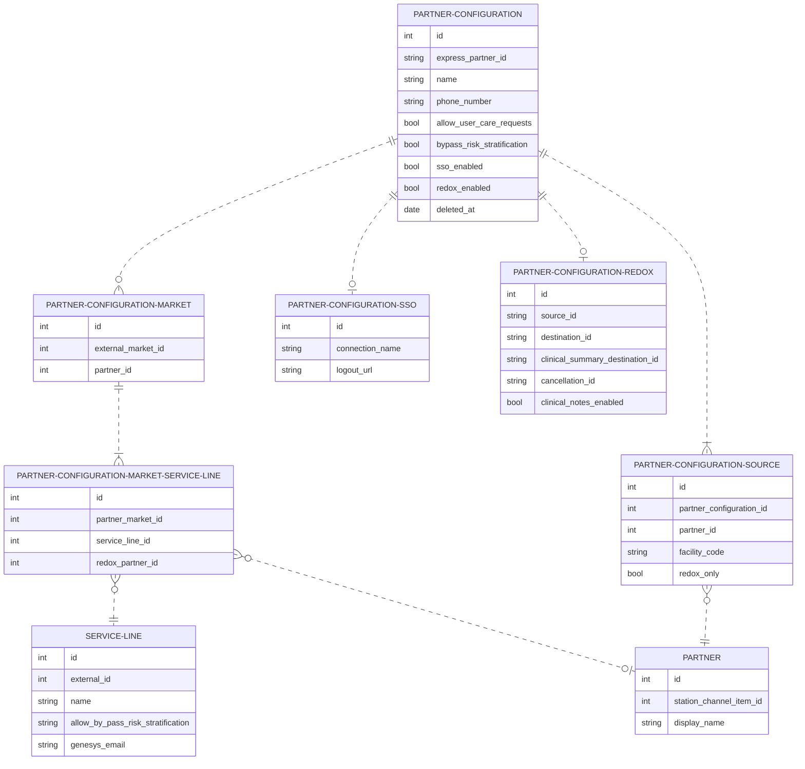

# EDD: Partner Configuration

**Author:** [Daniel Cohn](dan.cohn@*company-data-covered*.com)

## Pre-review Checklist

Before scheduling your design review, ensure that you have checked all of the following boxes:

- [ ] Familiarize yourself with our [EDR process](https://*company-data-covered*.atlassian.net/wiki/spaces/EN/pages/52002922/Process+Engineering+Design+Review)
- [ ] Make sure PRD and EDD are aligned - EM

## Resources

PRD: This EDD supports several PRDs.

[Express SSO](https://*company-data-covered*.sharepoint.com/:w:/r/sites/tech-team/_layouts/15/Doc.aspx?sourcedoc=%7B289F7A35-F89B-418A-A015-9FCE7233C295%7D&file=PRD%20-%20Express%20SSO.docx&action=default&mobileredirect=true&cid=8587c204-9c81-4882-9653-5def5c6c38c9)

[Express OSS](https://*company-data-covered*.sharepoint.com/:w:/s/tech-team/EbFcHGndJeFLuLwhsOuMXncBI7lehe6knlAYQuDUSFFQrg?e=GOJOa2)

[Redox](https://*company-data-covered*.sharepoint.com/:w:/s/tech-team/EaWJd1If6nlAn5ThK1KH8L4BBXQrMpheOFuFbAFL98ubBw?e=x2l535)

## Glossary

EHR: Electronic Health Record

Express: Web app used by partners to create care requests

OSS: Online Self-Scheduling

Redox: A app in Caravan which integrates with Redox. Redox is an external service that establishes connections with external EHRs.

## Overview

Partner Configurations are specific settings used to allow partners to create care requests in Express, Redox, and soon OSS. Right now, configurations are stored separately in Express and Redox which are completely different applications. The configuration schemas are very similar so it is logical to combine them and migrate to Partner Service which will simplify management to a single place. A service proto will be created for all services that need to consume the configurations.

Benefits of migration:

- Expose a single API for accessing and updating partner configurations. OSS can use this to discover a partner's markets, service lines, and sources. Express can use the API to maintain configurations. Redox will use it to load configurations and find service lines.
- Reduce data duplication across multiple projects.
- Simplify onboarding of new partners.
- Build foundation for a partner portal which can do things like manage all partner configuration settings and show partners all partner-associated care requests, not just those created in Express.
- Begin migration from deprecated Ruby and Elixir services to Go service.

## Goals

- Enhance Partner Service to store partner configurations, modify Express and Redox to consume new API
- Add required partner service line API for OSS
- Accelerate time to onboard partners
- Build foundation for partner portal
- Reduce overall amount of code maintained by team. This frees up team members to work in other things and reduces inherit risks in having larger codebase

## Design Proposals

There are several ways we can consolidate partner configurations. All of them should support the API and Schema described below.

| RPC                              | Params                                                       |
| -------------------------------- | ------------------------------------------------------------ |
| ListPartnerConfigurations        | partner_name, filter, order, page_length, redox_only         |
| GetPartnerConfiguration          | id                                                           |
| UpsertPartnerConfiguration       | id, partner                                                  |
| DeactivatePartnerConfiguration   | partner_configuration_id                                     |
| UpsertPartnerConfigurationMarket | id, partner_id, market_id                                    |
| DeletePartnerConfigurationMarket | id                                                           |
| UpsertPartnerConfigurationSource | id, partner_id, source_id                                    |
| DeletePartnerConfigurationSource | id                                                           |
| ListServiceLines                 | partner_id, market_id, facility_code, requested_service_line |

Additionally, proposals 1 and 2 should support these sequences, fullfilling the role of Partner Service.

**Express CR Flow with Partner Service**

**Redox CR Flow with Partner Service**

### Proposal 1 – Move Partner Configurations into Partner Service (Recommended)

This Proposal involves modifying existing Partner Go service. The schema and proto implementation would be part of the Partner Service. GRPC Gateway would be used to allow front ends and legacy services to access the API.

Pros:

- Configurations belong inside of the same service boundary as partners
- Service exists so there will be less overhead starting the project
- Can use OPA for authorization

Cons:

- Refactoring of Express and Redox will be required to integrate

### Proposal 2 – Move Partner Configurations into a new service

This Proposal involves creating a new Go Service. The schema and proto implementation would be part of a new service.

Pros:

- Less risk of breaking existing partner service
- Can use OPA for authorization

Cons:

- Seems unnecessary to create a new service to support closely related schemas
- Refactoring of Express and Redox will be required to integrate
- Add complexity since this service would also need to communicate with Partner Service.

### Proposal 3 – Enhance Express to support other projects

Keep all configurations in Express, add columns for Redox, and implement a GRPC server in Express.

Pros:

- Much of the required schema already exists
- Less risk of breaking Express

Cons:

- Express currently does not support GRPC
- Ruby is a deprecated language
- Does not include benefits of being in monorepo

## Platform Components

EDD proposes to implement a Proto for shared partner configuration. All RPCs are for performing CRUD operations however ListServiceLines can be used by OSS and Redox Orders to retrieve available services lines for the partner-market combination.

Express, Redox, and OSS applications will need to be updated to use the new partner configurations.

<!--

Replace this text with an explanation of what shared / platform components are related to this project.

- What existing shared components are utilized?
- Do any of them require changes?
- Are new shared components being developed as a part of this product?

Please be thoughtful about whether other teams will benefit from or need to use any components you're developing as a part of this product so that we make the right architectural decisions.

-->

## Data Design & Schema Changes

Except for partner the following models will be added to the Partner Service schema.

## Metrics & Data Integration

The data contained inside of partner configurations does not include transactions that would need reporting. Since we will be moving relationships of partner configurations including service lines and markets we will need to export all datasets to Redshift.

## Error Handling & Alerting

Datadog dashboard can be set up to monitor health of service by looking at errors and latency. It should already be in place for existing services. GRPC errors codes will be used appropriately and errors will be used in service logs. It is up to the calling service to respond to error codes.

## Safety

Partner Configuration data does not directly effect patients but reliability of service is essential to schedule care requests for partners.

## Security

Auth0 will use used to authenticate and authorize all requests. The API will be secured by Auth0 and OPA. OPA will be used to authorize requests based on the user's role and the partner configuration. For example, a user with the Express Super Admin role will be able to view and edit all partner configurations. Users with the Express Admin or User roles will be able to view partner configurations for their partner.

There is no plan to allow external users to access their own configuration.

## Audits and Logs

Audit service can be used to monitor changes to configuration and all errors will be logged. It would be preferable to use gRPC Gateway for requests so we can audit using user tokens.

## Scalability

Partner Service will receive requests from Express, Redox and OSS. We can use monitoring and alerting to check resource use and scale Aptible resources if needed. The code being added as part of this EDD will not be particularly CPU intensive as it is primarily performing indexed queries and CRUD operations.

## Cost

No significant cost is added beyond a potential need to scale partner service.

## Experimentation

No experimentation is planned.

## Testing

Benchmarks should be added if any queries are complex to ensure scalability. Go tests will be written to cover all new code. Express E2E tests should cover many aspects of the service since it will be a accessed directly or indirectly through the Express front end.

## Training

If Redox configuration settings are added to Express, super users should be informed of their availability. Other than that, changes should be transparent to users.

## Deployment

To deploy this, we will need to follow this sequence:

1. Build service.
2. Add Feature Flag in Express to use existing or new configuration. Express will initially save to existing models and Partner Service (controlled by a second feature flag).
3. Build rake task in Express to copy over all existing configurations.
4. Turn on both feature flags and verify correctness.
5. Remove feature flags and unused Express Code.
6. Update configurations with Redox properties.
7. Modify Redox to pull from Partner Service, using a Feature Flag.

## Lifecycle management

No new library or language choices outside of existing standards. Technology choices will be supported long term.
