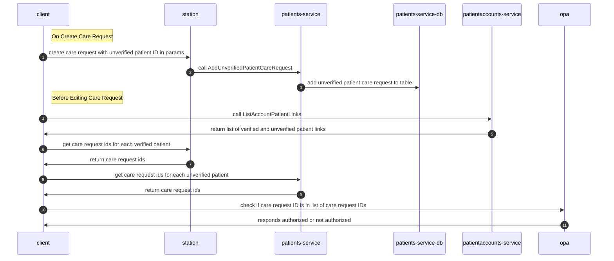
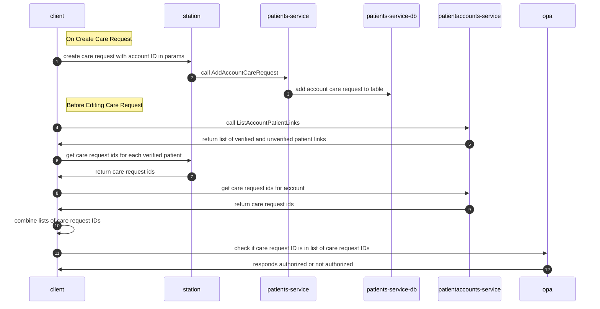
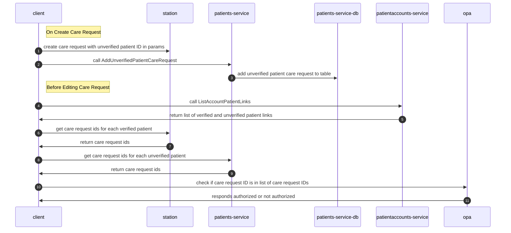
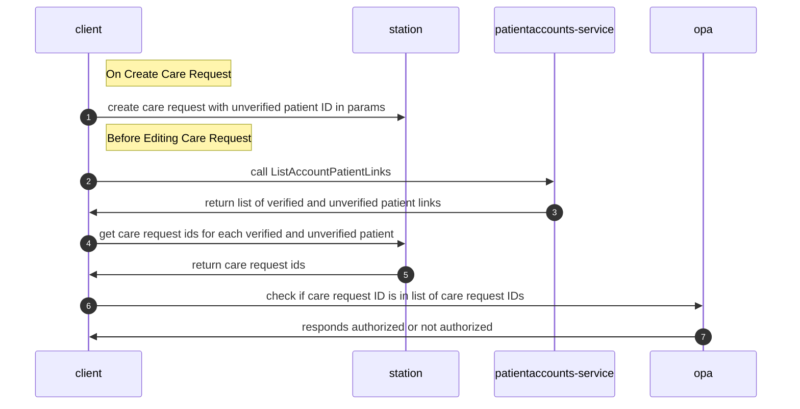
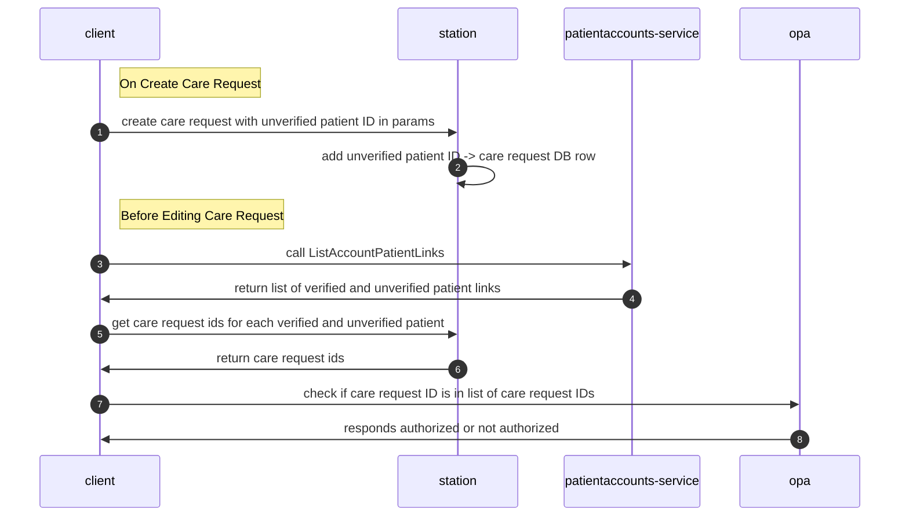
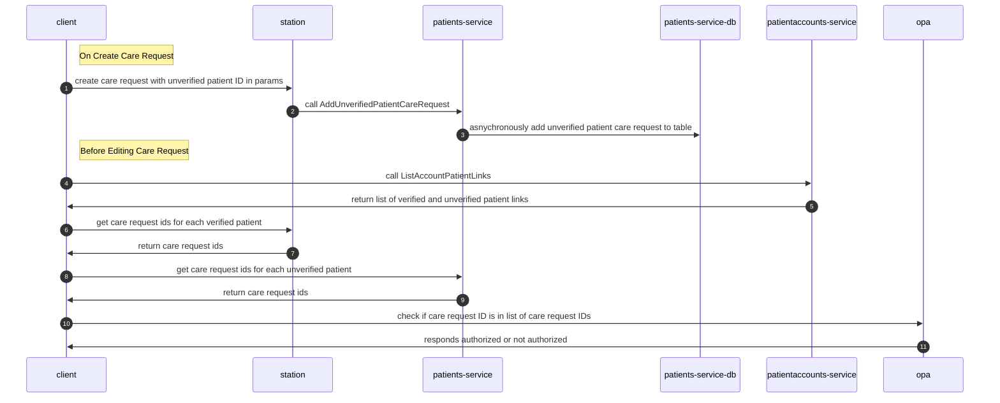
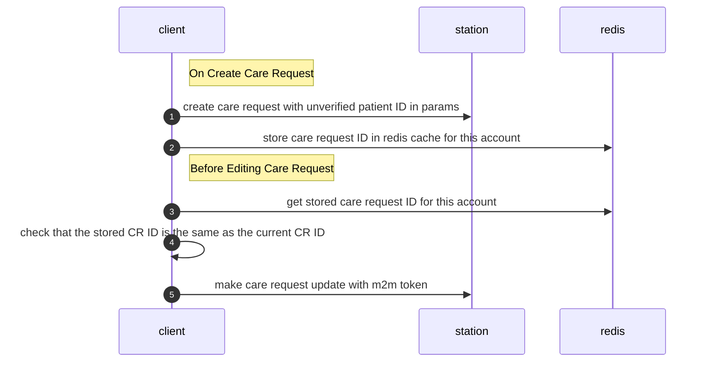

# EDD: Unverified Patient Care Request Relationship

**Author:** [Stephen Li](stephen.li@*company-data-covered*.com)

## Pre-review Checklist

Before scheduling your design review, ensure that you have checked all of the following boxes:

- [ ] Familiarize yourself with our [EDR process](https://*company-data-covered*.atlassian.net/wiki/spaces/EN/pages/52002922/Process+Engineering+Design+Review)
- [ ] Make sure PRD and EDD are aligned - EM
- [ ] EDD has been reviewed by internal team members - EM

## Resources

[PRD](https://*company-data-covered*.sharepoint.com/:w:/s/tech-team/EaELV-RUeeZDjHmUIv17aKcBKJRufaUcph3EmlzvYZNTWA)

Supporting designs:

- [Account Profile + Settings EDD](https://github.com/*company-data-covered*/services/blob/trunk/docs/edd/patient-portal/account-profile-and-settings.md)
- [Patient Accounts EDD](https://*company-data-covered*.sharepoint.com/:w:/s/tech-team/EQacNNZUlttAjvFU9vsu8GUB6gsK1VuIQVGEGjR7dITEyg)

## Glossary

UnverifiedPatient: Patient information that a user uploaded that is stored separately from Athena/Station for PHI reasons. See [Account Profile + Settings EDD](https://github.com/*company-data-covered*/services/blob/trunk/docs/edd/patient-portal/account-profile-and-settings.md#unverified-association) for details.

## Overview

Currently, in order to associate a patient account with care requests, you would need to look up the patients that the patient account is associated with (via `ListAccountPatientLinks`), get the *company-data-covered* patient ID for each one, then query station for the list of care requests associated with each patient.

However, this causes a problem when we have `UnverifiedPatient`s, as users are explicitly not supposed to have access (yet) to *company-data-covered* patient information that they did not upload; naively querying station with the *company-data-covered* patient ID would result in leaking previous CareRequests.

## Goals

- Given an account ID and a care request, we want to be able to safely authorize whether an account should have read/write access to that care request.
  - This is necessary so that OSS and Patient Portal can safely allow editing care requests, such as editing a time window or canceling a care request, for unverified patients

## Design Proposals

### Proposal 1 – Station synchronously sends UnverifiedPatient + CareRequest IDs to patients-service

The UnverifiedPatientCareRequests table will hold a record of all care request IDs created for an unverified patient.

When a care request is created in station with an unverified_patient_id in its params, it will (with an `after_save, on: :create` hook) send a gRPC to patients-service to update the UnverifiedPatientCareRequests table.

When a client (such as `onboarding-api`) wants to know whether an account should be able to modify a care request, it will query `patientaccounts-service` to `ListAccountPatientLinks` to get a list of account-patient links.

If the `AccountPatientLink` is for a verified patient, it is allowed to read/write all data on file for that *company-data-covered* patient, and can simply query station to see whether a particular care request is associated with the *company-data-covered* patient.

If the `AccountPatientLink` is for an unverified patient, it will query `patients-service` for a list of care requests associated with the unverified patient to see whether a particular care request should be authorized.

Pros:

- UnverifiedPatient info is centralized in `patients-service`

Cons:

- Requires a synchronous gRPC API call whenever a care request is created for an unverified patient
  - Similar gRPC API calls have a p95 latency of 8-12 ms
- Could theoretically succeed in creating record in UnverifiedPatientCareRequests table but not station if a later action in the transaction fails (such as an `after_save` or `after_commit` hook)

### Proposal 2 – Station synchronously sends Account + CareRequest IDs to patientaccounts-service

This is similar to proposal 1, but instead of storing unverified patient -> care request ID in `patients-service`, we store account id -> care request id in `patientaccounts-service`.

The AccountCareRequests table will hold a record of all care request IDs created for an account.

When a care request is created in station with an unverified_patient_id in its params, it will (with an `after_save, on: :create` hook) send a gRPC to patientaccounts-service to update the AccountCareRequests table.

When a client (such as `onboarding-api`) wants to know whether an account should be able to modify a care request, it will initiate the following process:

1. Query `patientaccounts-service` to `ListAccountPatientLinks` to get a list of account-patient links, then get the care requests for each verified patient.
   - If the `AccountPatientLink` is for a verified patient, it will query station for a list of care requests associated with the *company-data-covered* patient. If the `AccountPatientLink` is for an unverified patient, it will be ignored.
2. Query `patientaccounts-service` to get a list of care requests associated with the account.
3. Combine both lists of care requests (while deduping) and check whether the care request is in the resulting list.

Pros:

- Clear link between account and care request

Cons:

- May be confusing to have verified patient -> care request ID, but no unverified patient -> care request ID
- May be confusing to caller to have to combine verified patient -> care request ID (for historical care requests) and account id -> care request id, as there will be overlap.
- Requires a synchronous gRPC API call whenever a care request is created for an unverified patient
  - Similar gRPC API calls have a p95 latency of 8-12 ms

### Proposal 3 – Client directly calls patientaccounts-service endpoint

Instead of having station create a record of the unverified patient -> care request link, the caller will do this instead.

Pros:

- Does not increase the load of creating a care request

Cons:

- Creation of unverified patient -> care request record is not transactional, so we may succeed in creating a care request but fail creating an unverified patient -> care request link
  - User would have no way of fixing this, and would fail to be able to view the care request they just created
- Caller has more logic to worry about
- Multiple callers could mean recreating this logic in many places

### Proposal 4 - Add unverified_patient_id field in care request

We can directly add a nullable `unverified_patient_id` as another field on the care request.

Pros:

- Simple

Cons:

- CareRequest object already has tons of fields; would increase the size of the care request object even further

### Proposal 5 - Create mapping table of unverified patient ID -> care request ID in Station (recommended)

We can create a mapping table of unverified patient ID -> care request id in Station to keep track of which care requests are associated with which unverified patient IDs.

We would then create a new endpoint for callers to be able to get a list of care requests for each unverified patient ID.

Pros:

- Simple
- Easily transactional with creation of care request
  - Can verify care request exists with foreign key constraint
- Similar verified patient -> care request information lives in Station as well

Cons:

- Increases amount of code in station even further

### Proposal 6 - Asynchronously send update to patientaccounts service gRPC client

Instead of synchronously sending updates to patientaccounts service like in Proposal 1, we can create an async update like in CareManager or Logistics.

Pros:

- Does not increase delay of care request creation

Cons:

- Information can be arbitrarily out of sync between station and patientaccounts-service, leading to care requests that should be authorized not being authorized yet
  - This could cause confusion for end users

### Proposal 7 - Client keeps record of latest CareRequest ID for account in Redis cache and makes M2M calls to Station

Instead of persistently storing a mapping between care request ID and account/unverified patient in a DB, the client (i.e. `onboarding-api`) will just store the latest care request ID in the existing Redis cache. This is similar to what we do in onboarding-api now.

Pros:

- No new infrastructure needed

Cons:

- Cache expires in 8 hours; any edits after that cannot succeed

## Platform Components

Uses Station and (potentially) patientaccounts-service and patients-service

## Data Design & Schema Changes

Yes; actual change depends on the proposal.

## Metrics & Data Integration

Standard frameworks apply.

Data science/analytics may be interested in Account -> Care Request relationships.

## Error Handling & Alerting

Depending on the proposal, network failures or DB failures could lead to non-transactional behavior pointing to bad IDs.

Recommended proposal 5 avoids these.

## Safety

Depending on proposal, patient may create a care request then have no permissions to view or edit it.

## Security

Without a solution to this problem, a malicious actor may be able to steal PHI, depending on what information we display to the user.

## Audits and Logs

Standard auditing and logging applies.

## Scalability

No known scalability issues. If patientaccounts-service is taking traffic, it should easily be able to handle the relatively small number of care requests created per day.

## Cost

No significant increase in cost.

## Experimentation

Normal statsig flags. OSS launch cannot proceed without a solution here.

## Testing

Should all be testable via automation. No load tests necessary.

## Training

Will add info into runbook about what to do if end users are complaining about permissions issues when viewing care requests.

## Deployment

Standard deployment.

## Lifecycle management

Only station in danger of being deprecated, and this change would be included as part of the migration process.
