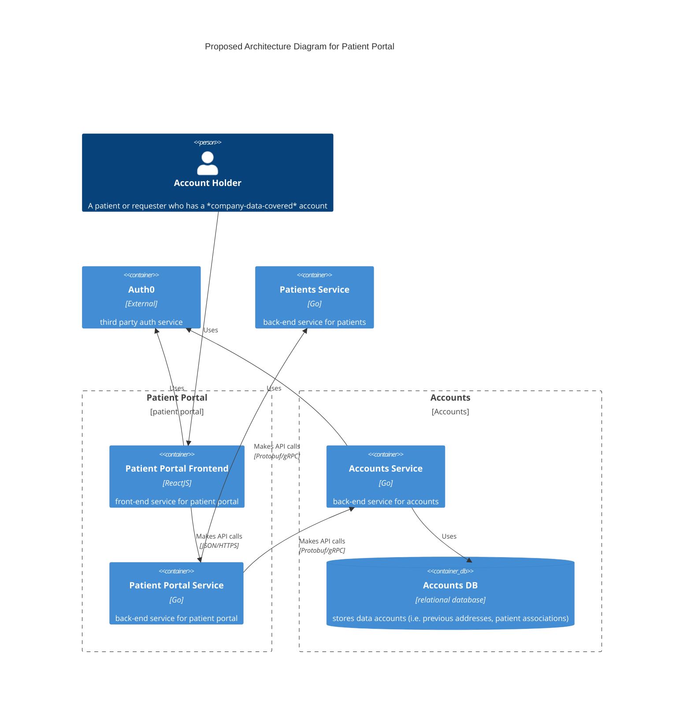
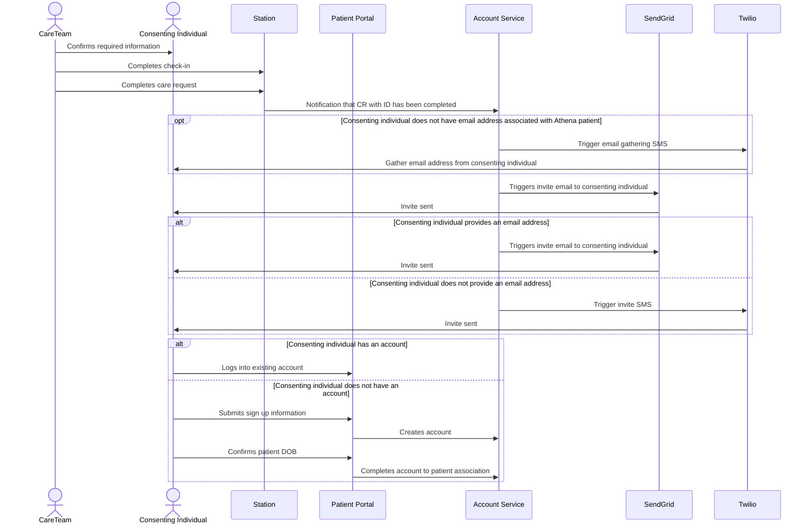
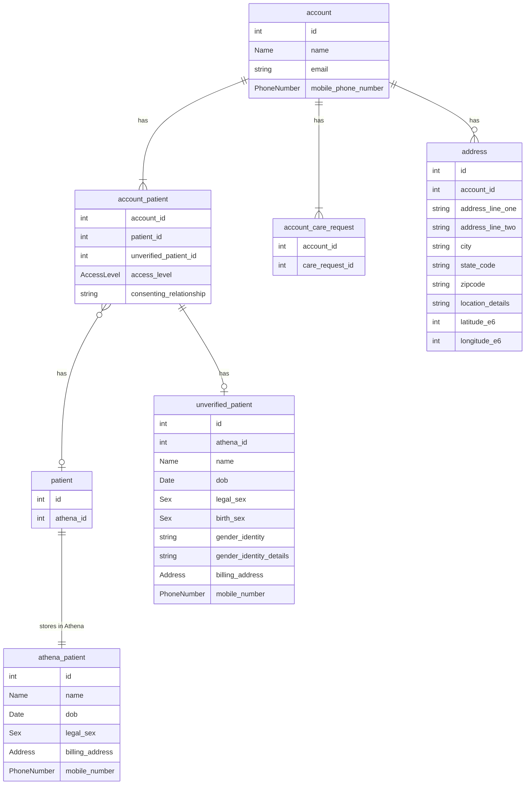

# Patient Portal - Scaffolding + Account Profile and Settings

**Author:** Lucas Peterson

## Pre-review Checklist

Before scheduling your design review, ensure that you have checked all of the following boxes:

- [x] Familiarize yourself with our [EDR process](https://*company-data-covered*.atlassian.net/wiki/spaces/EN/pages/52002922/Process+Engineering+Design+Review)
- [x] Make sure PRD and EDD are aligned - EM

## Glossary

- Account Holder - The owner of the account, not necessarily a patient
- BE (Backend)
- CCC (Clinical Care Coordinator)
- FE (Frontend)
- RCM (Revenue Cycle Management) - Refers to the billing operations team
- MDM (Medical Decision Maker) - The individual who makes medical decision for a patient
- MVP (Minimum Viable Product)
- PHI (Protected Health Information)
- SDoH (Social Determinants of Health)

## Resources

[PRD](https://*company-data-covered*.sharepoint.com/:w:/s/tech-team/EaELV-RUeeZDjHmUIv17aKcBKJRufaUcph3EmlzvYZNTWA)

[Figma - WIP](https://www.figma.com/file/n8WkWJweyzqe78TEoKhQLX/Patient-Accounts?type=design&node-id=839-18827&t=2Ux9vBBZp6Sfd5fC-4)

[Patient Accounts EDD](https://*company-data-covered*.sharepoint.com/:w:/s/tech-team/EQacNNZUlttAjvFU9vsu8GUB6gsK1VuIQVGEGjR7dITEyg) - Previously Approved

## Overview

The Patient Portal will be the landing point for patients to:

- Provide *company-data-covered* with the clinical profile of the account owner or related patients for which the account owner has access to
- Manage communications preferences
- Handle billing with *company-data-covered*
- Visit preparation for upcoming visits
- Receive after-care instructions and information
- Receive SDoH outreach and info
- Re-request care

All of those items listed above will be implemented over many projects that are too large to capture in the scope of a single EDD. Many smaller EDDs will cover specific pieces of the implementation of this long-running project.

The scope of this EDD will be limited to the scaffolding of the patient portal for future implementation and account profile and settings. The features for this scope:

- Account Holder Information
- Patient Demographics and Association
- Request/Service Addresses

The scope of the MVP for this product is yet to be determined. The project will not be released to production until it provides a minimum level of value to the end user. Engineering and product are working together to determine what the MVP scope will include. All sections below (costs, security, etc.) are filled out with production scale in mind.

## Goals

- Setup scaffolding that will be built on for future Patient Portal projects
- Collect and store information about the account holder, including identifying information
- Set foundations for account association to a patient including the updating of patient demographic information
- Facilitate requesting care in Online Self-Scheduling

## Design Proposals

### Frontend

The preferred option is `Option 1`.

#### Option 1: New Frontend

The proposal is to build a new frontend application in the monorepo. This frontend will communicate with the [proposed backend option](#backend).

Pros:

- Relatively low complexity and risk
- Follow new application design patterns that did not exist when Companion was started (Nx libraries, React Query, etc.). Consistent patterns have been set in the monorepo.

Cons:

- New deployed application, increase in resource cost
- Loss of shared components with Companion.
  - This can be mitigated by migrating Companion into the monorepo (already in progress) so that the components could be easily made sharable.

#### Option 2: Companion

Given that Companion is used for our existing patient "check-in", this could be a viable option to build on for the Patient Portal. It has concepts of most of the information we'll be gathering as part of the Clinical Profile feature of the portal.

Pros:

- No new deployed applications

Cons:

- Despite being used for similar concepts, the Patient Portal will operate under a different paradigm:
  - It is not associated to a care request
  - It is not authenticated using the same methods
- Increased risk in building on an application that is released to production

### Backend

The preferred option is `Option 1`.

#### Option 1: New Backend

The proposal is to build a new Golang backend for the Patient Portal project. This would be a BE for FE project that would facilitate communicating and data sourcing from multiple different services so that it is opaque to the FE.

#### Option 2: Multiple Backends for the Frontend

The frontend could theoretically communicate with all the BE services it needs to operate - patients service, athena service, and station are all hypothetical examples of services with which the FE could need to communicate.

Pros:

- No new BE service. Reduction in cost and architectural complexity.

Cons:

- Exposes information about *company-data-covered* architecture to the client
- Potential concerns with all of these services needing to handle tokens from the Patient Auth0 tenant
- The potential need to reconcile information from different sources, probably loading the FE with business logic.

#### Option 3: Companion API

Given that Companion API is used for our existing patient "check-in" via Companion, this could be a viable option to build on for the Patient Portal. It has concepts of most of the information we'll be gathering as part of the Clinical Profile feature of the portal.

Pros:

- Existing infrastructure that can be built on
- Reduce costs from adding extra infrastructure
  - Introducing more use cases could create the need to scale existing resources which negates some cost reduction.

Cons:

- Extending our use of TypeScript backends. TypeScript is not an organization-supported language for backend services and this would further lock us in to its continued use and increase the level of effort necessary to migrate to Go.
- Refactor existing logic. Companion API is focused on check-in "tasks" that would need to be refactored to be separate from the Patient Portal actions.
- Multiple authentication strategies. Companion API would need to support multiple authentication strategies: one for Companion FE and one for Patient Portal.
- Increased risk in building on an application that is released to production

### Account

See [Data Design & Schema Changes](#data-design--schema-changes) for a proposed entity relationship diagram.

Accounts will have a one-to-many relationship with patients with varying levels of access. See [Associated Patients](#associated-patients) for more info.

Accounts will have a one-to-many relationship with care requests. A policy will be set up to ensure that an account will only have permission to view a care request if:

- The account is the creator of the care request, as determined by the `account_care_request` table
- The account has verified `PHI` or `Primary` access to the care request's patient

#### Account Creation

Accounts will exist in two places:

- the patient accounts service
- Auth0 user database

In order to facilitate creation in both there are a multiple options that look to accomplish the following goals:

- Create accounts in both locations
- Minimize local development complexity
- Minimize client implementation complexity

##### Option 1: Client Account Creation - Recommended

Reference workflows

- [Account Workflows](../../architecture/patients/accounts/sequence.md#account-workflows) - See Find or Create Account by Token

This option relies on the client to create the account by exposing a find or create endpoint that leverages the token received from Auth0 to create the account.

Pros:

- Minimized complexity of local development
  - The client is creating the account, so there is no reliance on other applications that could have difficulty communicating with a local environment.
- Minimized complexity for the client
  - The client has to make a single call to the patient accounts service to get the account, which is true of all options

Cons:

- The scope required for account creation would be the same as other account level request scopes: `manage:patient_accounts:own`

##### Option 2: Auth0 Post-Login Action

This option leverages [Auth0 Actions](https://auth0.com/docs/customize/actions), specifically the [post-login action](https://auth0.com/docs/customize/actions/flows-and-triggers/login-flow#login-post-login), to facilitate creating an account model in the patient accounts service.

A high-level implementation would like the following:

- User authenticates with Auth0
- Auth0 post-login action is triggered
- If this is the user's first login (`event.stats.login_count = 1`), send a request to patient accounts service to create the account
  - This process is synchronous with login, so the user will not be redirected back to the client until it is complete
- User redirected back to the client application
- Client application receives a token from Auth0
- Client application sends the token to a `GetAccountByToken` endpoint
- Patient accounts service returns the account created by Auth0

Pros:

- Account creation could require a different token scope to allow for more fine-grained control over which applications can create accounts
- Same complexity for the client as [Option 1](#option-1-client-account-creation---recommended)
  - The client still has to make a single call to the patient accounts service to get the account

Cons:

- Implementation is more complex than [Option 1](#option-1-client-account-creation---recommended)
  - The Auth0 action requires its own Auth0 application resource to get a token to be able to communicate with patient accounts service.
- Local development workflows are more complex than [Option 1](#option-1-client-account-creation---recommended)
  - Auth0 Actions cannot send HTTP requests to a local development environment, so a separate workflow would need to facilitate account creation locally (likely manually adding the account to the database so it can be found based on the token)

#### Account Holder Information

We will collect the following information about the account holder as part of account creation:

- First/last name
- Email
- Phone

Account holders should be at least 21 years of age. After discussion with legal, this can be implicitly confirmed by the user at the time of account creation by display text similar to "By providing your email, you consent to our Terms and Conditions. You also confirm that you are over the age of 21." This age limitation is due to the fact that there are a few states where the age of majority for giving informed medical consent is 19 or 21([Reference](https://www.cdc.gov/hiv/policies/law/states/minors.html)). To maintain a single age limit to apply across all states, it should be 21 and not 18. The known states that are affected by this are:

- Alabama
- Mississippi
- Nebraska
- Pennsylvania

For details on the email update workflow, see [Patient Accounts Sequence Diagrams](../../architecture/patients/accounts/sequence.md#email-update-workflow).

For details on the phone update workflow: See [Patient Accounts Sequence Diagrams](../../architecture/patients/accounts/sequence.md#phone-update-workflow).

All other fields will be editable through standard workflows.

#### Updating Account Holder Information

Reference workflows:

- [Communication Channel Verification](../../architecture/patients/accounts/sequence.md#communication-channel-verification)
- [Update Email](../../architecture/patients/accounts/sequence.md#email-update-workflow)
- [Update Phone](../../architecture/patients/accounts/sequence.md#phone-update-workflow)

Requirements:

- OSS must be able to update an account without verifying the provided phone number to decrease friction in the UX
  - This implementation is equivalent to the current implementation in Web Request.
- Patient portal needs to verify existing account workflows when the user takes certain actions to protect against session hijacking attacks.
- Patient Portal should require verification of new values for email (see [Verifying Email and Phone Number](#verifying-email-and-phone-number)) because it is used for authentication.

Implementation:

- Update endpoint that does not require communication channel verification: `UpdatePatientAccount`
  - Path: `PUT /v1/patient_accounts/{account_id}`
  - Scope: `manage:patient_accounts:own`
  - Params: all updatable account fields except for email since it is the primary authentication factor
  - Description:
    - Updates patient account fields in the accounts service database and Auth0.
    - If phone has changed, sets `is_phone_verified` to false when updating values in Auth0.
- Start phone verification endpoint `StartPhoneVerification`
  - [Relevant Twilio Verify API Documentation](https://www.twilio.com/docs/verify/api/verification#start-new-verification)
  - Path: `POST /v1/patient_accounts/{account_id}/verifications/phone`
  - Scope: `manage:patient_accounts:own`
  - Params: Destination phone number, channel (sms or call)
  - Description: Creates the verification for the provided channel
- Start email verification endpoint `StartEmailVerification`
  - [Relevant Twilio Verify API Documentation](https://www.twilio.com/docs/verify/api/verification#start-new-verification)
  - Path: `POST /v1/patient_accounts/{account_id}/verifications/email`
  - Scope: `manage:patient_accounts:own`
  - Params: Destination email
  - Description: Creates the verification with email channel
- Check verification endpoint `CheckVerification`
  - [Relevant Twilio API](https://www.twilio.com/docs/verify/api/verification-check#check-a-verification)
  - Path: `POST /v1/patient_accounts/{account_id}/verifications/check`
  - Scope: `manage:patient_accounts:own`
  - Params: Destination value (either email or phone), OTP, `update_on_success` flag
    - Potentially could leverage proto `oneof` for phone/email fields, but not required as Twilio only requires a string. It might be preferable because the phone number must be in [E.164 format](https://www.twilio.com/docs/glossary/what-e164).
  - Response: nullable error message
  - Description:
    - Checks the given OTP against the Twilio API
    - If successful and `update_on_success` is true, use the `channel` in the Twilio response to update the necessary account field

Open questions (`FIXME`: to answer and document before merging):

- Do we need to support `call` channel for OTP (delivery by phone call)?
  - [Slack Thread to Answer](https://dh-techteam.slack.com/archives/C04AFMQRJNT/p1686029207346599)

#### Verifying Communication Channels

Reference workflows:

- [Communication Channel Verification](../../architecture/patients/accounts/sequence.md#communication-channel-verification)
- [Update Email](../../architecture/patients/accounts/sequence.md#email-update-workflow)
- [Update Phone](../../architecture/patients/accounts/sequence.md#phone-update-workflow)

In order to allow account holders to update the fields in their account that are used for authentication, the values must be verified. These fields are used for primary authentication (email with magic link) and targeted re-authentication (phone/email with OTP). The login process inherently confirms the email, but Auth0 does not provide a method for verifying an email in a passwordless environment while the user is trying to change the email address. The situation is similar for phone number verification.

In order to verify the values, the account service must implement a verification process when a user is attempting to update these values or update other values that require verifying the session has not been hijacked. The verification strategy has multiple options which will be described below and look to accomplish the following goals:

- Allow users to safely update their email/phone number
- Provide confidence that the email/phone number is valid to prevent product support issues where a user has unintentionally locked themselves out by mistyping a value
- Use existing *company-data-covered* vendors for patient communication: Twilio and SendGrid
- Avoid introducing unnecessary complexity to the accounts service
- Manage cost of validation
- Support OTP length configuration to balance UX (not too long, easy to remember) and security concerns (not too short, relatively difficult to brute force)
  - Limitations around attempt count, attempt rate, and expiration should mitigate security concerns
- Support multiple OTP delivery methods: email, SMS, and voice.

##### Option 1: Twilio Verification Service - Recommended

This option involves using the Twilio [Verification](https://www.twilio.com/docs/verify/api/verification) and [Verification Check](https://www.twilio.com/docs/verify/api/verification-check) APIs in the accounts service to facilitate the sending and validation of OTPs. A [Twilio Verification Service](https://www.twilio.com/docs/verify/api/service) will be created to facilitate accounts service workflows. For clarity, this is not a service within Dispatch Health but within Twilio.

This implementation will protect from over-use (and subsequently over-spending), by leveraging built in [Verify Rate Limits](https://www.twilio.com/docs/verify/api/programmable-rate-limits).

This solution offers all of the control necessary for the OTP flow:

- Code length
- Templates for delivery
  - The templates are currently in public beta
  - The templates offer translation services which could be useful for future localization efforts
- Controls around expiration, rate-limiting, and attempt limits

Pros:

- Simpler implementation when compared with [Option 2](#option-2-hybrid-*company-data-covered*twilio-verification-service) and [Option 3](#option-3-hybrid-auth0twilio-verification)
- More secure in terms of offloading responsibilities to Twilio
- Leverages existing *company-data-covered* vendors
- Supports all desired delivery channels

Cons:

- Higher [cost](#cost) than [Option 2](#option-2-hybrid-*company-data-covered*twilio-verification-service) and [Option 3](#option-3-hybrid-auth0twilio-verification):
  - Paying to send the sms/call/email and for the use of the Twilio Verify API
  - Justification: The workflows to update email/phone are not considerably high traffic, so cost increase in minor.

##### Option 2: Hybrid *company-data-covered*/Twilio Verification Service

This option involves generating OTPs in the accounts service that would be sent to the user and validated. Twilio would be used to send the OTPs created by the account service over SMS, voice, or email (via Twilio SendGrid.)

Pros:

- Leverages existing *company-data-covered* vendors
- Supports all desired delivery channels
- Lower [cost](#cost) than [Option 1](#option-1-twilio-verification-service---recommended) and similar cost as [Option 3](#option-3-hybrid-auth0twilio-verification):
  - Only paying to send the sms/call/email, not paying for the use of the Twilio Verify API

Cons:

- Implementation is more complex than [Option 1](#option-1-twilio-verification-service---recommended) and [Option 3](#option-3-hybrid-auth0twilio-verification) due to needing to manage OTP flow requirements internally.

##### Option 3: Hybrid Auth0/Twilio Verification

This option uses Auth0's implementation of step-up authentication to allow the patient portal to require MFA when accessing specific features/workflows in an application.

Pros:

- Simple to implement and allows the use for selective MFA in other areas of the application
- Auth0 is already involved in the workflow
- Supports all desired delivery channels

Cons:

- Adds complexity to the workflow by requiring communication channel verification through two vendors: Auth0 and Twilio
  - The MFA can only be used for current account values so Twilio would still need to be used to validate new values before updating the account.
- Does not allow for forced re-prompts
  - The verification of current account values before allowing the user to update a new value is to protect against session hijacking. The MFA process adds a claim to the token indicating the user is authenticated with MFA already and will not require it again. This makes it difficult for the Patient Portal to require re-prompting if the session was hijacked after already completing MFA.

#### Addresses

The patient portal will provide the ability to store a list of service addresses associated with an account. These addresses can be used when re-requesting care in Online Self-Scheduling.

The accounts service will accept an API call (from a frontend) to convert a raw address to latitude/longitude. It will then attempt to validate the address using the [Address Validation API](https://developers.google.com/maps/documentation/address-validation/overview), which will give actionable feedback to the user about what is wrong with their address if we are unable to validate. Validated addresses will include latitude and longitude in the response.
Once validated, addresses will be stored along with the latitude and longitude in the `Address` table in the Account Service Database.
If an address cannot be validated, it will be not be saved in the database, and an error will be returned to the caller.

Requests to the Address Validation gRPC endpoint that exists in the Patient Accounts Service will be rate limited to prevent misuse, both at a per-second level and a per-day level. If an account makes too many API calls in a day, it may be permanently blocked, either via manual action in response to alerts, or automatically.

Justification to store these separately from the patient: Athena only supports storing 1 address associated with a patient which is used as the billing address. Billing addresses and service addresses should not be conflated. The billing address for the patient will be separate and stored in Athena (see [Patient Demographics](#patient-demographics))

Storage:

- Account Service Database - The addresses are saved for a given account

Alternative relationship options for storing saved addresses:

- Addresses are saved for a given patient so any account with access to that patient has access to them
- Addresses are saved for a given patient AND account so there is one address book for each account patient

#### Associated Patients

As mentioned above, accounts will have access to 0 or more patients. This section will detail what information is in scope for this project. It should also clearly identify which sections will be viewable/editable by which access levels. There are two types of patient associations, [verified](#verified-association) and [unverified](#unverified-association).

The level of access an account has with respect to a specific patient's information falls into one of the following categories:

- `PRIMARY`: Full read/write access to the patient information with the ability to designate a new `PRIMARY`
- `PHI`: Full read/write access to the patient information
- `BILLING`: Full read/write access to the patient's billing information, excluding any PHI
  - This access level will only be available initially when invites are able to be sent through the portal.

Only one account will have `PRIMARY` access to the patient.

##### Unverified Association

All account holders will also be able to setup unverified patients. An unverified patient is, at its core, the patient information that was uploaded by the account holder. Unverified patients will have a reference to an Athena patient, but that reference (or patient information associated with it) will never be shown back to the account holder. This allows account holders to request care on behalf of the unverified patient in Online Self-Scheduling, without causing an absurd amount of duplicate Athena charts. Example use case:

> A father creates a *company-data-covered* account and adds patient information for his spouse, two children, and elderly mother to his portal.

In the above use case, the information collected for those family members cannot be visibly associated to an Athena patient. However, the account holder still expects to see that information when he logs into his account in Online Self-Scheduling. To do this, the Patient Portal will show only the patient information that was added by the account holder, and not the canonical information from the Athena patient.

Consequently, the information stored for an unverified patient will not be updated when changes are made in Athena in the event that patient is seen by *company-data-covered*; this is intentional for compliance reasons. In order for the two to be connected, and for changes in the Athena patient to be reflected in the Patient Portal, the account holder must gain verified access to this patient.

##### Verified Association

Accounts will be granted verified association to a patient when an email is associated with the patient record in AthenaHealth; this can be gathered on scene, or gathered afterwards by means of an SMS message sent to the phone number on file.

The proposal is to leverage the Consenting Individual step of the on-scene check-in process. This will allow the care team on scene to confirm the identity of the consenting individual. This will allow us to gather the following information about the consenting individual:

- First/last name
- Relationship to patient
  - Self
  - Legal guardian
  - MPOA
  - Other (free text)
- Phone number
- Email

Limitation: due to legal concerns with PHI age-restrictions, verified patients must be over the age of 21. Any patients under the age of 21 will remain unverified.

##### Removing Association

The different cases for disassociating a patient from an account are:

- The `PRIMARY` account for a patient will be able to remove any account associations to that patient.
- An account holder will be able to manually disassociate themselves from both verified and unverified patients

##### Patient Demographics

Patient demographics will be editable by the account holder if the account holder has any of the following levels of access:

- `PRIMARY`
- `PHI`

Uneditable fields are able to be changed by calling into the CCC/RCM lines to adjust. This will be made clear to the user in the application. The reasoning behind needing to call and update these fields is it can have some negative side affects for auto-merges on the Athena side. This decision was made in coordination with CCCs and Product.

The following demographics will be available in the patient portal:

- Uneditable fields:
  - First/Last name
  - Date of Birth
- Editable fields:
  - Email
  - Phone Number
    - Will be stored as the home number in the patient's athena chart
  - Legal sex
  - Consenting relationship (stored in account -> patient association)
  - Billing address

## Platform Components

New platform components:

- Patient Portal FE React application
- Patient Portal BE Go service
- Accounts Service database
- Station: updates to consenting individual check-in form to add email address

## Data Design & Schema Changes

Proposed account entity diagram:

New databases will be setup with read-replica access for Data Engineering.

Storage locations:

- Accounts Service
  - Account
  - AccountPatient
  - AccountHolder
  - Address
- Patients Service
  - Patient
  - Unverified Patient
- Athena
  - AthenaPatient

## Metrics & Data Integration

Metrics will be tracked in Datadog for resource, application, and feature metrics.

The FE will use Datadog RUM for session monitoring.

Key feature metrics to track:

- Count of unverified patients created
  - To gauge usage of this feature
- ...

## Error Handling & Alerting

Alerting for resource usage will leverage existing Aptible resource alerts.

Other key alerting scenarios:

- unusual spike in failed logins (datadog tracked)
- ...

## Safety

The account/patient association discussed in [Associated Patients](#associated-patients) has both safety and legal concerns. These are mitigated by the on-scene verification of the consenting individual who will be the individual invited to create an account.

Future Patient Portal features/projects will have safety concerns that will be discussed in those EDDs specifically.

## Security

The security implications of this project are covered in the Patient Account EDD linked under [Resources](#resources).

## Audits and Logs

New platform components will be built to conform with auditing standards at *company-data-covered*:

- Incoming requests to the new Go service will be audited using the audit interceptor
- Read/write actions to new databases will be audited
- Request to Athena Service to read/write data in Athena are audited. Already exists.

Logs will be consumed and monitored using Datadog.

## Scalability

No current scalability concerns. As traffic increases for the portal, resources can be easily scaled if it becomes a problem.

- Bottlenecks: none
- Maximum capacity: scalable via replication
- Fan out: another callback from station for account -> patient association
- Storage: minor, data for accounts is not large enough to be a scaling concern

## Cost

- New FE: $60-120/month, $720-1440/year (heavily usage dependent)
  - Estimates we're gathered by @dambrisco and can be viewed in [this slack thread](https://dh-techteam.slack.com/archives/C044WMNPRM5/p1682022303750959?thread_ts=1682021558.460579&cid=C044WMNPRM5).
- New BE: $59/month, $708/year
- New DB: $60/month, $720/year
- Communication channel verification:
  - $0.05 per _successful_ verification
  - For SMS: $0.0079 per SMS (US)
  - For email: Need to check SendGrid contract to confirm prices

## Experimentation

Statsig will be used to control access to different features once this is released to production

## Testing

Testing will follow *company-data-covered* standard testing practices:

- FE will use Jest and Cypress
- BE will use integrated Go testing tools

Load testing will not be large concern for the applications.

## Training

Tech team training:

- A new run book will be created as part of this project for handling outages

Operations training:

- Product support teams will need to be trained to handling calls/requests regarding the accounts

Until this product is ready for production release, operational training will not be a major consideration. Other projects, Account Reset for example, will have a much larger focus on operational training because there will be some manual touch points.

## Deployment

BE services and databases will be deployed to Aptible. FE applications will be deployed in the same pattern as our existing FEs, using AWS S3, CloudFront, and LambdaEdge.

Given that this will not be released to production for a while, these deployments will be limited to QA/UAT.

## Lifecycle management

No new technology choices are being made as part of this project.
