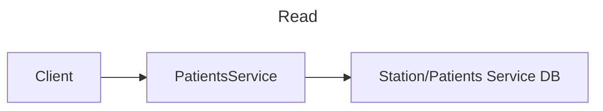
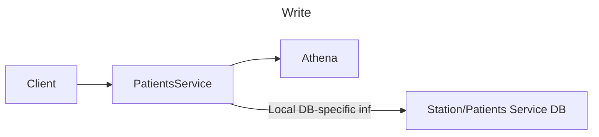
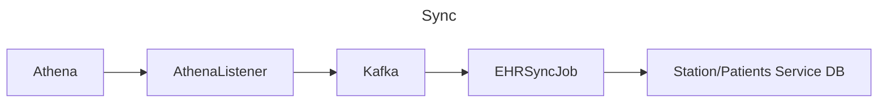
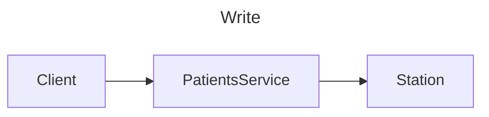
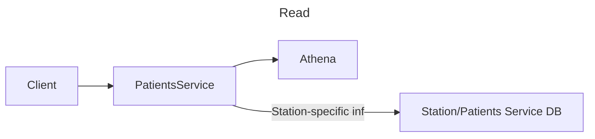
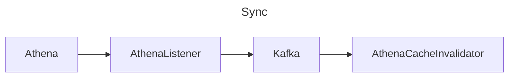
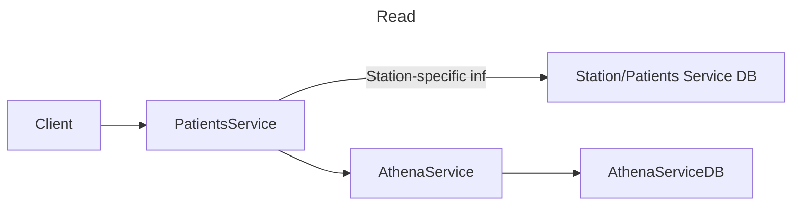
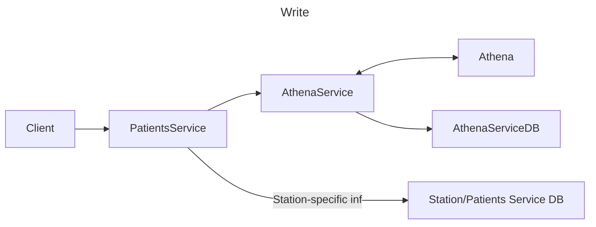
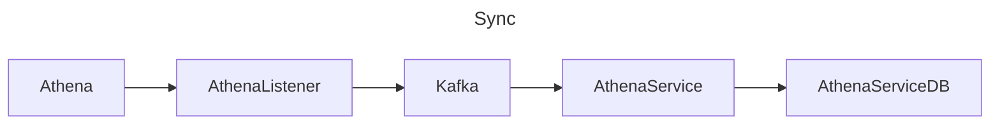

# EDD: Patients DB

**Author:** [Stephen Li](stephen.li@*company-data-covered*.com)

## Resources

PRD: [Patient Service PRD](https://*company-data-covered*.sharepoint.com/:w:/s/tech-team/EVa26T74qdJKrDe7KcI_k_wB4q6UIZBcOSVdCY2NE1QQ4w?e=2tX7Ji)

Supporting designs:

- [Patient Portal PRD](https://*company-data-covered*.sharepoint.com/:w:/s/tech-team/EaELV-RUeeZDjHmUIv17aKcBo0ZQkPUXPufUdEqATQ-jjg?e=mBqpeF)
- [Patients Service Migration Plan](https://*company-data-covered*-my.sharepoint.com/:w:/p/stephen_li/Ec0MyQHmd-VNmu6TfQvboQIBneM4cQz9pJmrwpCYkCsDag?e=E8HapY)
- [Patients Service Search](https://*company-data-covered*.sharepoint.com/:w:/s/tech-team/EY9fGxLwCV1Mv28YQuE6klwBpa_MqfLutHcW54cMTVt7Ig?e=v7ROwW)
- [Athena Service EDD](https://*company-data-covered*.sharepoint.com/:w:/s/tech-team/EZ2HU_GUr1VEuFW02EMbqjwBNBDCME6I_SeRX9l6cLcPaQ?e=6vmdae)
- [Patients Service EDD](https://*company-data-covered*.sharepoint.com/:w:/s/tech-team/EQwTgEgXz8ZJu4t76WJ32jsBIw8FfYxEXftTf8hAaO9K2g?e=3BmOXC)

## Glossary

<!--

List of terms, acronyms and/or abbreviations with their respective definitions that will be used across this EDD.

-->

## Overview

Previously, the plan (as outlined in the [Patients Service Migration Plan](https://*company-data-covered*-my.sharepoint.com/:w:/p/stephen_li/Ec0MyQHmd-VNmu6TfQvboQIBneM4cQz9pJmrwpCYkCsDag?e=E8HapY)) was for Patients Service to make calls directly to Athena Service, and Athena Service to cache calls to reduce API load.

However, implementation has revealed certain flaws in that plan; namely, `ListPatientsByIDs` and `SearchPatientsByName`.

`SearchPatientsByName` was intended to allow callers to search over the list of patients in the form "firstname lastname". `ListPatientsByIDs` was intended to allow callers to pass in a list of _company-data-covered_ Patient IDs and return a list of _company-data-covered_ patients.

In both cases (but especially `ListPatientsByIDs`), because Athena does not provide an equivalent endpoint, `patients-service` would be forced to make a call to `athena-service` for each result. As we have only 50 queries per second, and a single list or search query could have that many results, this would quickly result in running out of Athena API quota.

We want a solution that handles these cases, while having a single source of truth and keeping our Athena API quota under control.

## Goals

1. Support `ListPatientsByIDs` and `SearchPatientsByName`

   - `ListPatientsByIDs` is needed for CareManager and Patient Accounts, when we have a list of patients and want to display patient information for each of them.
   - `SearchPatientsByName` was requested by Partner/CareManager/Onboarding teams, who would like to be able to use a single search box to search for a name in the format "firstname lastname".

2. Single source of truth for patient information

   - Current Station solution has two sources of truth, and merge conflict resolutions between them are complicated and hard to understand, which results in bugs.

3. Keep API quota under control

   - If we overrun our Athena API quota, then no calls to Athena can be made.

4. Support migrating to `patients-service`

   - For all proposals (except proposal 3), we still plan to migrate the Station DB to a `patients-service` DB.

In scope:

- Patient info currently stored in the `patients` table in Station
- Patient info stored in the `Patient` object in Athena

Out of scope:

- Patient-adjacent information, such as ClinicalProvider, CareTeam, etc.

## Design Proposals

### Proposal 1a – Station/PatientsService DB layer with full patient info

Station will include a local version of [all patient info that we care about from Athena](https://github.com/*company-data-covered*/station/blob/a72504e815fdf85a3ff0dfd46d9b1c1db8930787/app/models/athena/patient.rb#L54), as well as any DH specific info (such as service line, partner id, etc).

All writes to patient information whose source of truth is Athena will synchronously go directly to Athena, while reads will go to Station. We will write synchronously to first Athena, then Station.

All writes to patient information whose source of truth is Station will go to station, as will reads.

To handle changes made directly in Athena, the `athena-listener-service` will listen for changes to Athena patients, and update Station with the latest information.

This is very similar to the existing station implementation, with simplified syncing logic.

Once changes are made, all patient data stored in Station will be migrated to a database in `patients-service`.

Pros:

- We can do local searches over this DB, satisfying the first goal.
- Athena is the single source of truth for info, satisfying the second goal.

Cons:

- Need to keep Station in sync with Athena remote instead of just invalidating cache
- Possibility of having divergent data in Athena and Station that only gets resolved on next `athena-listener`-based sync

### Proposal 1b – Immediate read on each write to sync Station/Patients Service DB

Same as proposal 1a, but every time we write patient information whose source of truth is Athena, instead of:

1. Writing to Athena
2. Writing to Station

we will instead:

1. Write to Athena
2. Read from Athena, and use that information to update Station

Once changes are made, all patient data stored in Station will be migrated to a database in `patients-service`.

If necessary, to avoid a latency increase for every write, we could asynchronously update the local DB on every write instead of doing it synchronously.

Pros:

- All Station updates go through the same codepath, so we're less likely to run into issues with divergent data

Cons:

- Doubles the quota necessary for each write operation to Athena.
- Latency increases by ~1.7x for each write operation (unless we do the "read/update local DB" asynchronously)

### Proposal 2 – Station/Patients Service DB with limited info

This is the same as proposal 1, except that the Station version of the patient object will be limited to only a few fields, such as:

- First name
- Last name
- Date of birth
- Athena EHR ID
- Sex

Once changes are made, all patient data stored in Station will be migrated to a database in `patients-service`.

Pros:

- Search results generally don't need more info than this to display options
- Since these fields don't change often, easier to keep in sync with Athena remote than proposal 1

Cons:

- All of the disadvantages of proposal 1 with not as many advantages
- May still require full reads to Athena for `ListPatientsByIDs`, depending on use cases

### Proposal 3 - Station with conflict resolution

This is the current state. Writes can happen to either Athena or station, and when syncing happens, a conflict resolution algorithm will be applied to decide which should be the canonical one. Reads go to station.

No migration to `patients-service` will occur in this proposal.

Pros:

- No more work necessary

Cons:

- Conflict resolution logic is complicated and hard to understand, leading to bugs

### Proposal 4 - No local DB in Station/Patients Service DB

`patients-service` will make all calls directly to Athena (with a cache layer to keep quota down).

When `patients-service` needs to get non-Athena specific information (such as `partner_id` or `power_of_attorney`), it will call the relevant service instead (initially Station, then `partner-service` or `patients-service` in the future), and join that information with the AthenaService response.

For `SearchPatientsByName`, we can either force clients to change their UI and split it into "first name" and "last name" fields, which we can then feed into Athena's native `/patients/search` endpoint, or we can force clients to take input in the form "lastname, firstname".

For `ListPatientsByIDs`, we'll force users to make individual `GetPatient` calls.

Pros:

- Current plan of record
- Closely mirrors Athena's capabilities

Cons:

- Can't support use cases of other teams (partner, care manager, onboarding)
  - Product/UX are unhappy with both solutions for `SearchPatientsByName`
- Potential quota issues when clients can't use `ListPatientsByIDs`

### Proposal 5 - Persistently store all Athena patient info in new athena-service local DB (Recommended)

Similar to proposal 4, but instead of a cache (which has no guarantees on indexing or existence of records), we will create a new persistent DB in Athena Service that has a record of all Athena patients.

In `athena-service`, keep a local copy of the Athena patient. We can initialize this table from the Athena data that data engineering has.

`athena-listener-service` will listen for relevant updates to Athena, and ask `athena-service` to update its local database whenever it detects a change.

Clients (like `patients-service`) will make calls to `athena-service` to get Athena-specific information. Because we own `athena-service`, we can also define our own API endpoints over the database (such as `SearchPatientsByName` or `ListPatientsByIDs`).

When `patients-service` needs to get non-Athena specific information (such as `partner_id` or `power_of_attorney`), it will call the relevant service instead (initially Station, then `partner-service` or `patients-service` in the future), and join that information with the AthenaService response.

After `athena-service` writes data, it will read from Athena and update its local Athena DB, so that it is kept in sync.

Pros:

- Much less concern for quota limits
  - All reads will directly call `athena-service` (except those from `athena-listener-service`, which should be negligible)
- Easily extensible to non-patient objects - CareTeam, ClinicalProvider, or anything else which has a [changed data subscription](https://docs.athenahealth.com/api/guides/changed-data-subscriptions) can be stored this way

Cons:

- Since DE has daily copies of Athena's tables, we'll need to initialize with their data, then update the table with all changes that have happened in the last day
- Adding new columns with data to our local Athena DB requires either iterating over every row and updating it, or reinitializing a new DB and pointing to that one.

## Platform Components

Using the Kafka queue that `athena-listener` will populate in order to determine when to update the Athena DB.

## Data Design & Schema Changes

In the short term, none. In the longer term, the station `Patient` table will move over to `patients-service`; see [Patients Service Migration Plan](#resources).

## Metrics & Data Integration

Standard frameworks apply.

## Error Handling & Alerting

Proposal 1: Biggest possible failure point is syncing issues; if we need to write to both Athena and station, and the one of the writes fails for some reason, we'll have conflicting information until the next time we poll Athena. We'll have retries for writes, and alerts thrown if all retries fail and information is not persisted.

Proposal 5: Biggest possible failure point has to do with optional data. If we're not careful, we may neglect to include optional data that we rely on when updating the local AthenaService database.

Alerts will include (but are not limited to)

- Standard alerts (latency, error rate, etc.)
- Nearing quota alerts (if they don't exist already)
- Lack of traffic alerts (during normal work hours)

## Safety

Errors could cause administrative patient info to be out of date.

## Security

Patient data is stored only in approved locations (station, patients/athena-service, Athena).

## Audits and Logs

Standard auditing and logging applies.

## Scalability

Potential issues with Athena quota; we'll monitor Athena quota and alert if quota usage gets too high.

## Cost

No extra cost except in proposal 4, where we might need to up limits.

## Experimentation

Statsig feature flags when possible.

## Testing

Unit tests.

Testing with Preview Environment:

- Load tests, to see roughly how much traffic corresponds to how much quota increase
- Test different scenarios
  - CRUD Patient in Athena but not through Patients Service
  - CRUD Patient through Patients Service
  - CRUD Patient via Station (as we need to support that while migration is ongoing)

## Training

Document how to trigger a sync on a specific patient ID. Also document how to debug `athena-listener` if it's not polling or consuming Kafka correctly.

### Triggering Sync

For proposal 1, `patient.ehr_adapter.sync_ehr` in Rails console will be added to a runbook.

For proposal 5, we'll expose an endpoint that will `GetPatient` for AthenaService and update the local DB, and document it in a runbook.

Manually triggering a sync should not be necessary in most cases, but can be done if there is evidence that there is a bug with automatic syncs. This should immediately be followed up with investigation into why a bug is occurring, and fixing it.

### Debug Athena Listener

Info will be included in Athena Listener Service runbook.

## Deployment

Standard deployment.

## Lifecycle management

Nothing should be nearing end of life; the closest is Station, which we will actively migrate away from.
