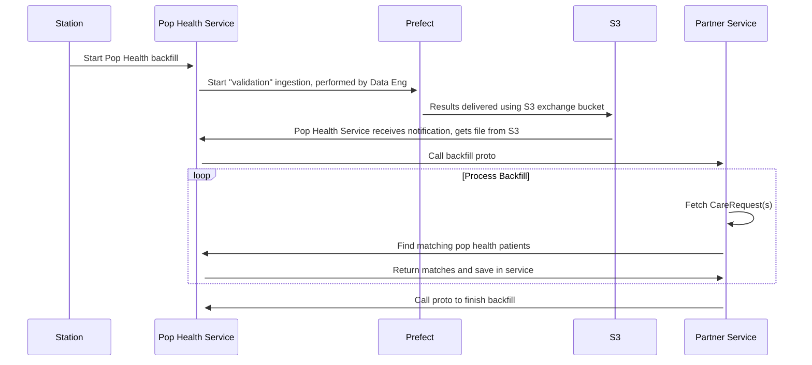

# EDD: Pop Health Backfill

**Author:** Daniel Cohn

## Pre-review Checklist

Before scheduling your design review, ensure that you have checked all of the following boxes:

- [ ] Familiarize yourself with our [EDR process](https://*company-data-covered*.atlassian.net/wiki/spaces/EN/pages/52002922/Process+Engineering+Design+Review)
- [ ] Make sure PRD and EDD are aligned - EM

## Resources

[PRD](https://*company-data-covered*.sharepoint.com/:w:/s/tech-team/EbIWW9MdmkBDvMidnCyrSLYBwzMaPj4W62c6kYWJ8-ik7A?e=a5ovm9)

## Overview

The Pop Health Service has successfully been running in production since January. The final requirement is to implement the ability to "backfill" data. This means that files are given to us after the date to which they apply and we are expected to correct historic data. Currently this can only be done using the station legacy process. This is the only reason we can't stop the legacy process in station. In addition to relying on deprecated code, the legacy backfill process is very slow and relies on multiple cron jobs.

The backfill process is initiated by specifying a file, partner id, start date, and end date. The process will iterate for care requests in the date range and find matches against the list of eligible patients in the provided file.

Using an interaction between Pop Health and Partner Services, we can perform the backfill, however the source of care requests and patients is outside of these services. How we will access this data is the focus of this EDD.

## Goals

In addition to knowledge sharing and general review, we want to decide on the best way for Partner Service to access care requests.

## Design Proposals

This diagram shows how we would like to implement the backfill. The area in question is the "Fetch CareRequest(s)" step.



After a pop health backfill is started using the Station Admin UI (a checkbox labelled Start Backfill and start and end date fields will be added to the UI), a Prefect ingestion flow currently used by Pop Health Service to ingest the file will be kicked off. After a successful run of the flow, the results containing patients will be delivered to an S3 bucket (currently in production).

At this point, the flow differs. Instead of storing the results in the main ElasticSearch Index, they will be stored in a new index specifically for backfills. This will ensure backfill data is separated completely from current production data.

Pop Health Service will then make a request to Partner Service to start processing the backfill. The division makes sense because Pop Health Service is concerned only with ingestion of Pop Health Files and Partner Service is concerned with providing partners and associating partners with care requests. Partner Service will iterate through care requests (subject of EDD) for the date range and partner ID and build associations. When it is finished, it will close the loop by making a request to Pop Health Service which will mark the backfill as complete and send the user an email containing information about the successful backfill.

### Proposal 1 – Store a shortened care request model in Partner Service

Currently Partner Service receives requests triggered by various changes to care requests. This is used for building partner associations. The payload includes basic care request and station data so it could be stored in a table to use for backfills and other tasks.

Pros:

- Easy to implement
- No dependencies on other services to provide care requests
- Potentially has multiple uses like storing care request priority scores
- Abstracts care request to station care request ids are not referenced directly

Cons:

- Another care request table, duplicating more data
- Could potentially get out of sync with source of truth

### Proposal 2 – Fetch care requests from station

A station_care_request_grpc is added, similar to station_patient_grpc. Partner service would get care requests in large batches as it processes the backfill. It could be implemented in a way to maximize efficiency and minimize requests to station. Batch size can be set in the proto and the ideal size can be determined through test in QA or UAT. Perhaps 100 is a starting point.

A table will be added to partner service to keep track of backfill tasks. It will include a column to store the timestamp of the last care request processed so it can resume processing the backfill in the same place if the service is restarted.

A new GRPC endpoint is preferred for the following reasons: We want to optimize queries, serialize the minimum amount of data, and have the ability to modify accepted params if needed. Additionally GRPC is the preferred protocol for new endpoints. It should also be mentioned that later on, Partner Service will need a GRPC connection with station anyway, when it becomes the source of truth for partner information.

The proto could look something like this. I added GetCareRequest because it probably makes sense to have this but backfill does not need it.

```
service StationCareRequestsService {
  rpc GetCareRequest(GetCareRequestRequest) returns (GetCareRequestResponse) {}
  rpc ListCareRequests(ListCareRequestsRequest) returns (ListCareRequestsResponse) {}
}

message ListCareRequestsRequest {
  google.protobuf.Timestamp start_time = 1;
  google.protobuf.Timestamp end_time = 2;
  int32 batch_size = 3;
}

message ListCareRequestsResponse {
  # CareRequest will include a small serialized care request including patient demographic data
  CareRequest care_request = 1;
}
```

Pros:

- Does not require a care request model in partner service, separation of concerns
- Will never be out of sync
- No PII in partner service

Cons:

- Is slightly slower to perform backfills
- Need to handle errors if station is down
- Adds more code and traffic to station

Benchmark: A benchmark was run on a query similar to what would need to be needed to implemented the rpc on station. The total time was 0.0006490000000169971 so impact on station should be minimal. We can continue to run benchmarks as this is developed.

```
irb(main):071:0> timing = Benchmark.measure {  CareRequest.where('id > ? and id < ?', 1000000, 1000100).includes(:patient).order('id asc') }
=> #<Benchmark::Tms:0x00007f2c880afb98 @cstime=0.0, @cutime=0.0, @label="", @real=0.0006442219018936157, @stime=4.700000000212867e-05, @total=0.0006490000000169971, @utime=0.0006020000000148684>
```

### Proposal 3 – Fetch care requests from care manager service

Similar to proposal 2, but care manager is the source of requests.

Pros:

- Same as proposal 2
- Does not involve more station code
- No PII in partner service

Cons:

- Acute care is not implemented in Care Manager
- Adds significant delay to the project

### Proposal 4 – Data engineering does backfill

Somehow data engineering would perform the backfill.

Pros:

- Arguably, this is a DE task
- All relevant data is collected in Redshift and easily accessible

Cons:

- Partner Service DB and Redshift would be out of sync and need to be reconciled
- Partner Service owns business logic of associating pop health patients with care requests and this should not be duplicated
- Would still require significant amount of work in Pop Health Service so benefit would be reduced
- Adds significant delay to the project

### Proposal 5 – Query read only replica of Station DB

There is no reason Partner Service couldn't use the read only replica.

Pros:

- Easy to implement
- No impact on other services
- No PII in partner service

Cons:

- Could be a misuse of the replica
- Service needs to have more knowledge of care request data model
- Code must be in sync with changes to station schema

## Preferred Solution

Proposal 2 is implemented in the short term and we can implement Proposal 3 if and when it makes sense. Proposals 1 and 5 are the easiest to implement but might break preferred patterns.

## Platform Components

If a station_care_requests proto is added, other services could potentially use it so it would be a shared resource.

## Data Design & Schema Changes

Proposal 2 does not require schema changes. Proposal 1 requires a care request table. it would look something like this.

```
CREATE TABLE care_requests (
    id BIGSERIAL PRIMARY KEY,
    station_care_request_id BIGINT NOT NULL,
    patient_id BIGINT,
    score BIGINT,
    score_calculated_at TIMESTAMP,
    patient_given_name TEXT,
    patient_family_name TEXT,
    patient_date_of_birth DATE,
    patient_ssn INT,
    created_at TIMESTAMP WITH TIME ZONE NOT NULL DEFAULT CURRENT_TIMESTAMP,
    updated_at TIMESTAMP WITH TIME ZONE NOT NULL DEFAULT CURRENT_TIMESTAMP
);
```

Partner Service data will need to be imported into Redshift at some point as it will replace current care_request_channel items in station. This can be done once partner service is in production and correctness of the service has been verified. If we need to perform a backfill before that time, we can copy data into station. Backfills are infrequent enough that a manual process is acceptable for a short period of time.

## Metrics & Data Integration

Pop Health Service already has sufficient logging and metrics to support the backfill. Partner Service can similarly use logging and Datadog metrics as needed.

## Error Handling & Alerting

We can use log monitor alerts for unexpected errors. Similar to current Pop Health file ingestion, emails will be sent out to users in the pop health notification list to notify of successful or failed backfills.

## Safety

This is primarily concerned with data used for partner attribution so patient safety is not a major concern, aside from protecting PHI.

## Security

All relevant security protocols will be used. A benefit of Proposals 2 and 3 is keeping PII out of the partner service.

## Audits and Logs

Datadog logs will be available. We can also log in station which user initiated the backfill.

## Scalability

This is not a major concern but we will use alerts on Partner and Pop Health services to make sure services are scaled in Aptible if thresholds are passed. Pop health backfills are a relatively rare task so the overall impact on system resources should be limited. We will need to make sure any queries performed in station use indexes and are maximized for efficiency to avoid impact. Should scaling be required, it will be done manually using the Aptible UI.

## Cost

No added cost as services already exist. Additional cost may be incurred if the service has to be scaled. If there is large demand for backfills, containers may be temporarily scaled for the duration of running backfill tasks.

## Testing

Unit tests will cover all code. Manual testing will be performed before launch to ensure correctness.

## Training

Product will inform Pop Health users of changes to the backfill process. In particular, instead of Partner team managing backfills manually, this project will allow us to initiate backfills in a UI due to a more scalable and robust process.

## Deployment

Standard Aptible deployment will be used. There are no changes and services are already deployed.

## Lifecycle management

NA
