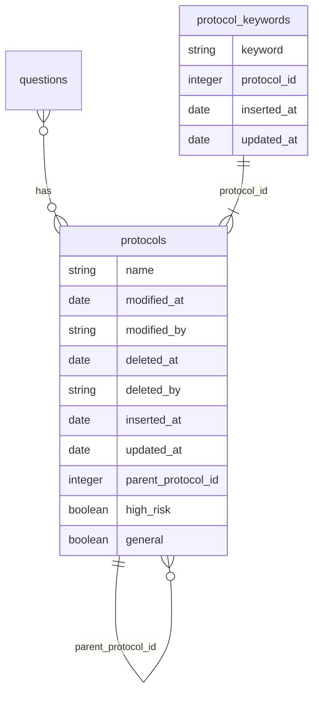
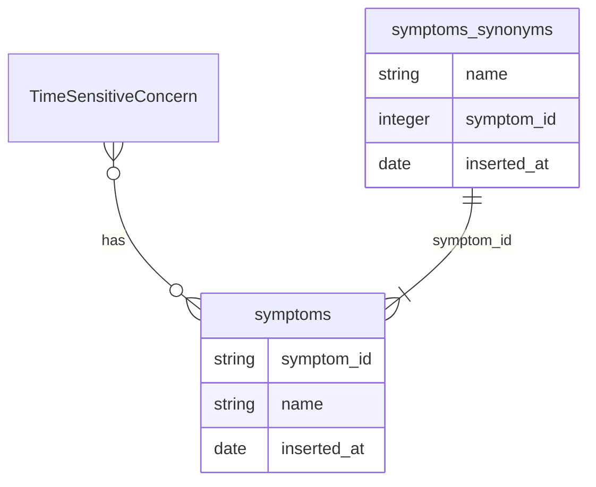

# EDD: Symptom Bank

**Author:** [Omar Ibañez](omar.ibanez@*company-data-covered*.com)

## Pre-review Checklist

Before scheduling your design review, ensure that you have checked all of the following boxes:

- [x] Familiarize yourself with our [EDR process](https://*company-data-covered*.atlassian.net/wiki/spaces/EN/pages/52002922/Process+Engineering+Design+Review)
- [x] Make sure PRD and EDD are aligned - EM
- [x] EDD has been reviewed by internal team members - EM

## Resources

- [DAGs](https://*company-data-covered*.sharepoint.com/:f:/s/tech-team/EiXtgAOZdmBEgNbKXGzWvBABb9XCKVdaXFrFyOnQgCt-lQ?e=zQDjnk)
- [PRD](https://*company-data-covered*.sharepoint.com/:w:/s/tech-team/EbbW1wxRpG1JqAbmZL9XEpYBudicbY3bhcYooTb2M9frIw?e=jOAtxi&nav=eyJjIjo4MDAxNzUxOTB9)
- [Supporting designs](https://www.figma.com/file/qaveqnX7cqal0X0ghbgRvp/%F0%9F%A6%81--Risk-Stratification-Service?type=design&node-id=1546-131140&mode=design&t=J5OwpnW2JJEhY4gT-0)

## Glossary

- **Symptom:** A specific manifestation or indication of a medical condition or concern reported by a dispatcher during onboarding.
- **Synonym Symptom:** A symptom that shares a similar or equivalent meaning to another symptom. Synonym symptoms are grouped together to efficiently assess patient risk.
- **Time-Sensitive Concern:** Also known as "Risk Protocol," it refers to a group of symptoms for which specific questions are asked to arrive at an outcome or risk assessment as quickly as possible.

## Overview

This design document is part of a series of EDDs aimed at gradually replacing [TurfOrSurf](https://github.com/*company-data-covered*/turf_or_surf) as outlined in the [PRD](https://*company-data-covered*.sharepoint.com/:w:/s/tech-team/EbbW1wxRpG1JqAbmZL9XEpYBudicbY3bhcYooTb2M9frIw?e=QK6VUa).

The Symptom Bank serves as a repository of symptoms and their associated child symptoms, acting as synonyms. It replaces the "protocols" and associated tables stored in the TurfOrSurf project. The symptoms stored in the bank will be used to determine appropriate actions within the Risk Stratification Service, such as asking a set of questions based on the severity and nature of the reported symptoms.

After careful evaluation, Proposal 1, which leverages Trigram Search with PostgreSQL, is recommended for implementing the Symptom Bank. This proposal aligns well with the project's goals and requirements, providing efficient search capabilities while leveraging the existing PostgreSQL infrastructure. The use of PostgreSQL's Trigram Search extension offers a proven and reliable solution. Elasticsearch integration is unnecessary given the finite nature of symptoms, and PostgreSQL can handle the workload effectively. This decision simplifies the system architecture and avoids the need for additional technology components.

## Goals

- Create a holistic list of symptom bank that can be associated with time sensitive concerns and DAGs.
- Implement a system capable of storing symptoms and their associated child symptoms (synonyms) in a structured and scalable manner.
- Enable search capabilities to quickly identify and retrieve symptoms based on name or related child symptoms.
- Ensure the symptom bank can be easily integrated with the Risk Stratification Service and accessed by multiple teams involved in the risk assessment process.

## Design Proposals

### Proposal 1: Trigram Search with PostgreSQL (Recommended)

This proposal leverages PostgreSQL for the Symptom Bank, utilizing its [Trigram Search extension](https://www.postgresql.org/docs/current/pgtrgm.html). It provides efficient search capabilities avoiding additional components.

#### Pros:

- Utilizes PostgreSQL as the primary database, leveraging existing infrastructure.
- Provides efficient search capabilities through PostgreSQL's Trigram Search extension.
- Simplifies the system architecture by avoiding the need for additional technology components.

#### Cons:

- The search performance may vary depending on the complexity and volume of data.

### Proposal 2: Elasticsearch Integration

In this proposal, [Elasticsearch](https://www.elastic.co/guide/en/elasticsearch/reference/current/index.html) is integrated to enhance search capabilities within the Symptom Bank using the [Elasticsearch Synonym token filter](https://www.elastic.co/guide/en/elasticsearch/reference/current/analysis-synonym-tokenfilter.html). Although it introduces additional complexity, it offers powerful search functionality. Since Symptoms would be a finite list, we don't really need to support a lot of data.

#### Pros:

- Offers enhanced search capabilities through Elasticsearch's powerful search and indexing features.
- Provides scalability and performance benefits for handling large volumes of data.
- Supports graph-based data modeling for storing symptoms and their relationships.

#### Cons:

- Introduces additional complexity and infrastructure requirements by integrating Elasticsearch.
- Requires data synchronization and potential data inconsistencies between PostgreSQL and Elasticsearch.
- May increase maintenance and operational overhead.

## Platform Components

### Station

Endpoints are available on Station to fetch protocols (Symptoms) through [/api/risk_stratification_protocols](https://github.com/*company-data-covered*/station/blob/trunk/app/frontend/javascript/API/riskStratificationsApi.jsx), which acts as a proxy to call TurfOrSurf via [this controller](https://github.com/*company-data-covered*/station/blob/trunk/app/controllers/admin/risk_stratification_protocols_controller.rb).

### TurfOrSurf

TurfOrSurf currently contains the [existing Symptom bank (protocols)](https://github.com/*company-data-covered*/turf_or_surf/blob/trunk/web/controllers/api_protocol_controller.ex).

### Onboarding API

[onboarding-api](https://github.com/*company-data-covered*/services/tree/trunk/ts/apps/nest/onboarding-api) [fetches protocols](https://github.com/*company-data-covered*/services/blob/1cd28ef9907f8d5f7c1ebff0e285ed8f7dbbd7ec/ts/libs/shared/consumer-web/types/src/lib/@types/risk-stratification-protocol.ts#L14) is using filtering by age, gender, high risk, etc...

## Data Design & Schema Changes

The Symptom Bank will incorporate a data design that includes a table for storing symptoms and their synonyms, along with a constraint for preventing duplicate symptom names. The schema changes will be introduced to an existing database.

### Protocols (Legacy)

The current symptom bank consists mainly of two tables: "protocols" and "protocol_keywords":

These two tables will be replaced by "symptoms" and "symptoms_synonyms"

### Symptoms Table (New)

The Symptom table represents the symptoms stored in the Symptom Bank.

The Symptom table establishes a many-to-many relationship with the TimeSensitiveConcern table. This relationship allows for the association of multiple symptoms with multiple Time-Sensitive Concerns, enabling the accurate identification of appropriate actions or protocols based on reported symptoms.

A constraint ensures symptom name uniqueness, preventing duplicate entries.

The main difference on schema is the removal of `high_risk` and `general`.

## Metrics & Data Integration

The Symptom Bank system will include instrumentation to capture relevant metrics for monitoring and performance evaluation. The metrics will be sent to the usual monitoring systems for centralized visibility.

## Error Handling & Alerting

Symptom selection is critical for Onboarding, so it needs to be always available. We will use Datadog for monitoring and alerting.

The following items will be tracked:

- Service health status
- Error rate
- Latency

## Safety

Symptoms and Synonyms are going to be initially populated by Clinical Leaders.

## Security

The Symptom Bank design will adhere to the standard security practices and protocols in place within the organization. It will not introduce any unusual security concerns, such as new endpoints, external dependencies, or third-party libraries.

## Audits and Logs

We will use the Audit Service for tracking changes.

## Scalability

There are currently no scalability concerns. If traffic increases, resources can be easily scaled as needed.

## Cost

The Symptom Bank implementation will have no significant impact on cost since it utilizes existing infrastructure and does not require the deployment of new services.

## Experimentation

No experimentation is required for this implementation.

## Testing

We will use integrated Go testing tools and RSpec for testing.

## Training

The onboarding flow will be unchanged by the introduction of the symptom bank, so the onboarding users will no require training.

## Deployment

The usual deployment process will be followed, utilizing Github Actions and Aptible.

## Lifecycle Management

The technology choices align with the [Monorepo Supported Code Languages and Frameworks](https://github.com/*company-data-covered*/services/blob/trunk/docs/code/language.md) and will be supported long term.
