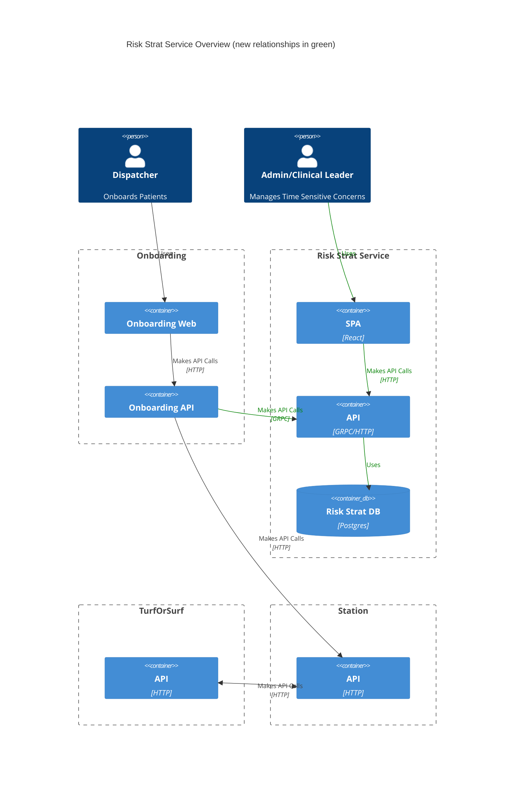
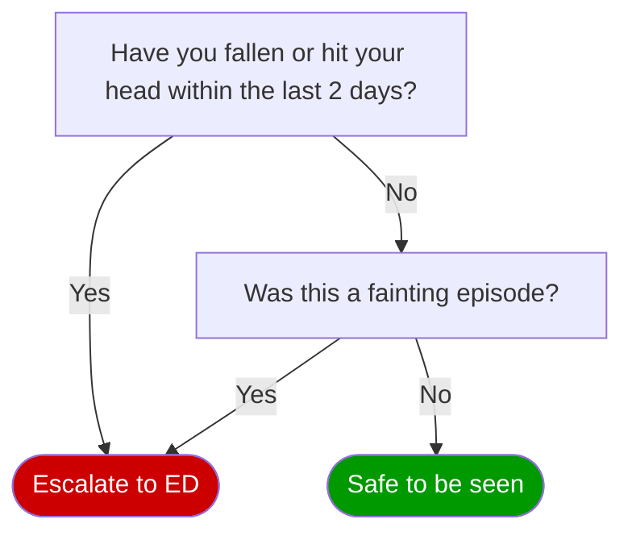
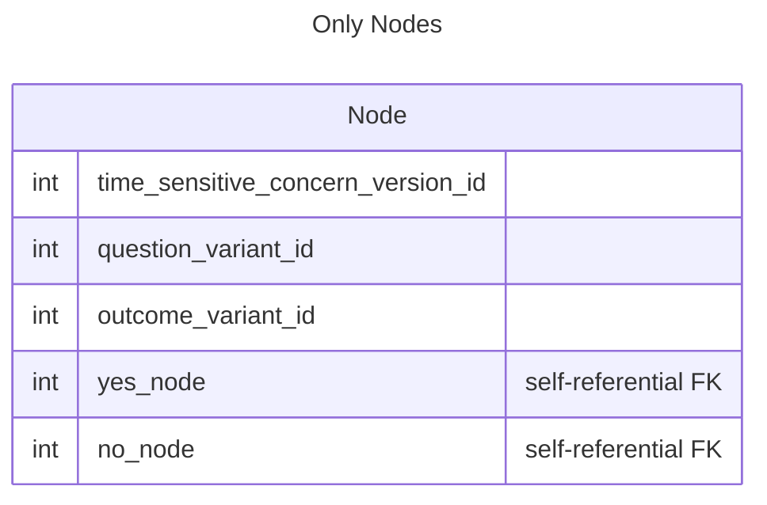
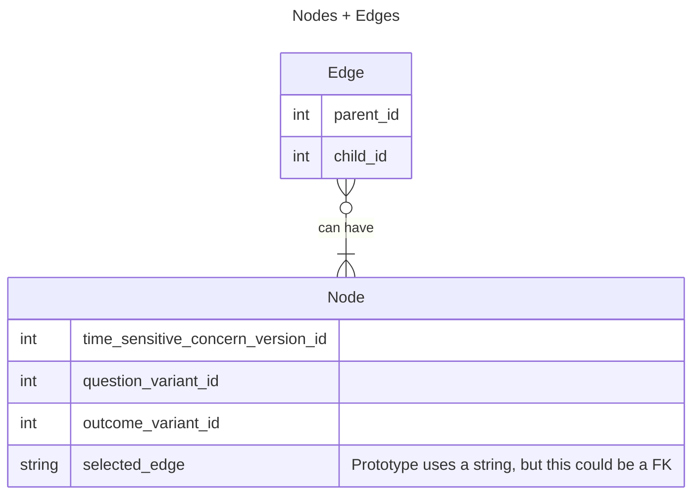
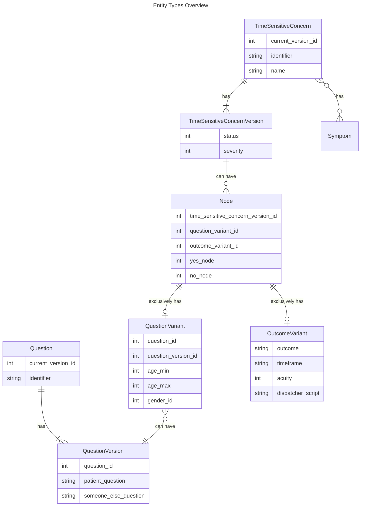

# EDD: Risk Strat Service Backend

**Author:** [Favio Manriquez](mailto:favio.manriquez@*company-data-covered*.com)

## Pre-review Checklist

Before scheduling your design review, ensure that you have checked all of the following boxes:

- [x] Familiarize yourself with our [EDR process](https://*company-data-covered*.atlassian.net/wiki/spaces/EN/pages/52002922/Process+Engineering+Design+Review)
- [x] Make sure PRD and EDD are aligned - EM

## Glossary

#### Clinical Leader

The person that creates the questions and diagrams that will be conducted during assisted onboarding. They will also need to be able to review the impact data of Risk Strat in order to evaluate our clinical capacities and make changes as appropriate.

#### DAG

Directed acyclic graph. This is the term that we use to refer to a set of risk strat questions in a tree with question and terminal nodes that is associated to a Time Sensitive Concern. [Current designs for RS DAGs][dags].

#### Outcome Node

Also known as [Terminal Node](#terminal-node).

#### Question Node

A node in a DAG that asks a question. It can have age and gender restrictions.

#### RS

Risk stratification.

#### Terminal Node

A node in a DAG that dictates a conclusion (vs another question). These conclusions could be things like “requires secondary screen”.

#### Time Sensitive Concern

Another name for "Risk Protocol". A name for a group of symptoms that we want to ask questions about to arrive at an outcome as quickly as possible.

## Resources

[prd]: https://*company-data-covered*.sharepoint.com/:w:/s/tech-team/EbbW1wxRpG1JqAbmZL9XEpYBudicbY3bhcYooTb2M9frIw?e=QK6VUa
[figma]: https://www.figma.com/file/qaveqnX7cqal0X0ghbgRvp/%F0%9F%A6%81--Risk-Stratification-Service?type=design&node-id=527-98614&t=htAt8vb9tOS45I2K-0
[fe_edd]: https://*company-data-covered*.sharepoint.com/:w:/s/tech-team/EcXyLAUfmehMqTDz_wzighUBMadB-ipl3ZztkdjlGI7avw?e=x1CvR3
[tos]: https://github.com/*company-data-covered*/turf_or_surf
[dags]: https://*company-data-covered*.sharepoint.com/:f:/s/tech-team/EiXtgAOZdmBEgNbKXGzWvBABb9XCKVdaXFrFyOnQgCt-lQ?e=zQDjnk
[sb_edd]: https://github.com/*company-data-covered*/services/pull/5513
[rssi_edd]: https://github.com/*company-data-covered*/services/pull/5578

PRD: [Risk Strat Service][prd]

Supporting designs: [Figma][figma]

Other:

- [EDD - Risk Strat Service Frontend][fe_edd]
- [RS Service DAGs][dags]

## Overview

<!--

Brief outline of what this design is intended to achieve and anything useful to set context for readers. Assume that the reader has looked over the PRD and focus on specific engineering concerns. Do not duplicate info unnecessarily.

- Is this an interim solution or something expected to be maintained long term?
- Are there alternatives to the chosen path?
  - If yes, briefly outline what they were, the pros/cons of each, and why this design was ultimately chosen.
  - If the purpose of this EDD is to choose among several solutions, make that clear and consider a first pass review before fleshing out the detailed design.

-->

This design intends to create a subset of the features described in the [PRD][prd] to gradually replace [TurfOrSurf][tos] due to the following problems:

- With current Risk Stratification we can only establish if a patient is "Safe to be seen". We want to extend the outputs of [RS](#rs) to include Acuity, Timeframe, Modalities, etc.
- Each risk protocol is a single list of questions asked one after another. There is no branching logic, which can lead to asking unnecessary and/or duplicate questions.
- Each patient can only answer a single Risk Stratification protocol, because of this, it is likely we are not collecting all clinically relevant information.
- It is difficult to iterate on risk protocols with the current tool, as there is no versioning support, and no experimentation features.
- A risk protocol may change at a whim and have a convoluted version history, where a historical version of a risk_protocol may not have the same intention as a current version (ie. changing "chest_pain" to a "nausea" risk protocol"), which means we currently do string manipulation to verify its name is identical, and some aggregation when names are changed cosmetically.

**The scope of this EDD is limited to only the backend service**. There will be at least two more EDDs for:

- **Symptom Bank**: a holistic/canonical symptom list, its search interface, and how it will connect with the service and DA/DS teams.
- **Risk Strat Service Integrations**: where we will detail proposed interactions with other services/teams.

The service is expected to be maintained long term.

Although several proposals are described, for [DAGs](#dag) we are recommending going with [Proposal 1](#dag-proposal-1) as all questions will in the Yes/No format for the foreseeable future, there are no other type of questions in the [currently designed RS DAGs][dags].

The existing Risk Stratification service (Golang) will be used to develop the new features; updating TurfOrSurf was not considered due to Elixir [not being supported](https://github.com/*company-data-covered*/services/blob/trunk/docs/code/language.md).

## Goals

<!--

Brief list of goals of this project. All designs should be evaluated explicitly against these goals.

- Include reasons for each of these goals
- Include links to PRD for aspects that are non-obvious

-->

- Enable the creation of dynamic questionnaires ([DAGs](#dag)) that support conditional questions and a configurable set of outcomes including other questionnaires.
- Support question and [DAG](#dag) versioning to enable experimentation between versions.
- Create a Question Bank to reuse questions across different [Time Sensitive Concerns](#time-sensitive-concern).

## Design Proposals

<!--

The details of the proposed solutions. Include various alternative proposals. Note which proposal you recommend. Generally, you should have at least 2 proposals.

- New APIs or modifications to existing ones.
- Overview diagrams to set context for where this is in the overall system and how it connects to other services.

-->

### DAGs

The Risk Strat service asks a series of questions to arrive as quickly as possible at an outcome (Safe to be seen, Requires Secondary Screening, Escalate to the ED, etc.). Because:

- Questions are asked one at a time
- There is a clear dependency in the order the questions are asked
- You cannot move backwards in the questionnaire without resetting progress
- You can arrive to the same question or outcome from different questions (a question/outcome can have one or more parent questions)

We propose to represent the list of questions as a [DAG](#dag). DAG filtering (at the start, by Symptoms and by Service Lines) will be detailed on the Risk Strat Service Integrations EDD.

An example of a DAG within the context of the Risk Strat service would be:

A DAG has [question nodes](#question-node) and [terminal nodes](#terminal-node). Question nodes can **only** be configured with demographic filters (age and gender), when you arrive at a question node that doesn't match patient demographics, the question will be skipped according to configuration ([Skip to: Yes/No](https://www.figma.com/file/qaveqnX7cqal0X0ghbgRvp/%F0%9F%A6%81--Risk-Stratification-Service?type=design&node-id=656-114647&mode=design&t=fh9FdoQbz8v7mw4g-0)). This places some restrictions in the way a DAG is designed, therefore [Clinical Leaders](#clinical-leader) will verify they are properly configured.

An Terminal node is a grouping of different configurations: Outcome (Safe to be Seen, Secondary Screening, Escalate to ED, etc.), Timeframe (Today, Today or Tomorrow, etc.), Acuity (Low, Medium, High), and Excluded Modalities (Hybrid, etc.). It's possible that for some outcomes (for example, Outcome: Escalate to ED), the rest of the configurations are not applicable.

The current designs for RS DAGs can be found [here][dags].

There are several strategies for storing and querying DAGs in a database. We considered the following:

#### Proposal 1 - Use a single nodes table to represent parent/child relationships (Recommended)

Instead of using a dedicated `edges` table, we can represent all Time Sensitive Concerns with only the `nodes` table by adding nullable columns that point to the nodes that will be next after answering a question with Yes/No. This structure covers [all designed DAGs][dags]. ([Prototype](https://github.com/*company-data-covered*/services/pull/5283))

Pros:

- Simple design exactly adjusted to how Time Sensitive Concerns currently work.
- We can use referential integrity.
- Query execution time is fast.
- Queries are simpler compared to other database proposals.
- We can still migrate to other database storage strategies if needed.

Cons:

- Schema will need to be altered, and existing data migrated if we need to support different answers.
- Proper flow in a Time Sensitive Concern DAG will depend on its design and configuration. Currently, only 2 people are in charge of that in the organization (clinical leaders) and they will veriy the DAGs are properly configured.

#### Proposal 2 – Use nodes/edges tables with recursive CTEs

We can use the Adjacency Model with Recursive CTEs for managing and querying the DAGs. ([Prototype](https://github.com/*company-data-covered*/services/pull/5160))

Pros:

- Simpler design compared to other strategies (for example: Materialized Path, Nested Set Model): only needs one table to hold the node + edges relationships.
- We can use referential integrity.
- Query execution time is fast-enough as long as the the data size for DAGs is small (largest DAG at the time of writing has 27 edges).
- It's simpler to migrate to other strategies if the need arises.

Cons:

- Can be slow for large DAGs if we get to that point.
- Need to prevent/fix DAG cycles (for example: via triggers).
- Recursive CTEs can be harder to understand.
- With this proposal we can represent any DAG (any number of parents and children), however, Time Sensitive Concerns follow the same pattern: a parent node can only have 0, or 2 children. Therefore, it might be unnecessarily complex.

<!-- Pros and cons of proposal, and evaluation against above listed goals -->

#### Proposal 3 – Use ltree

[ltree](https://www.postgresql.org/docs/current/ltree.html) is a postgres module that adds a new datatype to represent hierarchical tree-like structures (similar to materialized path).

Pros:

- It is a trusted postgres module.
- Provides varied operators and functions for tree traversal.
- Column indexing is supported by postgres.
- Fast queries.

Cons:

- Requires learning the module.
- Does not support referential integrity.
- Special restrictions for defining and storing label paths.
- For DAG retrieval we almost exclusively retrieve full trees (we don't plan to retrieve specific ancestors, or descendants).
- Requires more code/sql to prevent/fix cycles.
- Migrating to another strategy for storing and retrieving trees could have increased complexity.

#### Proposal 4 - Use a JSON column to store the DAGs

Instead of managing DAGs at the backend, let the frontend application take care of it and store a JSON blob in the database.

Pros:

- Since all logic happens at the frontend, required backend code is minimal.
- Frontend can take care of the cycle-detection logic and other validations.
- Simple and fast queries to retrieve the DAGs.

Cons:

- No relational logic for querying and validation.
- No referential integrity.
- Requires complex frontend logic.
- Migrating to another strategy (if based on a relational database) could have increased complexity.

<!-- Pros and cons of proposal, and evaluation against above listed goals -->

### Versioning

We need to support multiple versions for DAGs and questions. Only one DAG version will be published at any given time, while any question version can be selected for a DAG node.

#### Proposal 1 - Use dedicated version tables (Recommended)

Create tables to hold versioned data and maintain integrity with the usual relational constraints. An initial version of the ERD is shown at the [Data & Schema Changes](#data-design--schema-changes) section.

Pros:

- Flexibility to design and tweak according to present and future requirements.
- Can control storage usage by limiting number of versions.
- Simpler versioning strategy: versions are created on-demand.

Cons:

- Tables can become large as the number of versions increases.
- Need to create the SQL queries to take care of synching data for new and existing versions.

#### Proposal 2 - Use temporal tables extension

Postgres has an [extension](https://github.com/arkhipov/temporal_tables) available that is slightly based on the [SQL:2011](https://en.wikipedia.org/wiki/SQL:2011) standard. It only supports system-period temporal tables.

Pros:

- Straightforward documentation.
- It updates history/version tables automatically.
- Table inheritance keeps source table and version table in sync.

Cons:

- Less flexible to modify or tailor to requirements.
- Extra dependency to maintain.
- Seems to be moderately maintained.
- Because history table rows are created on every update, there needs to be a pruning mechanism in place to deal with storage limitations.

### Question Bank

We don't have a list proposals for the Question Bank as creating new database tables for question storage is the only solution considered; a database ERD is shown at the [schema changes section](#risk-stratification-service) . It will make use of the [versioning feature](#versioning).

## Platform Components

<!--

Replace this text with an explanation of what shared / platform components are related to this project.

- What existing shared components are utilized?
- Do any of them require changes?
- Are new shared components being developed as a part of this product?

Please be thoughtful about whether other teams will benefit from or need to use any components you're developing as a part of this product so that we make the right architectural decisions.

-->

### New platform components:

- Risk Stratification Backend for Time Sensitive Concerns

### Changes to existing platform components:

These changes will be described in the RS Service Integrations EDD, which is still a work in progress. Initially:

- Onboarding will get updates to the Frontend and API to integrate the Time Sensitive Concerns (behind a feature flag) and replace the current risk stratification section.
- Station might be updated to support the new outputs from risk stratification.

## Data Design & Schema Changes

<!--

- If a new database will be incorporated, please follow guidelines to create and share credentials with data engineering
- By default we will include a read replica for data engineering. If we will not do this, please provide a reason.
- If schema changes will be introduced to an existing database, please share with data engineering.

-->

### Risk Stratification Service

New database tables are required to support Time Sensitive Concerns, Questions, and their DAGs. They will be added to the existing Risk Stratification database.

### Station

Station's database `risk_assessments` and `secondary_screenings` tables will need to be updated (or new tables created) to support the new outputs from the service. These changes will be covered in the upcoming [RS Service Intgrations EDD](#).

## Metrics & Data Integration

<!--

What instrumentation will be done (outside of any handled intrinsically by standard frameworks)?

- Are the metrics going to the usual places or someplace where they might be less discoverable? If the latter, why?

Are there any interesting downstream effects on users of the metrics?

- Normalization that might be required for data bridging this release: _field "dob" used to contain date of birth information, but after this change will no longer be populated and is instead decomposed into "dob_y", "dob_m", "dob_d"_

Are there any quick win opportunities with downstream users?

- Things **Data Science** could use to improve models?
- Things **Analytics** would want for business intelligence?
- Things **DevOps** could use to improve monitoring of system operation?

Are there any new monitors for **DevOps** or engineering to keep aware of?

- Add answer here

-->

The existing RS service is already integrated with Datadog. New metrics will use Segment and Datadog.

Looker dashboards will need to be updated to be able to differentiate between existing Onboarding RS flow, and the new flow that will use [Time Sensitive Concerns](#time-sensitive-concern). Details will be covered in the [RS integrations EDD][rssi_edd].

## Error Handling & Alerting

<!--

What are the most likely failure points in this design?

- How will errors be handled?
- How critical are various errors?
  - Is partial failure fatal?
    - If so, what time frame and how is the interim state represented?
    - If not, are errors corrected later?

What conditions will be alerted on and at what thresholds?

- Add answer here

Are there cases where errors will be queued or silently ignored? Are there requirements to report errors back to the system that initiated a request?

- Add answer here

-->

Risk stratification is an essential step for Onboarding so it needs to be always available. Datadog will be used for monitoring and alerting.

Among the things that will be tracked are:

- Service health status
- Error rate
- Latency

## Safety

This is a required service for Onboarding that needs to be always available and working correctly. The service won't store Patient Information directly, but will store the care request id, and the answers to any Time Sensitive Concern that was asked.

The service depends on correctly configured Time Sensitive Concerns.

<!--

Are there any unusual safety concerns around this design?

- E.g., is it possible for an error to cause a patient request to become lost? To be miscommunicated in a way that might be confusing to the provider?

-->

## Security

There are no unusual security concerns. The service will provide an internal API via GRPC Gateway to retrieve [Time Sensitive Concerns](#time-sensitive-concern), and save their answers. The API will be consumed by the Onboarding API.

There are no external dependencies, nor third party libraries considered.

<!--

Are there any unusual security concerns around this design?

- New endpoints or methods of interaction within the system?
- New dependencies on external systems?
- New third party libraries?

-->

## Audits and Logs

We will make use of the audit service to track a subset of the changes to [Time Sensitive Concerns](#time-sensitive-concern), since we are already storing versioned data. We will use the audit service GRPC interceptor for Admin Endpoints: users that create, edit, and manage Time Sensitive Concerns, and the Question Bank.

Logs will be sent to Datadog.

<!--

Will any new functionality need to have its state changes observed and stored in compliance with retention policy?

- Persist the who, what, when in indestructible storage
  - User ID
  - Properties that changed
  - Values that changed
  - Date/time of change
  - Success or failure
- Examples:
  - Changes to system configuration
  - Changes to PHI
  - Changes to care information
  - Admin-only functionality

-->

## Scalability

<!--

Where is this going to fall over?

- What are the expected bottlenecks in this design?
- What is the maximum capacity?
  - What happens when maximum capacity is exceeded?
  - Can this capacity be increased via simple replication?
- Does this change introduce new fanout behavior that may impact other parts of the system?
- Does this change rely on existing known bottlenecks/high latency actions?
- Does this change introduce meaningful storage requirements (including for logging)?

-->

No current scalability concerns. As traffic increases, resources can be easily scaled if it becomes a problem.

## Cost

<!--

If the solution involves resources that are expected to increase with scale (e.g., AWS services), estimate the initial cost based on today's usage and projected cost 1-2 years out if it's expected to change substantially.

- Add answer here

-->

There will be no significant impact to cost since we will be using existing infrastructure and not deploying any new services.

## Experimentation

Experimentation will be supported with existing StatSig infrastructure.

<!--

How do we enable experimentation for different features?

- Add answer here

-->

## Testing

<!--

Are there components that will need to be manually tested?

- Ideally justify why these cannot be tested via automation

Are any load tests needed?

- Add answer here

-->

Testing will follow _company-data-covered_ standard testing practices:

- BE will use integrated Go testing tools and rspec
- FE (covered in [FE EDD][fe_edd]) will use Jest and Cypress
- Datadog Synthetic Tests will be used for API testing

## Training

Dispatchers will receive training for interacting with the updated Onboarding flow for risk stratification, but the flow will remain largely unchanged.

Clinical Leaders will receive training to manage Time Sensitive Concerns and Questions on the Risk Stratification Admin SPA.

<!--

Will this change require any end-user training?

- Clinical/ops/etc.
- Eng/IT/QA/Data science/Data analytics

-->

## Deployment

<!--

Are there any unusual notes about the deployment of this change?

- Dependencies on updates covered by other designs?
- Things that the DevOps or release teams need to know/do to deploy this change correctly?
- Are there any changes to run books/playbooks?
- Does anybody need to be made explicitly aware when this rolls out? If this is rolled back?
- Is there any reason this can't be trivially rolled back?
  - If so, are there steps that can be taken to roll back or is it 1-way?

-->

Usual deployment process will be used (Github Actions + Aptible)

## Lifecycle management

<!--

Are any technology choices in danger of being sunset, abandoned, or deprecated?

- How will chosen products, service providers, technologies be observed for announcements of retirement?

-->

Technology choices adhere to the [Monorepo Supported Code Languages and Frameworks
](https://github.com/*company-data-covered*/services/blob/trunk/docs/code/language.md) and will be supported long term.
