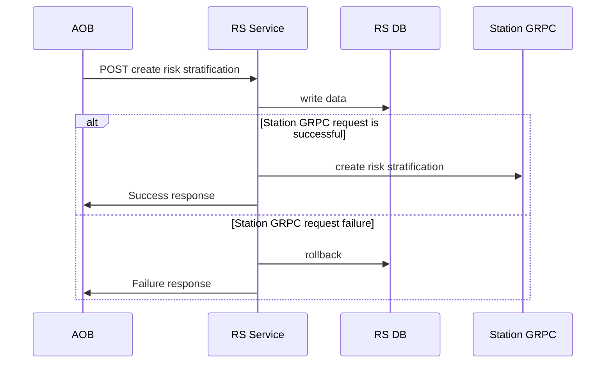
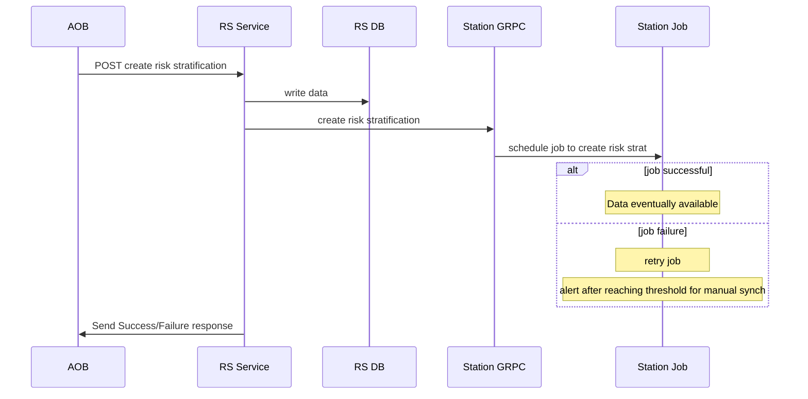
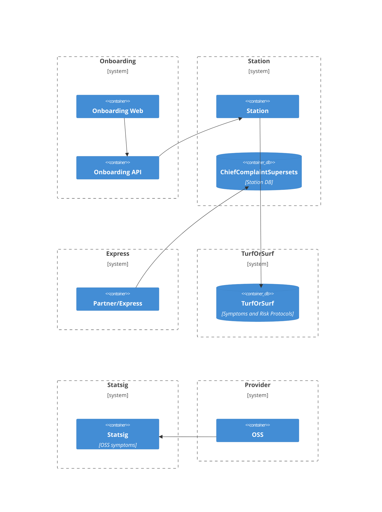
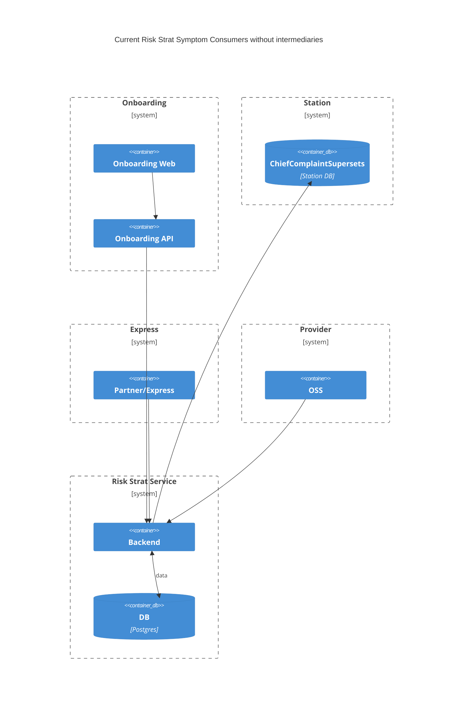
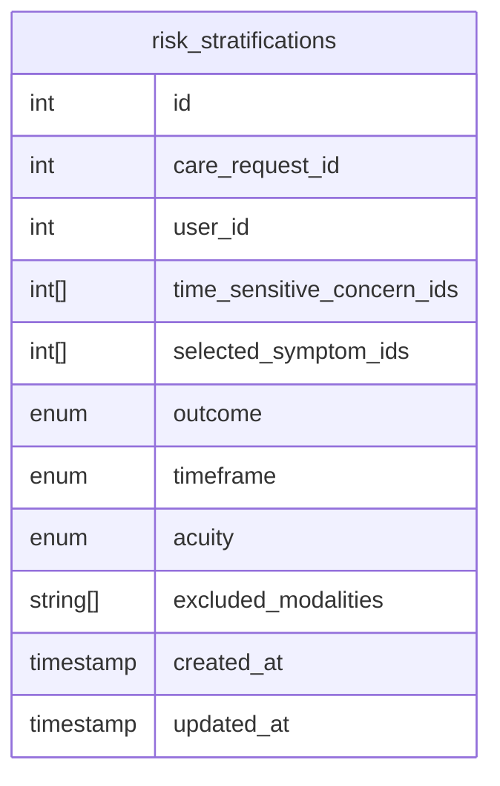
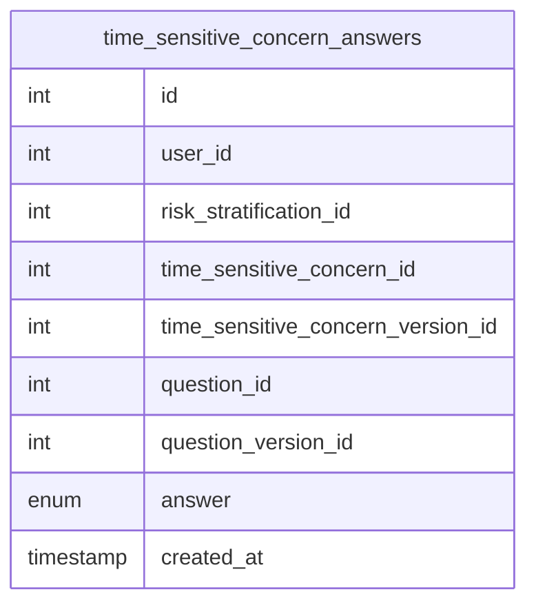

# EDD: Risk Strat Service Integrations

**Author:** [Favio Manriquez](mailto:favio.manriquez@*company-data-covered*.com)

## Pre-review Checklist

Before scheduling your design review, ensure that you have checked all of the following boxes:

- [x] Familiarize yourself with our [EDR process](https://*company-data-covered*.atlassian.net/wiki/spaces/EN/pages/52002922/Process+Engineering+Design+Review)
- [x] Make sure PRD and EDD are aligned - EM
- [x] EDD has been reviewed by internal team members - EM

## Resources

[prd]: https://*company-data-covered*.sharepoint.com/:w:/s/tech-team/EbbW1wxRpG1JqAbmZL9XEpYBudicbY3bhcYooTb2M9frIw?e=QK6VUa
[figma]: https://www.figma.com/file/qaveqnX7cqal0X0ghbgRvp/%F0%9F%A6%81--Risk-Stratification-Service?type=design&node-id=527-98614&t=htAt8vb9tOS45I2K-0
[fe_edd]: https://*company-data-covered*.sharepoint.com/:w:/s/tech-team/EcXyLAUfmehMqTDz_wzighUBMadB-ipl3ZztkdjlGI7avw?e=x1CvR3
[tos]: https://github.com/*company-data-covered*/turf_or_surf
[dags]: https://*company-data-covered*.sharepoint.com/:f:/s/tech-team/EiXtgAOZdmBEgNbKXGzWvBABb9XCKVdaXFrFyOnQgCt-lQ?e=zQDjnk
[sb_edd]: https://github.com/*company-data-covered*/services/pull/5513/files
[rs_edd]: https://github.com/*company-data-covered*/services/pull/4787/files

PRD: [Risk Strat Service][prd]

Supporting designs: [Figma][figma]

Other:

- [EDD - Risk Strat Service Frontend][fe_edd]
- [EDD - Risk Strat Service Backend][rs_edd]
- [EDD - Risk Strat Symptom Bank][sb_edd]
- [RS Service DAGs][dags]

## Glossary

#### AOB

Assisted Onboarding frontend application.

#### DAG

Directed Acyclic Graph that represents the questions that are asked to the patient. It is part of the [TSC](#tsc).

#### RS

Risk Stratification.

#### Station

Station is the main application (Rails/React) that runs most of _company-data-covered_. It's also called Dashboard.

#### ToS

TurfOrSurf, the Elixir application where symptoms and risk protocols exist.

#### TSC

Time Sensitive Concern, also known as risk protocol. It contains the questions that are asked to the patient on [AOB](#aob).

<!--

List of terms, acronyms and/or abbreviations with their respective definitions that will be used across this EDD.

-->

## Overview

<!--

Brief outline of what this design is intended to achieve and anything useful to set context for readers. Assume that the reader has looked over the PRD and focus on specific engineering concerns. Do not duplicate info unnecessarily.

- Is this an interim solution or something expected to be maintained long term?
- Are there alternatives to the chosen path?
  - If yes, briefly outline what they were, the pros/cons of each, and why this design was ultimately chosen.
  - If the purpose of this EDD is to choose among several solutions, make that clear and consider a first pass review before fleshing out the detailed design.

-->

Given that we are building a new [Risk Stratification Service][rs_edd] with increased scope and new outputs, its integration points with other teams/services will need to be described and agreed upon.

So far, we have identified the following integration points:

- Station:
  - Care Request
  - Risk Assessment
  - Secondary Screening
- Onboarding:
  - AOB
- Marketplace:
  - Hybrid LV1 model
  - Acuity model
  - On Scene model
- Provider:
  - DHFU
- Partner/Express:
  - Symptoms source

In the current service, the concept of symptoms and protocols is mixed, there is overlap between them: a symptom can be considered a risk protocol and vice versa.

In the new service, these concepts are separated: 1) we'll have unique symptoms from the Symptom Bank, and 2) Time Sensitive Concerns (which would be the new risk protocols) that contain the questions we want to ask for a particular combination of symptoms.

The resulting major breaking changes are:

- We no longer need a chief complaint.
- Risk score is no longer utilized.
- The patient reported symptoms can trigger multiple [TSCs](#tsc) so a Risk Assessment having only one risk protocol associated is not compatible.
- The new service has outputs that replace/extend existing logic. For example:
  - we use a different kind of risk protocol (TSCs),
  - determine screening requirements via a terminal node, and
  - provide defaults for ML Models (Acuity/Hybrid).

This EDD only discusses the integration points and related proposals, therefore the rest of the sections are marked N/A as they were discussed in the earlier EDDs linked.

TurfOrSurf s only a source of symptom/risk protocol data for legacy Risk Stratification.

## Goals

- Propose a plan to integrate the new Risk Stratification service with Platform Components that consume data and behavior from the current Risk Stratification service.

- Define a transition strategy to the new service.

<!--

Brief list of goals of this project. All designs should be evaluated explicitly against these goals.

- Include reasons for each of these goals
- Include links to PRD for aspects that are non-obvious

-->

## Design Proposals

<!--

The details of the proposed solutions. Include various alternative proposals. Note which proposal you recommend. Generally, you should have at least 2 proposals.

- New APIs or modifications to existing ones.
- Overview diagrams to set context for where this is in the overall system and how it connects to other services.

-->

### Data Location

Currently, risk stratification data is stored across three databases ([symptom data lives in two of them](#symptoms-on-current-risk-strat-service)):

- Station database, in the `risk_assessments` table, which stores the results of risk stratification.

- TurfOrSurf database, which has risk protocols and questions.

- Risk Stratification Service database (golang), which has time sensitive questions asked during secondary screening.

For the goals of this EDD, we recommend storing everything in the existing Risk Stratification Service database rather than keep using Station even if it's temporary.

The implicit side effect is that Station data that belongs to risk stratification, and TurfOrSurf service are going to be deprecated, however, that is not a goal for this EDD. Fully deprecating existing services will be discussed in another EDD, but this work will move us closer towards that.

#### Proposal 1 – Use Risk Stratification Service database (Recommended)

<!-- Pros and cons of proposal, and evaluation against above listed goals -->

Use the Risk Stratification Service database for Symptoms and Time Sensitive Concerns. [Symptom consumers diagram under this proposal.](#symptoms-on-new-risk-strat-service)

Pros:

- Necessary step towards becoming a single source of truth.
- Data encapsulation.
- Service ownership.

Cons:

- In case of rollbacks, data synchronization could be more complex depending on the chosen [compatibility strategy](#compatibility-strategy) as there would be two potential places where changes need to occur: Station database and Risk Stratification database.

#### Proposal 2 – Use Station database

Keep using Station's database to store data for the new service with the aim to deprecate and migrate it to the RS service database as soon as the new service has been throughly tested.

<!-- Pros and cons of proposal, and evaluation against above listed goals -->

Pros:

- Allows for performing code and data changes separately, instead of applying them at the same time, therefore mitigating risk.
- Allows for fixes and improvements to stabilize while using the same database.

Cons:

- Strong preference to avoid putting new code in Station that handles the new service logic.
- No data encapsulation.
- It can be difficult to understand the schema dependencies and who/what is responsible of managing the data.
- Susceptible to modification by Station users.
- If we keep using a shared database for a long time the potential for pain points to develop increases as more features are added/modified.
- Potentially, we would still need new Station GRPC endpoints.

### Compatibility Strategy

On the first deploy of the new service, we will have the following running:

- Legacy Risk Stratification = Station + TurfOrSurf = Legacy
- Risk Stratification V1 = new monorepo service = V1

Both existing and new services are incompatible by themselves, but they need to be running simultaneously and made compatible while we gradually deploy the new service to different markets/users.

So far, the only proposal for resolving this situation is having a mapping between the new service outputs and the current service outputs.

An outline of how it could work is:

1. A CareRequest is created by Onboarding/Express/OSS.
2. Depending on the user segment configured on the Statsig feature flag, the dispatcher will use either the V1 flow, or legacy flow. Further segmentation will be done by only enabling white-listed Time Sensitive Concerns to use the new service.
3. When a user has RS V1 enabled, we recommend doing a [double write](#proposal-1---always-create-both-oldnew-service-records-aka-double-write-recommended) for both services, [creating database records](#creating-database-records-for-legacy-and-v1-services) for both V1 and legacy services only when RS V1 is used for a `CareRequest`. The care request record will have a column that stores the version of RS that is being used.
4. If we need to go back to legacy mode for that `CareRequest`, we'll set the version column in the care request to "legacy".
5. Once a care request is rolled back to legacy, the flow should continue as usual.

##### Fallback mechanism

If everything fails, product team is ok with simply turning off the feature flag, and creating another care request or, if feasible, reusing the already existing care request in order to move forward with onboarding.

#### Proposal: Adapter/Mapper for service outputs

The main outputs of the risk stratification service are:

- Chief complaint
- Risk protocol
- Risk score
- Screening requirements
- Modalities calculation
- Inputs for ML models

We propose creating a mapping between the current and new outputs of the service. This has been discusssed with Data Science team and they are going to create a mapping so that we can convert a risk stratification under the new service to the current service.

Additionally, we will have a service mapper to translate outputs that are closer to 1-to-1 matching (risk score, worst case score).

| Legacy Risk Stratification                                      | Mapping             | Risk Stratification V1         |
| --------------------------------------------------------------- | ------------------- | ------------------------------ |
| `CareRequest#chief_complaint`, `RiskAssessment#chief_complaint` | Data Science Mapper | List of reported symptoms      |
| `RiskAssessment#protocol_name`                                  | Data Science Mapper | List of TSCs                   |
| `RiskAssessment#protocol_id`                                    | Data Science Mapper | List of TSCs                   |
| `RiskAssessment#worst_case_score`, `RiskAssessment#score`       | Service Mapper      | Outcome from TSC Terminal Node |

**Note**: The stored answers for each service are not planned to be made compatible.

Pros:

- Allow us to run both services in production with backward compatibility.
- Rollbacks to the ToS/Station based service are straightforward.

Cons:

- Complexity/work could be increased in order to have an exhaustive mapping for all possible ToS risk protocols (which can constantly change) and symptoms. Having a default mapping (for example: General Compliant) could be a tradeoff to solve this potential issue.
- This could be a new source of errors if a mapping gives unexpected results.

### Creating database records for Legacy and V1 services

With a way to go back to legacy mode for a care request that had risk stratification on the V1 service,
we need to decide when and how Legacy database records are going to be created.

Differentiation between V1 and Legacy risk stratifications is going to depend on the feature flag user segment the current user belongs to, since records are going to be written to both RS service and Station.

We are also considering creating a column on the care requests table to indicate if the care request was created under the new RS service.

#### Proposal 1 - Always create both old/new service records AKA double-write (Recommended)

Pros:

- Design is mostly driven by feature flags as both services have the corresponding records created at all times.

Cons:

- Duplication of data between the services.
- Optionally, need to create a UI to toggle a Care Request to use Legacy mode.

##### Sub Proposals

###### Proposal 1.1 - Sync double write (Recommended)

Pros:

- Data is consistent/available on both services.
- Simpler to implement as all creation logic is controlled only by the RS service.

Cons:

- Increased latency, but we can measure impact and fallback to an async strategy if needed.

###### Proposal 1.2 - Async double write

Pros:

- Reduces latency as we are not dealing with both services.

Cons:

- Data is eventually consistent when full workflow is successful.
- Failures can take longer to fix as they require developer intervention.
- Might need UI/UX changes when data is not immediately available.

#### Proposal 2 - On-demand rollback to old version

Create the legacy risk statification database records only when needed.

Pros:

- New records are only created if we need to go back to the previous version, reducing duplication of data.

Cons:

- Need to create a more complicated UI/workflow to trigger the rollback from V1 to Legacy.

## Platform Components

<!--

Replace this text with an explanation of what shared / platform components are related to this project.

- What existing shared components are utilized?
- Do any of them require changes?
- Are new shared components being developed as a part of this product?

Please be thoughtful about whether other teams will benefit from or need to use any components you're developing as a part of this product so that we make the right architectural decisions.

-->

### Symptoms

#### Symptoms on Current Risk Strat Service

#### Symptoms on New Risk Strat Service

### Station

Most of the logic that is related to risk stratification will need to go through a new single Rails library that decides which RS service to call (existing, or new one). It will contain most of the feature flag logic as well.

Station will call the new RS service via GRPC. There will be at least one endpoint to fetch risk stratification information from the new service.

### TurfOrSurf

This is being replaced by the [Symptom Bank][sb_edd] and [RS backend service][rs_edd].

### Onboarding

Major components that will require updates and feature flag logic are:

- symptom retrieval
- riskAssessmentHelper
- RiskStratificationModal
- Demographics/index.tsx
- useRiskStratification hook
- serviceLineHelper (matchesRiskAssessmentRequirements), part of ScheduleVisitForm getSubServiceLine call, but as long as LV1 is toggled for the market, it is not included in the code flow!! Might still have to support it.

DHFU and OSS will need to call the new symptoms endpoint (with FF logic).

### Partners/Express

Express will need to call the new symptoms endpoint, and chief complaint supersets will be deprecated eventually.

### Ml Models

Models will need to be retrained with new inputs, but we can have fallbacks.

### Data Team

Anything that uses affected table sources in redshift. To be [defined/discussed](https://dh-techteam.slack.com/archives/C0454KWM56J/p1688589498451979) with the data team.

## Data Design & Schema Changes

<!--

- If a new database will be incorporated, please follow guidelines to create and share credentials with data engineering
- By default we will include a read replica for data engineering. If we will not do this, please provide a reason.
- If schema changes will be introduced to an existing database, please share with data engineering.

-->

### Risk Stratifications

With the new service, the results from risk stratification directly correspond to the Terminal Node that was chosen in the last answered [TSC](#tsc) [DAG](#dag).

A new dedicated table will be created with the following structure to store those results:

### Storing Answers to TSC questions

A new table will be created to store answers for all TSCs that were displayed during a Risk Stratification session:

## Metrics & Data Integration

N/A.

<!--

What instrumentation will be done (outside of any handled intrinsically by standard frameworks)?

- Are the metrics going to the usual places or someplace where they might be less discoverable? If the latter, why?

Are there any interesting downstream effects on users of the metrics?

- Normalization that might be required for data bridging this release: _field "dob" used to contain date of birth information, but after this change will no longer be populated and is instead decomposed into "dob_y", "dob_m", "dob_d"_

Are there any quick win opportunities with downstream users?

- Things **Data Science** could use to improve models?
- Things **Analytics** would want for business intelligence?
- Things **DevOps** could use to improve monitoring of system operation?

Are there any new monitors for **DevOps** or engineering to keep aware of?

- Add answer here

-->

## Error Handling & Alerting

N/A.

<!--

What are the most likely failure points in this design?

- How will errors be handled?
- How critical are various errors?
  - Is partial failure fatal?
    - If so, what time frame and how is the interim state represented?
    - If not, are errors corrected later?

What conditions will be alerted on and at what thresholds?

- Add answer here

Are there cases where errors will be queued or silently ignored? Are there requirements to report errors back to the system that initiated a request?

- Add answer here

-->

## Safety

N/A.

<!--

Are there any unusual safety concerns around this design?

- E.g., is it possible for an error to cause a patient request to become lost? To be miscommunicated in a way that might be confusing to the provider?

-->

## Security

N/A.

<!--

Are there any unusual security concerns around this design?

- New endpoints or methods of interaction within the system?
- New dependencies on external systems?
- New third party libraries?

-->

## Audits and Logs

N/A.

<!--

Will any new functionality need to have its state changes observed and stored in compliance with retention policy?

- Persist the who, what, when in indestructible storage
  - User ID
  - Properties that changed
  - Values that changed
  - Date/time of change
  - Success or failure
- Examples:
  - Changes to system configuration
  - Changes to PHI
  - Changes to care information
  - Admin-only functionality

-->

## Scalability

N/A.

<!--

Where is this going to fall over?

- What are the expected bottlenecks in this design?
- What is the maximum capacity?
  - What happens when maximum capacity is exceeded?
  - Can this capacity be increased via simple replication?
- Does this change introduce new fanout behavior that may impact other parts of the system?
- Does this change rely on existing known bottlenecks/high latency actions?
- Does this change introduce meaningful storage requirements (including for logging)?

-->

## Cost

N/A.

<!--

If the solution involves resources that are expected to increase with scale (e.g., AWS services), estimate the initial cost based on today's usage and projected cost 1-2 years out if it's expected to change substantially.

- Add answer here

-->

## Experimentation

N/A.

<!--

How do we enable experimentation for different features?

- Add answer here

-->

## Testing

N/A.

<!--

Are there components that will need to be manually tested?

- Ideally justify why these cannot be tested via automation

Are any load tests needed?

- Add answer here

-->

## Training

Statsig feature gates are going to be used to toggle between legacy service and the new service. Documentation will be created to describe the process, and training will be provided to key users.

<!--

Will this change require any end-user training?

- Clinical/ops/etc.
- Eng/IT/QA/Data science/Data analytics

-->

## Deployment

N/A.

<!--

Are there any unusual notes about the deployment of this change?

- Dependencies on updates covered by other designs?
- Things that the DevOps or release teams need to know/do to deploy this change correctly?
- Are there any changes to run books/playbooks?
- Does anybody need to be made explicitly aware when this rolls out? If this is rolled back?
- Is there any reason this can't be trivially rolled back?
  - If so, are there steps that can be taken to roll back or is it 1-way?

-->

## Lifecycle management

N/A.

<!--

Are any technology choices in danger of being sunset, abandoned, or deprecated?

- How will chosen products, service providers, technologies be observed for announcements of retirement?

-->
