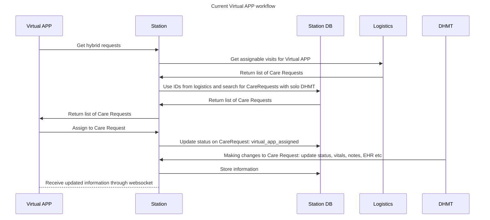
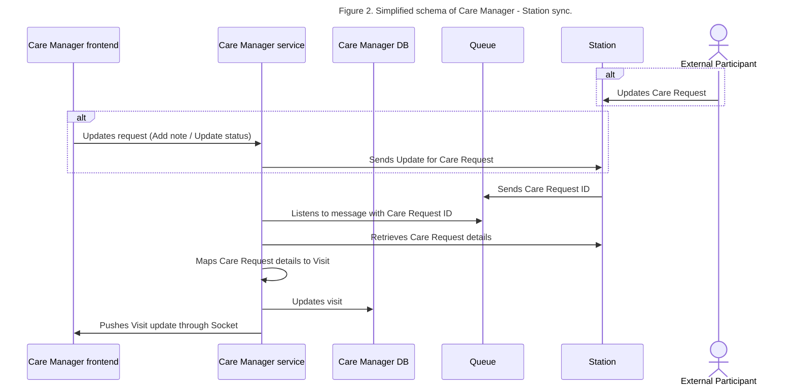
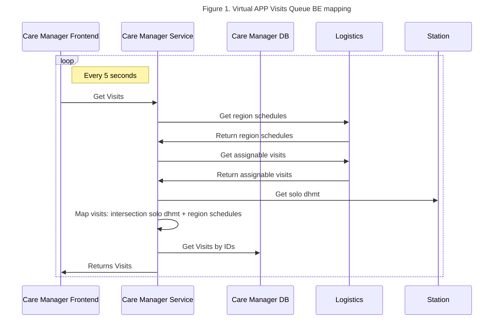
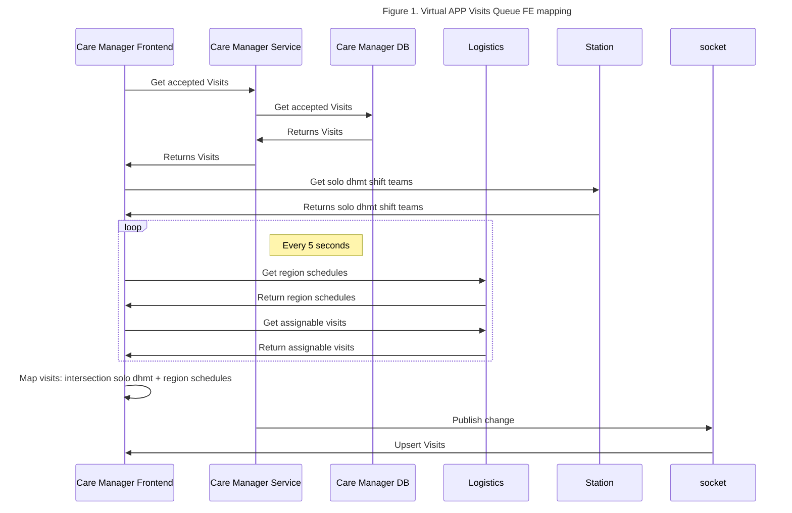

# EDD: Virtual APP Experience

**Authors:**

- Dmytro Hruzin (dmitry.hruzin@_company-data-covered_.com)
- Yurii Kirgizov (yurii.kirgizov@_company-data-covered_.com)
- Mykhailo Hladkyi (mykhailo.hladkyi@_company-data-covered_.com)

## Pre-review Checklist

Before scheduling your design review, ensure that you have checked all of the following boxes:

- [x] Familiarize yourself with our [EDR process](https://*company-data-covered*.atlassian.net/wiki/spaces/EN/pages/52002922/Process+Engineering+Design+Review)
- [x] Make sure PRD and EDD are aligned - EM
- [x] EDD has been reviewed by internal team members - EM

## Resources

- PRD: [Provider migration](https://*company-data-covered*.sharepoint.com/:w:/s/tech-team/EUlR7hSg-ylBkcV6Hdy4ILcBR1oZ9WaeWZgvh7WWpLjBxw?e=ebYmZg)
- PRD: [Virtual APP Experience](https://*company-data-covered*.sharepoint.com/:w:/s/tech-team/EdX0mkizQexKm00JCJ2VVToBmrlqYKvBbzWXqETyvAEsow?e=r2DtYb)
- Acute & Virtual APP workflow: [Providers workflow](https://www.figma.com/file/BgzByC0xSUGhKbzAgf9mzH/Acute-vs.-Telepresentation-Visit-Workflow?type=whiteboard&node-id=0-1&t=x3B6QXaT4s74x1fp-0)

Supporting designs:

- [Virtual APP Experience Design](https://www.figma.com/file/UBo81ZjFjwtLZxJynhyEdI/Virtual-APP?type=design&node-id=38-9415&mode=design&t=DTUk6k0zMCclvMCq-0)

## Glossary

- BE - backend
- FE - frontend
- Solo DHMT - medical technician that drives to the patient and participate in Hybrid visit on patient side
- Virtual APP - app that participate in Hybrid visit and provide care remotely
- Hybrid CareRequest - Care Requests with Acute Care service line and Hybrid modality. Handled by solo DHMT on scene and Virtual APP remotely.

## Overview

We plan to move Virtual APP users into separate platform out of Dashboard as part of bigger initiative of moving all providers. By moving we mean that Virtual APP users will work with Visits in CareManager UI instead of Dashboard. Backend implementation have several options: having Station as source of truth or have a mixed solution where we sync data between Station and CareManager.
What needs to be done:

- `Scheduled Visits` queue - list of accepted solo DHMT care requests
- `Unassigned Visits` queue - list of accepted hybrid care requests without assigned Virtual APP
- `Assigned Visits` queue - list of accepted hybrid care requests with assigned Virtual APP
- Visit details with minimal required information
- Ability to assign/unassign and create notes on CareRequest
- On Call Doctors widget
- SSO link to Athena
- SSO link to TytoCare
- Realtime Visit status update in frontend
- Extend Authorization / Authentication to support Virtual APP roles. For Virtual APP we will need to evaluate `provider position` since there is no such role as Virtual APP

To understand how the flow works now there is good explanation in [Virtual APP Experience PRD](https://*company-data-covered*.sharepoint.com/:w:/s/tech-team/EdX0mkizQexKm00JCJ2VVToBmrlqYKvBbzWXqETyvAEsow?e=r2DtYb)
and on the [Providers workflow design](https://www.figma.com/file/BgzByC0xSUGhKbzAgf9mzH/Acute-vs.-Telepresentation-Visit-Workflow?type=whiteboard&node-id=0-1&t=x3B6QXaT4s74x1fp-0)

Virtual APP works with [telepresentation_solo_dhmt](https://github.com/*company-data-covered*/station/blob/268bdbc22eb8e6a394e34a73dd12223a9ac94911/app/controllers/api/v1/care_requests_controller.rb#L289) (Hybrid) queue. This queue gets assignable visits from Logistics for current shift team (Virtual APP). Then list of assignable Care Requests ids is used to filter Care Requests in Station database: get only requests with assigned shift team with modality in_person and without rendering provider. Virtual APP can assign himself to provided Care Requests.

## Goals

- Simplify Virtual APP workflow: new solution will have less "noise" than Dashboard. Virtual APP is using only 1 subqueue within Dashboard.
- Decide where to store and how to sync care requests data
- Reduce development complexity and improve development experience
- Support simultaneous work in different tools: DHMT in Dashboard and Virtual APP in CareManager should interact on the same CareRequest/Visit
- Have a single source of truth

## Design Proposals

At the current state it's really hard to design a solution that fits all providers workflows, so we want to focus specifically on Virtual APP transition and accept the fact that solution may not work for other service lines/modalities.

To support new workflow for Virtual APP we will need to access following entities:

- Scheduled and available Care requests
- Virtual APP assignment status
- Patient details
- Care team details: Car and members
- Chief Complaint
- Symptoms
- Risk strat score
- Secondary screening + Screener
- EHR: patient id, appointment id, order id
- Notes
- Available On call doctor
- Care request timeline

### Proposal 1 – Build Gateway (proxy) to Station

We propose to build a proxy to Station and keep backend part as it is. As result, we remove layer from `Station`, so in
future it will be easier to split in into smaller parts. Simple endpoints could be exposed via gRPC. On the other hand
we still heavily rely on Station availability and codebase. GET /api/care_requests/telepresentation_solo_dhmt contains
all the data which is needed in new workflow: care request, screening, risk, shift team etc. We do not plan to create
Episodes and Visits in CareManager DB. Station CareRequest **id** will be used in /api/visit/**:id**. CareRequests from
Station will be transformed into Visits.

This is a temporary solution and will be used until all providers are transitioned to Care Manager. As a second step we could relatively easy switch proxy logic and implement workflow within CareManager avoiding complex synchronization.

Virtual APP assignment will happen on Station side since it already has integration with logistics and has access to source database.

Following REST endpoints should be implemented in Station as gRPC:

| Action                     | Route                                                                                          | CareManager Route                          |
| -------------------------- | ---------------------------------------------------------------------------------------------- | ------------------------------------------ |
| assign to care request     | PATCH /api/care_requests/:id/assign_virtual_app                                                | PATCH /api/visit/:id/assign_virtual_app    |
| unassign from care request | PATCH /api/care_requests/:id/unassign_virtual_app                                              | PATCH /api/visit/:id/unassign_virtual_app  |
| CRUD note                  | POST/PATCH/DELETE /api/care_requests/:id/notes.json                                            | POST/PATCH/DELETE /api/visit/:id/notes     |
| Create EHR appointment     | POST /api/ehrs/appointments                                                                    | POST /api/ehrs/appointments                |
| Get EHR appointment types  | GET /api/ehrs/appointment_types                                                                | GET /api/ehrs/appointment_types            |
| Get EHR departments        | GET /api/ehrs/departments                                                                      | GET /api/ehrs/departments                  |
| Get hybrid care requests   | GET /api/care_requests/telepresentation_solo_dhmt?day=X&load_previous=true&market_ids=Y&page=1 | GET /api/visits/hybrid?date=X&market_ids=Y |
| Get on call doctor         | GET /api/on_call_shift_team                                                                    | GET /api/on_call_shift_team                |
| Get current user details   | GET /api/users/user                                                                            | GET /api/me                                |

Mapping for Care Request - Visit

| Care Request                                     | Visit                      |
| ------------------------------------------------ | -------------------------- |
| id                                               | id                         |
| id                                               | care_request_id            |
| id                                               | episode_id                 |
| nil                                              | visit_type_id              |
| active_status.name                               | status                     |
| active_status.updated_at                         | status_updated_at          |
| created_at                                       | created_at                 |
| updated_at                                       | updated_at                 |
| care_request.care_request_statuses.first.user_id | created_by_user_id         |
| care_request.care_request_statuses.last.user_id  | updated_by_user_id         |
| care_request.address.id                          | address_id                 |
| care_request.eta_ranges.last.starts_at           | patient_availability_start |
| care_request.eta_ranges.last.ends_at             | patient_availability_end   |
| care_request.car.name                            | car_name                   |
| care_request.shift_team.members                  | provider_user_ids          |

Mapping for Care Request - Episode

| Care Request                                       | Episode                  |
| -------------------------------------------------- | ------------------------ |
| id                                                 | id                       |
| 1                                                  | care_day                 |
| now                                                | admitted_at              |
| nil                                                | discharged_at            |
| care_request.patient.source_type                   | source                   |
| care_request.chief_complaint                       | patient_summary          |
| nil                                                | primary_diagnosis        |
| care_request.patient.insurances.first.company_name | payer                    |
| nil                                                | doctors_primary_care     |
| care_request.patient.id                            | patient_id               |
| created_at                                         | created_at               |
| updated_at                                         | updated_at               |
| nil                                                | deleted_at               |
| 1 (pending)?                                       | care_phase_id            |
| care_request.service_line.name                     | service_line_id          |
| care_request.market_id                             | market_id                |
| false                                              | is_waiver                |
| care_request.id                                    | original_care_request_id |
| nil                                                | service_request_id       |

Pros:

- Use existing Station endpoint guarantee that flow will be working as before
- Less engineering effort required than Proposal 3
- Single source of truth - Station
- Enforce gRPC between services

Cons:

- Providers will still be working with CareRequests instead of Visits
- Too much dependency on Station
- Hard to implement new features since they must be implemented in Station first
- As far as it is temporary solution - there is some tech debt
- Latency to the overall response time of the endpoints

### Proposal 1a – Build Gateway (proxy) to Station

We propose to build a new Go microservice that will be forwarding requests to `Station`. With this approach we can build `Providers Portal`: UI for providers plus backend that will be a proxy to Station and other services.

Pros:

- Dedicated service for Providers workflow

Cons:

- Another service will increase overall complexity
- CareManager FE will work with different backends

### Proposal 1b – Use CareManager as proxy to Station

The idea is to build proxy in `caremanager-service` that will forward requests to existing `Station` endpoints. This is
almost the same as Proposal 1 but instead of creating new service we will use CareManager BE.

Pros:

- Use already deployed solution: don't need to bootstrap new service

Cons:

- Risk to build new monolith

### Proposal 2 – Use Station endpoints directly

New frontend will be making direct calls to `Station` API. Avoid building any kind of backend will reduce dev effort to move APPs out of `Dashboard`. CareRequests will be fetched from Station and mapped to Visits on frontend.

Pros:

- Almost no backend work
- New UI will utilize already working and well tested backend

Cons:

- Hard to make any changes in future
- Possible client side performance issues due to serialization CareRequests queue

### Proposal 3a – Build solution in `CareManager`

Since CareManager already has some logic around Episodes and Visits, we propose to extend codebase to support Virtual
APP. This approach require changes to code and database. Some entities can be delegated to other services: patients,
insurances etc. During transitioning `CareManager` we need to support providers work in different tools: while DHMT use Dashboard and update `CareRequest`, Virtual APP should use `CareManager` and update `Visit`. To support this some kind of 2-way sync between CareManager and Station is required.

There is already implemented logic for one way sync for Advanced Care visits. Queue and Create / Update Visit methods can be reused hybrid visits.

For hybrid Visits service line is Acute Care, so we can not just simply filter by service line like it is for Advanced Care `self.service_line == ServiceLine.advanced_care`. We need to extend condition to check if `self.service_line == ServiceLine.acute_care` in status 'Accepted', 'Committed', 'On route', 'On scene'.

Virtual APP assignment will happen on Station side and eventually inserted in CareManager DB into virtual_app_visit_statuses table. This process is described on fig. 2.

Backend implementation will require following endpoints:

| Action                    | Route                                      | Status |
| ------------------------- | ------------------------------------------ | ------ |
| Assign to visit           | PATCH /api/visit/:id/assign_virtual_app    | to do  |
| Unassign from visit       | PATCH /api/visit/:id/unassign_virtual_app  | to do  |
| CRUD note                 | POST/PATCH/DELETE /v1/episodes/:id/notes   | to do  |
| Get hybrid visits         | GET /api/visits/hybrid?date=X&market_ids=Y | to do  |
| Get on call doctor        | GET /api/on_call_shift_team                | to do  |
| Create EHR appointment    | POST /api/ehrs/appointments                | to do  |
| Get EHR appointment types | GET /api/ehrs/appointment_types            | to do  |
| Get EHR departments       | GET /api/ehrs/departments                  | to do  |

Fig. 2 describes sync. flow:

- For write operations Care Manager just proxying requests to station
- After Station Care Request is updated (by Care Manager request or not) it sends the Care Request ID to queue (e.g. Sidekiq)
- Station is listening this queue. Receiving Care Request IDs from queue messages and update CareManager with the latest Care Request data. The method [update_caremanager_patient_episode_and_visit](https://github.com/*company-data-covered*/station/blob/09106e772d2e9188d0acd0f99409c0fe4834a419/app/lib/caremanager/client.rb#L42C9-L42C53) will be reused for this.
- Based on retrieved data Care Manager updates its state (Visit, Episode, etc.) and push update to Care Manager frontend through Web Socket Server

Pros:

- Control over database schema and queries
- Lower latency for read operations: data come from DB instead of Station
- Reduce dependency on Station: Care Manager DB contains most of the data that is shown on Care Manager FE. So there are fewer calls to Station for read operations.
- Potentially simplified flow and schema
- The approach is consistent with the way CareOrch is handling Care Request/Visit syncing for Advanced Care

Cons:

- Huge engineering effort required in comparison with proxy solution (proposal 1): we will need to properly setup synchronization triggers. Every CareRequest change (status, shift team, service line, modality, patient etc) could be a potential trigger
- Potential issues with synchronization: Write operations update Station DB (which is source of truth). After this Care
  Manager DB should be updated eventually. In case there is an error during synchronization, there will be inconsistent
  data stored up until the next Care Request update
- The Care Manager Visits are eventually consistent. So there is some delay between Care Request is updated in
  Station and Visit is updated in Care Manager DB
- All (telepresentation) "Acute Care" care requests should be synced that increases load on sidekiq queue.

### Proposal 3b (recommended) – Hybrid solution: proxy + `CareManager` implementation

This proposal implies splitting the "source of truth" between Station and CareManager (mix of Proposal 1b and Proposal 3a)

Station will be considered the source of truth for CareRequest/Visit data, and will asynchronously update CareManager when a CareRequest of interest is mutated (as described in Proposal 3a). All write operations will be forwarded to Station.

Also Station will still hold the information of the following entities (and we will be opening read operations for this entities via gRPC):

- providers
- risk_assessments
- secondary_screenings
- on_call_shift_teams
- on_call_shift_team_markets
- notes

CareManager will hold the information related to:

- episode and visit

Pros:

- We effectively start migrating features and responsibilities out of Station (which is a known company goal)
- Consistent with current CareManager patterns

Cons:

- Implies building new code on Station, and this code will mostly by temporal in nature (until DHMTs are also migrated into CareManager)
- The async nature of it will require some sort of subscription based communication to offer the best user experience for providers

## Visits queue

Currently Virtual APP jump between Accepted and Hybrid queues to see future and current CareRequests. In current state Logistics engine do not autoassign Virtual APP. Thats why we need to support manual selection and assignment.
In new experience we plan to build 3 queues:

- `Scheduled Visits` queue - list of accepted solo DHMT care requests. Can be retrieved by LogisticsService.GetServiceRegionSchedule (assigned team should be Solo DHMT) - to see scheduled visits. Logistics response contains `shift_team_id`. Solo DHMT shift team can be determined by [this condition](https://github.com/*company-data-covered*/station/blob/681b3b31fc2653b34d024117dd6ba98e87cb6a86/app/models/care_request.rb#L1286): shift team modality - `in person` and `rendering provider` - is empty.
- `Available Visits` queue - list of accepted hybrid care requests without assigned Virtual APP. Can be retrieved by LogisticsService.GetAssignableVisits for Virtual APP shift team and virtual_app_care_request_statuses last status for Visit should not be `Assigned`.
- `Assigned Visits` queue - same as `Available Visits` but virtual_app_care_request_statuses last status for Visit should be `Assigned`.

### Proposal 1 (recommended) - BE mapping of Visits

In this proposal all logic for building queue implemented on backend. Client will requests relevant queue every 5 seconds (this is polling interval in Dashboard but can be extended).

Pros

- Less load on client side
- Business logic on backend
- No need socket

Cons

- Bigger response payload in comparison to Proposal 2
- Scalability issue: increasing number of customers will increase O(n) load on server

### Proposal 2 - FE mapping of Visits

This is similar approach to what we have in Dashboard currently. Client receive all Accepted CareRequests and map them to Logistic schedules. Live updated handled by socket server.

Pros

- Low traffic
-

Cons

- Huge load on client
- Business logic of mapping on client
- Need socket for live updates

## Platform Components

- Station: use station as source of truth for Care Requests
- Logistics service: use `get_assignable_visits` method to get Care Request IDs for assigned / unassigned queue

## Data Design & Schema Changes

Proposal 1-2 do not require schema change. Mapping of CareRequest data in CareManager schema for Proposal 3.

| Station DB                        | CareManager DB                        | Status           | Description                                                                                          |
| --------------------------------- | ------------------------------------- | ---------------- | ---------------------------------------------------------------------------------------------------- |
| care_requests                     | visits/episodes                       | implemented      | Station CareRequest                                                                                  |
| care_requests.ehr_id              | visits.ehr_id                         | to do            | CareRequest Athena ID                                                                                |
| virtual_app_care_request_statuses | virtual_app_visit_statuses            | to do            | Virtual APP status of CareRequest: assigned/unassigned. Since CareRequests status must be "On scene" |
| patients                          | patients                              | implemented      | Patient                                                                                              |
| patients.ehr_id                   | patients.athena_medical_record_number | implemented      | Patient Athena ID                                                                                    |
| providers details                 | providers                             | to do            | Provider image, name, role                                                                           |
| car details                       | visits.car_name                       | implemented      | Car name                                                                                             |
| care_request.chief_complaint      | visits.chief_complaint                | to do            | Chief complaint                                                                                      |
| risk_assessments                  | risk_assessments                      | leave in station | Risk assessments                                                                                     |
| secondary_screenings              | secondary_screenings                  | leave in station | Secondary Screenings                                                                                 |
| labs_lab_orders                   | labs_lab_orders                       | to do            | Ordered labs by DHMT                                                                                 |
| notes                             | notes                                 | implemented      | Notes: created by Virtual APP and DHMT                                                               |
| notes.featured                    | notes.featured                        | to do            | Flag on note                                                                                         |
| on_call_shift_teams               | on_call_shift_teams                   | leave in station | Available on call doctors                                                                            |
| on_call_shift_team_markets        | on_call_shift_team_markets            | leave in station | Available on call doctors markets                                                                    |
| care_request_statuses             | visits_statuses                       | to do            | Status of CareRequest: on scene, virtual app assigned etc. Used in timeline                          |

## Metrics & Data Integration

Monitoring will be done as it is today, using DataDog's APM.

## Error Handling & Alerting

Data Dog logging for errors. Slack alerts.

## Safety

No unusual safety concerns around this designed are forecasted.

## Security

No new dependencies on external systems

## Audits and Logs

No additional logging or audit is necessary, since all involved systems already have their necessary tooling in place.

## Scalability

Additional load on Care Manager Service.

## Cost

If there is new aptible server needed for new service or scaling of existing one - $56 per month for 1 instance
For the new service additional UAT and QA services are needed

## Experimentation

Statsig experiment.

## Testing

Statsig will be used to control access to the Leads view page once this is released to production

## Training

No training for BE part.

## Deployment

Usual deployment flows will be enough to launch this feature.

## Lifecycle management

No technology in danger of being sunset, abandoned or deprecated.
